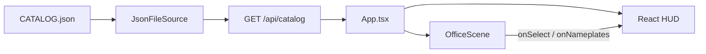

# 新人开发指南

面向第一次进仓的开发者：讲清本项目做什么、怎么跑起来、代码按层怎么走、改功能该动哪里。最短启动命令见 [`README.md`](../README.md)；仓规与能力边界见 [`AGENTS.md`](../AGENTS.md)。

## 先读什么

| 文档 | 用途 |
|---|---|
| [`AGENTS.md`](../AGENTS.md) | 目录语义、能力声明（owns / not）、Agent 协作约定 |
| [`README.md`](../README.md) | 30 秒启动、素材准备、操作说明 |
| [`docs/doc_index.md`](./doc_index.md) | 技术文档地图 |
| [`docs/wa-reference.md`](./wa-reference.md) | WA 双参考仓：MCP `workadventure` / `wa-village`，文件降级 |
| [`docs/map-editing.md`](./map-editing.md) | 改图交接手册：floorLayer 心智模型、任务菜谱、碰撞 / 出门 |
| [`specs/prds/`](../specs/prds/) | 产品规格（PRD） |
| [`.cursor/commands/team/`](../.cursor/commands/team/) | Cursor 团队命令（产品 / 验收 / 游戏前端 / 测试 / 自主交付） |

## 代码检索顺序

查本仓或对照参考仓时，**先用 Codebase Memory MCP，再降级全文检索**（与 [`AGENTS.md`](../AGENTS.md) 一致）：

1. **首选 MCP**
   - 本仓：`project="Users-peng.zhi-Documents-Object-huyuan-evo-agent-team"`（`search_graph` / `search_code` / `trace_path` / `get_code_snippet`）
   - WA 参考仓：`workadventure` / `wa-village`，细节见 [`docs/wa-reference.md`](./wa-reference.md)
2. **降级 `Grep` / `Read`**：MCP 未接入、项目不在列表、查询失败、或目标落在图覆盖缺口时再用（大地图用 Tiled）

本仓图覆盖缺口（即使 MCP 可用也直接读文件）：二进制素材、`public/assets/**/*.png`、字体等。本仓同样 MCP 优先。

## 做什么 / 不做什么

**做：**

- 把 AgentWikiIndex 的 `CATALOG.json` 花名册渲染成像素风办公室大屏
- 每个 `workspace` 一个会走路的小人，显示名字与状态，点击查看详情
- 本地一键预览（`pixel-office` CLI）

**不做（见 AGENTS.md `not`）：**

- Agent 业务实现
- 实时任务状态监控
- 发布到 npm registry
- SQLite / Postgres 建表（仅预留 `CatalogSource` 接口）

## 技术栈与运行时

| 层 | 选型 |
|---|---|
| 前端壳 | Vite 8 + React 19 + TypeScript + Tailwind CSS 4 |
| 办公室世界 | Phaser 4（`pixelArt` / `OfficeScene`） |
| 花名册 API | Node ESM；开发态 Vite 插件，预览态 `pixel-office` |
| 包管理 | **pnpm**（`packageManager: pnpm@10.26.2`） |
| Lint | `oxlint`（`pnpm lint`） |

环境建议：Node 20 LTS 或 22+。花名册来自环境变量 `EVO_AGENT_CATALOG`，或同级 `../AgentWikiIndex/CATALOG.json`，或当前目录 `CATALOG.json`。

目前仓库**没有**自动化测试目录（无 `*.test.*`）；质量门禁以 `pnpm lint` + `pnpm build` 为主。

## 仓库地图

改动落进既有目录语义，**不新增平级顶层目录**。`cache/`、`temp/`、`output/`、`node_modules/`、`dist/` 全部 gitignore。

| 路径 | 职责 |
|---|---|
| [`src/App.tsx`](../src/App.tsx) | 拉取 `/api/catalog`、挂载 Phaser、HUD 状态 |
| [`src/catalog/`](../src/catalog/) | `AgentPersona` 类型与 TS 侧映射（[`mapPersona.ts`](../src/catalog/mapPersona.ts)） |
| [`src/cli/catalog.mjs`](../src/cli/catalog.mjs) | **运行时真正读 JSON 的地方**（Vite 插件与 CLI 共用） |
| [`src/cli/vite-plugin-catalog.ts`](../src/cli/vite-plugin-catalog.ts) | 开发态 `GET /api/catalog` |
| [`src/cli/run.mjs`](../src/cli/run.mjs) / [`static.mjs`](../src/cli/static.mjs) | 预览态静态托管 + 同路径 API |
| [`src/game/`](../src/game/) | Phaser 场景、小人 FSM、相机拖拽/缩放 |
| [`src/ui/`](../src/ui/) | 名牌层、详情卡、顶栏（React overlay，不是 Phaser 文本） |
| [`bin/pixel-office.mjs`](../bin/pixel-office.mjs) | CLI 入口 → `src/cli/run.mjs` |
| [`scripts/`](../scripts/) | `pack:assets` / `gen:assets` |
| [`public/assets/`](../public/assets/) | 像素素材、`maps/`、CREDITS |

## 架构与数据流



两种进程共用同一套 `CatalogSource`（v1 = `JsonFileSource`）：

| 模式 | 入口 | 默认地址 |
|---|---|---|
| 开发 | `pnpm dev` → Vite + [`catalogApiPlugin`](../src/cli/vite-plugin-catalog.ts) | `http://localhost:5173` |
| 一键预览 | `pnpm build` 后 `pnpm pixel-office` 托管 `dist/` | `http://localhost:3780` |

### 花名册映射约定

权威实现在 [`src/cli/catalog.mjs`](../src/cli/catalog.mjs)。[`src/catalog/mapPersona.ts`](../src/catalog/mapPersona.ts) 是 TypeScript 孪生实现——**改映射逻辑必须两边一起改**。

- 只渲染 `workspaces[]`；`unmanaged` **不进**办公室
- `id` ← `dirname`
- `name` ← `title` 中破折号（`—` / `–` / `-`）前半段
- `status` ← `lifecycle === 'experiment'` →「实验中」；否则 `owns[0]` / `blurb` 截断 /「待命」
- `skin` ← `hash(id) % SKIN_COUNT`（[`skinCount.json`](../src/catalog/skinCount.json)，现 64）
- `CatalogSource` 只预留换源接口，本仓**不**实现 SQLite / Postgres

顶栏「刷新花名册」请求 `/api/catalog?refresh=1`，清缓存后重新读 JSON。

## 第一次把项目跑起来

按顺序执行（安装命令请在本机终端手动跑）：

### 1. 安装依赖

```bash
pnpm install
```

### 2. 准备花名册

任选其一：

```bash
# 推荐：显式指定路径
export EVO_AGENT_CATALOG=~/Documents/Codex/AgentWikiIndex/CATALOG.json

# 或保证同级存在 ../AgentWikiIndex/CATALOG.json
# 或当前目录有 CATALOG.json
```

### 3. 准备像素素材

仓库内已有运行时切片，**日常开发直接用，不要跑 `pnpm pack:assets`**：

- [`public/assets/maps/`](../public/assets/maps/)（`company-25.json`、tilesets）
- [`public/assets/characters.png`](../public/assets/characters.png)（角色 atlas，已入库）
- 改图见 [`map-editing.md`](./map-editing.md)
- 地图校验（可选）：`pnpm gen:assets`（不覆盖 PNG）

从 WA starter 重置主图（覆盖 `company-25.json`，维护者偶发）：

```bash
pnpm import:wa-company
```

**仅维护者改皮肤池时**才需要 Pipoya 原包（不入库、不要求每个开发者自备）：

1. itch 下载原包 → 解压到 `temp/vendor/pipoya/`（gitignore）或设 `EVO_VENDOR_PIPOYA`
2. `pnpm pack:assets` → 提交更新后的 `public/assets/characters.png`

署名与许可见 [`public/assets/CREDITS.md`](../public/assets/CREDITS.md)。

### 4. 开发启动

```bash
EVO_AGENT_CATALOG=~/path/to/CATALOG.json pnpm dev
```

浏览器打开终端提示的地址（默认 `http://localhost:5173`）。

### 5. 一键预览（可选）

```bash
pnpm build
pnpm pixel-office --catalog ~/path/to/CATALOG.json
```

常用参数：`-c/--catalog`、`-p/--port`（默认 `3780`）、`--no-open`。

### 6. 质量门禁

```bash
pnpm lint
pnpm build
```

### 操作速查

- 拖拽：移动相机
- 滚轮：缩放
- 点击小人 / 名牌：右侧详情卡
- 点击大门 / 回门：办公室 ↔ 室外桩图
- 顶栏「刷新花名册」：重新读取 JSON

## 游戏层要点

核心在 [`src/game/OfficeScene.ts`](../src/game/OfficeScene.ts)，由 [`createGame.ts`](../src/game/createGame.ts) 创建 Phaser 实例。地图 id 见 [`mapRegistry.ts`](../src/game/mapRegistry.ts)。

### 资源

| 路径 | 说明 |
|---|---|
| `/assets/maps/company-25.json` | 公司主图 ≤25（Tiled） |
| `/assets/maps/world-map.json` | 世界园区图（`kind: world`，不 spawn 员工） |
| `/assets/maps/tilesets/*.png` | 办公室 32×32 瓦片 |
| `/assets/maps/tilesets/village/*.png` | 园区瓦片（本地测试导入） |
| `/assets/characters.png` | Pipoya atlas：12 列 × `SKIN_COUNT` 行（现 64；帧规格对齐 WA） |

加载失败或未注册 `exitMap` 会走 `onAssetsError`，页面顶部显示提示。相机 bounds 等于当前地图像素尺寸；切图后落到 entry/start，仍可自由拖拽。`kind === 'world'` 时不 `spawnAgents`、名牌清空。

### 地图图层

心智模型与操作菜谱见 [`map-editing.md`](./map-editing.md)（`floorLayer` 切点、谁盖谁）。

| 层 | 用途 |
|---|---|
| `floor` / `walls` / `furniture` / `aboveFurniture` | 办公室可见分层；均在 `floorLayer` 之下（角色可盖住） |
| `floorLayer` | WA objectgroup；**z-order 切点**（其上 → overlay depth） |
| `abovePlayer*` | 须在 Tiled 列表里位于 `floorLayer` 之上才会盖住角色 |
| `GroundWorld` / `AboveWorld*` / `roof*` 等 | 世界图可见分层（按 Tiled 顺序；无 floorLayer 时无 overlay 切点） |
| `collisions` | 碰撞（不可见）；`index > 0` 不可走 |
| `start` | 默认出生 |
| `office-door` / `from-office` 等 | `startLayer=true` 命名入口 |
| `exit` | 属性 `exitMap` + `entryName`；踩格或点击切图 |
| `objects` | `spawn_*` / `computer_*` 坐标（仅办公室）；不参与绘制 |

### 小人 FSM

见 [`agentFsm.ts`](../src/game/agentFsm.ts)：**工作是默认**。出生为 `working`（20–60s），到期约 85% 续在岗、约 15% 短闲逛（6–12s）；闲逛结束后必须走回自己的 `spawn`。过道不进入 `idle`（在岗时播站立 `idle-{skin}-{dir}`）。皮肤索引 `0…SKIN_COUNT-1`（`hash(id) % SKIN_COUNT`，见 [`skinCount.json`](../src/catalog/skinCount.json)，现 **64**），无 hue tint；`CHAR_SCALE≈1` 对齐 32px 格。动画 key 形如 `walk-{skin}-{dir}` / `idle-{skin}-{dir}`。

工位：**人数 ≤ 桌数时按 `id` 排序一对一独占**；仅超额才 `hashPick` 复用。在岗朝向由 `spawn → computer` 主轴决定（禁止写死向上）。从世界图回办公室时**镜头**可落 `office-door`，**人**全体回各自工位。

### 人物碰撞（脚底 24×24 盒 + 南向 8px）

本仓**不开** Phaser Arcade。地图碰撞是 `boolean[][]` 格网（`rebuildCollision`）；走路时用脚底盒四角 + 中心查格，不是脚底单点。帧规格与 WA 同为 **32×32**（`CHAR_SCALE=1`），不是人物更大才穿帮。

- **高 24**：比 WA 脚高 16 更高一截，避免从桌子南侧贴近时脚/阴影压到桌面 overhang
- **南向垫高 8**：盒底在脚以下 `y+8`，避免从桌子北侧（椅子侧）贴近时阴影压在桌面上
- **宽 24**：本仓办公室隔断视觉余量（WA 物理宽是 16；加宽避免胳膊/头发盖住墙瓦）
- 精灵 `origin (0.5, 1)` 时盒为 `[x−12, y−24]→[x+12, y+8]`
- spawn / working 目标若落在阻挡格会 BFS 吸附到最近可走点
- 人人互撞不做

椅子（如 GID 340）**不**标 `collides`，否则座位卡死；见 [`docs/map-editing.md`](./map-editing.md)。

### 参考项目 WorkAdventure（本机）

查 WA **先用 Codebase Memory MCP**（`workadventure` 引擎仓 / `wa-village` 大图与 tilesets），MCP 不可用或图缺口再读本机文件；双仓约定见 [`docs/wa-reference.md`](./wa-reference.md)。**本仓同样 MCP 优先**（见上文「代码检索顺序」）。

| 项 | 值 |
|---|---|
| 引擎仓 | `/Users/peng.zhi/Documents/Object/参考项目/workadventure`（相对 `../../参考项目/workadventure`） |
| Village | `/Users/peng.zhi/Documents/Object/参考项目/wa-village`（相对 `../../参考项目/wa-village`） |
| 用途 | 地图分层 / tileset / 进出 / **人物做法**；village 侧重总部大图与 `tilesets/` |
| 禁止 | 拷贝 `play/` 后端、聊天、Jitsi、AGPL 源码，或 village 整图/整套 tileset 进本仓 |

**对齐 WA 的是「做法」，不是「24 套数量」：**

| 要对齐 | 说明 |
|---|---|
| 帧 | 32×32；原图 96×128（3×4）；四向 × 3 帧 |
| 打包 | Pipoya 式完整精灵 → atlas（`pnpm pack:assets`） |
| 碰撞思路 | 脚底盒查格（本仓宽 24 / 高 24） |
| 池大小 | **本仓自定**（现 64，可扩 128）；WA `woka.json` 默认 24 只是对方产品池 |

本仓**不**接 WA 分层换装。扩皮肤：改 `scripts/pipoya-64-manifest.txt` 行数 + [`src/catalog/skinCount.json`](../src/catalog/skinCount.json) + `pnpm pack:assets`。细节见 [`docs/map-editing.md`](./map-editing.md)「WA 人物资源」。

### React ↔ Phaser

`App` 通过 `createOfficeGame` 拿到：

- `reloadAgents(agents)`：刷新花名册后在**当前图**重建小人
- `destroy()`：卸载时销毁游戏
- 回调：`onSelect`、`onNameplates`、`onAssetsError`

名牌坐标由 Phaser 每帧算出屏幕位置，再交给 React [`NameplateLayer`](../src/ui/NameplateLayer.tsx) 渲染（常显名字 + 截断状态；像素 HUD 皮肤在 [`src/index.css`](../src/index.css)）。每个小人有脚底椭圆阴影，随 `clearAgents` / 切图销毁，**不**启用 Phaser Light2D。

## 常见改动落点

| 你想改… | 去哪 |
|---|---|
| 像素 HUD 皮肤 / 字体 | [`src/index.css`](../src/index.css)（`Fusion Pixel 12`、`.hud-panel`）；字体文件 [`public/fonts/`](../public/fonts/)；署名 [`public/assets/CREDITS.md`](../public/assets/CREDITS.md) |
| 详情卡字段 / 布局 | [`src/ui/AgentCard.tsx`](../src/ui/AgentCard.tsx)（像素直角框，与工牌/顶栏同皮肤） |
| 名牌样式 | [`src/ui/NameplateLayer.tsx`](../src/ui/NameplateLayer.tsx)（常显工牌；选中高亮置顶） |
| 顶栏文案 / 刷新 | [`src/ui/Toolbar.tsx`](../src/ui/Toolbar.tsx) |
| 小人脚底阴影 | [`src/game/OfficeScene.ts`](../src/game/OfficeScene.ts)（`shadows` Map；无 Light2D） |
| 状态文案、皮肤规则、字段映射 | [`src/cli/catalog.mjs`](../src/cli/catalog.mjs) **和** [`src/catalog/mapPersona.ts`](../src/catalog/mapPersona.ts) |
| 走路、碰撞、相机、切图 | [`src/game/OfficeScene.ts`](../src/game/OfficeScene.ts) + [`mapRegistry.ts`](../src/game/mapRegistry.ts) |
| 办公室 / 桩图布局 | Tiled 编辑 `public/assets/maps/*.json`；重置主图用 `pnpm import:wa-company` → `pnpm gen:assets` |
| 角色 atlas / 皮肤清单（维护者） | 改 [`scripts/pipoya-64-manifest.txt`](../scripts/pipoya-64-manifest.txt) + [`skinCount.json`](../src/catalog/skinCount.json) → 本机 `pnpm pack:assets` → **提交** `characters.png` |
| 开发态 API | [`src/cli/vite-plugin-catalog.ts`](../src/cli/vite-plugin-catalog.ts) |
| 预览 CLI | [`src/cli/run.mjs`](../src/cli/run.mjs) |

## 边界与坑

1. **目录**：不新增平级顶层目录；产物进 `cache/` / `temp/` / `output/`，不入库。
2. **能力声明**：改 `AGENTS.md` 的 owns/not 后，若同级存在 `../AgentWikiIndex/`，执行 `python3 ../AgentWikiIndex/scripts/refresh_catalog.py`；**没有该目录则跳过**，不要报错、不要去建。
3. **不要提交**：`temp/` 里的 itch 原包、`.env`、`dist/`、`node_modules/`。
4. **映射双份**：`catalog.mjs`（运行时）与 `mapPersona.ts`（类型/前端）必须保持一致。
5. **素材缺失**：办公室空白或顶部报错时，先确认 `maps/*.json` / `maps/tilesets/*.png` / `characters.png` 齐全。
6. **静态托管**：[`src/cli/static.mjs`](../src/cli/static.mjs) 有路径穿越防护（禁止读出 `dist/` 根外），改静态服务时不要拆掉。
7. **团队命令**：母版维护于 Obsidian Vibecoding 库；本仓 `.cursor/commands/team/` 只作安装稿，勿另起一套命令体系。
8. **包管理**：只用 pnpm；需要新增依赖时只给出 `pnpm add …` 命令供本机执行，不擅自改 lockfile。

## 相关脚本速查

| 命令 | 作用 |
|---|---|
| `pnpm dev` | Vite 开发服务器 |
| `pnpm build` | `tsc -b` + Vite 生产构建 |
| `pnpm lint` | oxlint |
| `pnpm preview` | Vite 预览（不含花名册 API；日常用 `pixel-office`） |
| `pnpm pixel-office` | 构建产物 + `/api/catalog` 一键预览 |
| `pnpm pack:assets` | （维护者偶发）本机 vendor → 覆盖 `characters.png`；日常开发不需要 |
| `pnpm gen:assets` | pack `tilesets/*.tsj` 后校验 Tiled 地图（不写 PNG） |
| `pnpm pack:tilesets` | 把共享 `.tsj` 的 collides 灌进地图 JSON |
| `pnpm annotate:collides` | 批量补 `.tsj` collides 再 pack |
| `pnpm import:wa-company` | 用 WA starter 重置 `company-25.json` |
| `pnpm sync:map-palette` | 同步 WA `maps/assets` PNG 到 tilesets |
