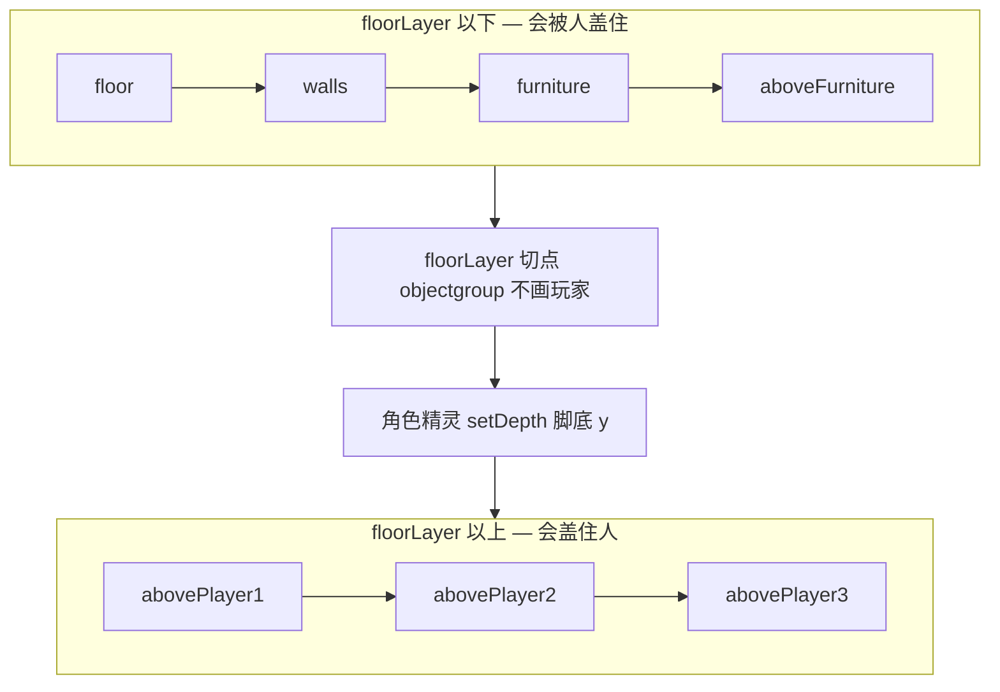

# 办公室地图改图手册

面向第一次接手本仓地图的同事：用 **Tiled** 改办公室 / 世界园区图，本地预览后提交。不假定懂 Phaser；假定会用 git 与终端。

产品规格见 [`specs/prds/prd-00002-tiled-office-world.md`](../specs/prds/prd-00002-tiled-office-world.md)（办公室）与 [`specs/prds/prd-00004-world-map.md`](../specs/prds/prd-00004-world-map.md)（世界图）。工程师运行时要点见 [`docs/dev-guide.md`](./dev-guide.md)。

---

## 开篇（30 秒）

| | |
|--|--|
| **改什么** | [`public/assets/maps/`](../public/assets/maps/) 下的地图 JSON + `tilesets/`（PNG / `.tsj`） |
| **怎么预览** | `pnpm gen:assets` → `pnpm dev:office` → 浏览器 **硬刷新**（Cmd+Shift+R） |
| **怎么保存** | Tiled 里 **File → Save**，保持 JSON；不要手写覆盖主图 |
| **不要做** | 删/改名 `floorLayer`；指望拖图层相对 `objects` 来盖人；接 WA 在线编辑器；往 `company-25` 乱加 `tilesets/village/` |

地图是 **正交、32×32**。Tiled 里请保持该设置。

---

## 心智模型（必读）

运行时对齐 WorkAdventure：玩家**不画在某一瓦片层上**。名为 `floorLayer` 的 **objectgroup** 只是 z-order **切点**：



| 规则 | 含义 |
|------|------|
| 切点**下**的瓦片层 | depth 低 → **被人盖住**（含 `aboveFurniture`） |
| 切点**上**的瓦片层 | depth ≥ `1_000_000` → **盖住角色**（`abovePlayer*`） |
| `objects` | 只存 `spawn_*` / `computer_*` 坐标，**不参与绘制**；在图层列表里拖到哪都无关 |
| 谁盖谁 | 看相对 `floorLayer` 的位置，**不是**相对 `objects` |

因此：桌上电脑若要挡住走过的人，画在 `abovePlayer1`（或任意 `floorLayer` **之上**的层）；画在 `aboveFurniture` 会被人「踩住」——这是正确行为，不是 bug。

世界图 `world-map` 为 25×25 色块桩图，**没有** `floorLayer`；全部按 Tiled 顺序低档绘制；世界图**不 spawn 员工**。

---

## 需要什么工具

| 工具 | 是否必需 | 用途 |
|------|----------|------|
| [Tiled Map Editor](https://www.mapeditor.org/) 1.3+ | **必需** | 铺地板/墙/家具、标碰撞、做出入口 |
| 本仓地图 JSON + tileset PNG | **必需** | 见下表 |
| `pnpm gen:assets` | **建议** | pack tileset + 校验图层 / exit / spawn |
| `pnpm dev:office` | **必需** | 本地预览 |
| Piskel / Aseprite / Krita | 按需 | 自绘或改 32×32 瓦片 |
| WorkAdventure Inline Editor | **不需要** | 见附录「为何不用在线编辑器」 |

---

## 本仓文件在哪

| 路径 | 说明 |
|------|------|
| [`public/assets/maps/company-25.json`](../public/assets/maps/company-25.json) | **主图（≤25 人）** |
| [`public/assets/maps/world-map.json`](../public/assets/maps/world-map.json) | **世界桩图**（25×25 色块；出门往返；`kind: world`） |
| [`public/assets/maps/registry.json`](../public/assets/maps/registry.json) | map id → JSON + `kind`；exit 只引用 id |
| [`public/assets/maps/tilesets/`](../public/assets/maps/tilesets/) | 办公室瓦片；地板在 **tileset1.png**；碰撞标在 `*.tsj`；生成的 `art/tilesets/<pack>` 图集；`world-stub.png` |
| [`public/assets/maps/tilesets/village/`](../public/assets/maps/tilesets/village/) | 办公室用到的 `fountain-sculptures` / `decor-rugs-1`；其余供可选 `import:wa-world`（不进 npm） |
| [`art/maps/maps.tiled-project`](../art/maps/maps.tiled-project) | **Tiled 工程入口**（唯一；会话在 `art/maps/`，不进 npx） |
| [`art/tilesets/`](../art/tilesets/) | 自制图集：一类一目录；`raw/` 原始稿 + `src/` 条带 + manifest（`pnpm pack:art-tilesets`） |
| [`public/assets/maps/README.md`](../public/assets/maps/README.md) | 工作区一页纸 |
| [`public/assets/CREDITS.md`](../public/assets/CREDITS.md) | 瓦片许可与署名 |

### 地板贴图在哪？

**没有单独的 `floor.png`。** 地板是图集格子：

1. Tiled 右侧 **Tilesets** 点选 **`tileset1`**（不要选 Special_Zones / tileset5）
2. 木地板主格 ≈ 图集左上（地图 GID **201**）；变体 GID **223**
3. 文件：[`tilesets/tileset1.png`](../public/assets/maps/tilesets/tileset1.png)

家具桌椅多在 **`tileset1-repositioning`** / **`tileset5_export`**；墙在 **`tileset5_export`**。

---

## 第一次上手

### 推荐流程

```bash
pnpm unpack:tilesets          # Tiled 只显示一份外部 .tsj，避免「一对一对」
# Tiled: File → Open → art/maps/maps.tiled-project（或直接打开 public/assets/maps/company-25.json）
# 改图 → File → Save（JSON）
pnpm gen:assets               # pack art/tilesets/* + tilesets + sync 预加载 + 校验
pnpm dev:office               # 浏览器硬刷新
# git 提交改过的 .json / .png / .tsj
```

**反映修改：** Phaser 直接读 `public/assets/maps/*.json`，无需另编地图。日常只 Save JSON，不要手写覆盖主图。

### 协同约定

| 角色 | 做什么 |
|------|--------|
| 你（Tiled） | 打开 JSON，摆图后 Save |
| Agent / 开发 | 校验、修运行时；按你保存的 JSON 验收 |
| 预览 | `pnpm gen:assets` → `pnpm dev:office` → 硬刷新 |

重置主图（覆盖 `company-25.json`，维护者偶发）：`pnpm import:wa-company`。  
重置世界桩图：`pnpm gen:world-stub`（日常）。可选大图导入：`pnpm import:wa-world`（会覆盖桩图；见 [`wa-reference.md`](./wa-reference.md)）。

---

## 图层一览

`pnpm gen:assets` 按 `kind` 分档：

- **office**（如 `company-25`）：至少 `floor`、`walls`、`furniture`、`collisions`、`start`、`exit`。
- **world**（如 `world-map`）：至少 `collisions`、`start`、`exit`；视觉层用 Village 命名。

| 图层名 | 美术可改？ | 作用 |
|--------|------------|------|
| `floor` | 可 | 地板（tileset1） |
| `walls` | 可 | 外墙 / 隔断 |
| `furniture` | 可 | 桌椅等（角色下方） |
| `aboveFurniture` | 可 | 家具之上、**角色之下**（须在 `floorLayer` 下面） |
| `abovePlayer1`…`3` | 可 | 盖住角色（须在 `floorLayer` **之上**） |
| `floorLayer` | **勿删** | objectgroup；z-order 切点 |
| `collisions` | 层须存在；**可空** | 漏标补洞（有瓦不可走）；办公室主要靠家具 `collides` |
| `start` | 慎改 | 默认出生 |
| `office-door` | 慎改 | 命名入口（`startLayer=true`） |
| `from-office` | 慎改 | 世界图出门落点 |
| `exit` | 慎改 | 切图；属性 `exitMap` + `entryName` |
| `objects` | 可 | 仅 `spawn_*` / `computer_*`；**不绘制** |
| `GroundWorld` / `AboveWorld*` / `roof*` | 可 | 世界图视觉层 |

Jitsi / clock / website / audio 等 WA 功能层**不导入**。

逻辑层（`objects` / `collisions` / `start` / `exit*` / `office-door` / `from-office`）运行时**不创建绘图层**，避免 Special Zones 色块脏画面。

---

## 按任务改图

### 1. 铺地板 / 墙 / 家具

1. 左侧 Layers 选中目标层（如 `floor` / `walls` / `furniture`）
2. 右侧选对 tileset（地板 → `tileset1`；墙 → `tileset5_export`；桌椅 → `tileset1-repositioning` 等）
3. 工具 **B（图章）** 或地形刷铺瓦 → Save

当前 `company-25` 视觉来自 WA starter（**静态烘焙桌**），不做运行时动态摆桌。

### 2. 桌上装饰：盖人 vs 被人盖

| 想要的效果 | 画在哪一层 |
|------------|------------|
| 人走过时盖住装饰（键盘、鼠标垫等） | `aboveFurniture`（`floorLayer` **下**） |
| 人走过时被装饰挡住（屋顶、檐、要挡人的显示器） | `abovePlayer1`（或 2/3；`floorLayer` **上**） |

不要指望把 `aboveFurniture` 拖到 `objects` 上面——`objects` 不参与绘制。

### 3. 摆工位（桌 + 出生点）

**一对工位 = `spawn_N` + `computer_N`（同一数字 N）**

1. 在 `furniture`（及需要的 `aboveFurniture` / `abovePlayer*`）上摆好桌子与显示器
2. 选中 **`objects`** 层（objectgroup）
3. 插入 **Point** 对象：
   - 员工站位：`spawn_0`、`spawn_1`、…
   - 工作目标（电脑前）：`computer_0`、`computer_1`、…（与 spawn 同号）
4. `company-25` 校验要求 **≥25 组成对**（同一 N 同时有 spawn 与 computer），且 spawn↔computer 欧氏距离 **≤2 格**；禁止空地板孤儿点凑数
5. 人少时空桌仍在图上；**人数 ≤ 工位数时一对一独占**，仅超额才 hash 复用

座位椅子（如 GID **340**）**不要**标 `collides`，否则站不上 spawn（`snapToWalkable` 会把人吸到过道）。

### 3.1 摆闲逛 POI（休息 / 会议 / 因果家具）

**座位类**（lounge / meeting）用 `poi_<kind>_<n>` Point，约定见 **[`docs/map-poi.md`](./map-poi.md)**。到站脸朝哪用 **`dwellFacing`**，见 **[`docs/map-facing.md`](./map-facing.md)**。与工位对象同层 `objects`。

**因果家具**（打印机、咖啡机等，`CAUSAL_POI_KINDS`）：不要插 Point。标 `poiKind` / `collides` / 可选 `standSides`·`standSeed`·`poiStand`；站位垫见 [`map-poi.md`](./map-poi.md)「站位垫 stand pads」。同白名单再铺一台只需瓦片；改完 `.tsj` **只跑 `pnpm gen:assets`**。

### 4. 标碰撞（人走不过去）

对齐 WA：给瓦片加布尔属性 **`collides`**（Custom Properties，**不要**填 Class）。

一格不可走，当且仅当：

1. 该格 `walls` / `furniture` / `aboveFurniture` / `collisions` 上瓦片的 **`collides === true`**，或  
2. **`walls` 层** `gid > 0`（兜底），或  
3. **`collisions` 层** `gid > 0`（补洞）

| 操作 | 做法 |
|------|------|
| 手改 collides | Tiled → File → Open → `tilesets/*.tsj` → 选瓦片 → Custom Properties 加 `collides` bool → Save |
| 批量补常用墙/会议桌 | `pnpm annotate:collides` |
| 灌进地图给 Phaser | `pnpm pack:tilesets`（`gen:assets` 会自动先跑） |
| 漏标补洞 | 选 `collisions` → **B** → `Special_Zones` 的 `BLOCK` → 拖刷 |

**重要：** 碰撞属性维护在 [`tilesets/*.tsj`](../public/assets/maps/tilesets/)，不是每张地图各改一遍。Phaser **不支持**外部 `source` tileset，预览前必须 pack 成 embedded。

椅子 / 座位瓦片（local 16–19，如 GID 340）不要批量打进 `annotate:collides`。

人物脚底是 **24×24** 盒查格（见 [`dev-guide.md`](./dev-guide.md)），不是整格 32×32。

#### 为什么 Tiled 里 tileset「一对一对」？

1. 地图里挂了两份同名 tileset（embedded + 又 Add External）→ 关 Tiled 后重新打开地图；日常先 `pnpm unpack:tilesets`
2. 顶栏开了地图里的 tileset Tab 又开了 `.tsj` → 改 collides 时 **只打开 `.tsj` 文件**

**不要**对已在地图上的 tileset 再点 `Add External Tileset...`。

### 5. 改出入口（办公室 ↔ 世界桩图）

| 地图 | `exit` 层属性 | 含义 |
|------|---------------|------|
| `company-25` | `exitMap=world-map`，`entryName=from-office` | 出门 → 桩图 `from-office`（白格南侧蓝格） |
| `world-map` | `exitMap=company-25`，`entryName=office-door` | 点中间白格 → 办公室门口 |

`exitMap` 必须是 [`registry.json`](../public/assets/maps/registry.json) 里已有的 id，不要写公网 URL。

**怎么验：**

1. `pnpm dev:office`，拖到公司大门  
2. 点大门 `exit`（或等人踩上）→ 切到 `world-map` 蓝底 25×25，落在 `from-office`；**无员工、无名牌**  
3. 点中间白格 → 回到 `company-25` 的 **`office-door`**，员工重新出现  
4. 黑屏 /「地图未注册」→ 查 `exitMap` 是否在 registry

### 6. 改世界桩图

1. 重建默认桩图：`pnpm gen:world-stub`（写 `world-map.json` + `tilesets/world-stub.png`）  
2. 或 Tiled 打开 `world-map.json` 微调；保持正交 32×32、`exit` / `start` / `from-office`  
3. 无员工 spawn；无 `floorLayer`  
4. Save → `pnpm gen:assets` → 预览  

`pnpm import:wa-world` 会覆盖为 wa-village 大图（非默认）；恢复桩图再跑 `pnpm gen:world-stub`。

办公室装饰若引用 `tilesets/village/`，npm 只放行当前画到的 PNG（见 pack 门禁），不要往 `company-25` 再挂整包 village。

---

## 提交前检查清单

- [ ] `pnpm gen:assets` 通过（图层 / exit / spawn 校验）
- [ ] `pnpm dev:office` 硬刷新后：地板墙家具正常
- [ ] 人走在桌**前**盖住家具；走在 `abovePlayer` 檐下被挡住
- [ ] 座位可站、桌上该挡的路走不过去（collides）
- [ ] 出门 / 回来切图正确
- [ ] 未删 `floorLayer`；未提交 `temp/` 或未署名素材（见 [`CREDITS.md`](../public/assets/CREDITS.md)）

---

## 常见踩坑

| 现象 | 原因 / 处理 |
|------|-------------|
| 电脑在 `aboveFurniture` 被人踩住 | 预期行为；要盖人请放到 `abovePlayer*` |
| 在 Tiled 把层拖到 `objects` 上面仍无效 | `objects` 不绘制；只看相对 **`floorLayer`** |
| 删了或改名了 `floorLayer` | overlay 切点失效，`abovePlayer*` 不再盖人 → 恢复该 objectgroup |
| 人能走上桌子 | **碰撞**问题，不是 depth → 给桌瓦加 `collides` 或刷 `collisions` |
| 站座位卡死 | 椅子被标了 `collides` → 去掉 |
| tileset 成对出现 | `pnpm unpack:tilesets` 后重开地图；勿重复 Add External |
| 改了 `.tsj` 预览没变 | 跑 `pnpm gen:assets`（会 pack）再硬刷新 |
| 切图黑屏 | `exitMap` 不在 `registry.json` |

---

## 附录

### 人数分档

| 档 | 人数 | map id | 本轮 |
|----|------|--------|------|
| S | ≤10 | `company-10` | 预留 → 回退 `company-25` |
| M | ≤25 | `company-25` | **已落地** |
| L | ≤100 | `company-100` | 预留 → 回退 `company-25` |

启动时 `selectOfficeMapId(agents.length)` 选办公室图；**人数 ≤ 工位数时一对一独占**，超过工位数才 hash 复用桌。

### 相关命令

```bash
pnpm gen:assets           # pack art + tilesets + sync 预加载列表 + 校验 maps
pnpm pack:art-tilesets    # art/tilesets/<pack> → public/.../<pack>.png + .tsj
pnpm pack:office-anim     # 同 pack:art-tilesets（别名）
pnpm sync:tileset-assets  # 从地图 tilesets[] 同步 registry + tilesetAssets.generated.ts
pnpm unpack:tilesets      # 地图改回 source → .tsj（Tiled 改图前）
pnpm pack:tilesets        # 把 tilesets/*.tsj 的 collides 灌进各地图 JSON
pnpm annotate:collides    # 批量补 .tsj 的 collides，再 pack
pnpm sync:map-palette     # 从本机 WA maps/assets 再同步 tileset PNG
pnpm import:wa-company    # 用 WA starter 重置 company-25（结束后会 pack）
pnpm gen:world-stub     # 重建 25×25 色块世界桩图
pnpm import:wa-world    # 可选：覆盖为 wa-village 大图（非默认）
pnpm pack:assets          # 仅组装 Pipoya characters.png
pnpm crop:tiles extract … # 从 WA 图集只读抠格 → temp/crops/（禁止写回）
pnpm dev:office           # 本地预览（推荐）
pnpm dev                  # 本地预览（需自备 EVO_AGENT_CATALOG）
```

### 从 WA 图集抠格（无原文件时）

**执行清单**见 [`docs/workflows/crop-wa-tiles.md`](./workflows/crop-wa-tiles.md)（Agent / 复跑优先跟那篇）。

`tileset*_export.png` 来自 WA 兄弟项目，**没有可改的源文件**。不要手改、也不要用脚本写回这些 PNG。做法是只读抠格 → 晋升 `raw/` → 编辑 → 条带进 `src/` → 打进**新** `art/tilesets/<pack>`：

```bash
# 例：打印机（tileset6 左上角 local id 50，横 3 × 竖 2 = 96×64）
pnpm crop:tiles extract \
  --from tileset6_export \
  --x 0 --y 5 --w 3 --h 2 \
  --out temp/crops/printer.png
# 等价：--id 50 --w 3 --h 2
```

1. 在 Tiled 打开对应 `.tsj`，看 Properties 的 Rectangle / Tile → 得到格子 `(x,y)` 或 local id  
2. `pnpm crop:tiles extract …` → `temp/crops/*.png`（gitignore；一次性刮板）  
3. 拷进 `art/tilesets/<pack>/raw/`（入库原始稿）；Piskel / Aseprite 工程也放 `raw/`  
4. 导出条带 PNG 到 `src/`（横=占格，竖=帧）→ `pnpm pack:art-tilesets` → Tiled 铺**新**图层  

脚本**故意没有** stamp/写回；传 `stamp` / `apply` 会直接失败。

### 作者工作区 `art/` vs 运行时 `public/`

| | `art/` | `public/` |
|--|--------|-----------|
| 谁用 | 人、Tiled 工程、Piskel、打包脚本 | 浏览器、Phaser、`pixel-office` / npx |
| 例子 | `maps/` 工程、`tilesets/<pack>/raw/` + `src/` | 地图 JSON、tileset PNG、打好的 `<pack>.png` |
| 进 `dist` | **否** | **是**（Vite 整份拷贝） |

```
art/
  maps/maps.tiled-project     # 只开这一份工程
  tilesets/office-anim/       # 动画类 → office-anim.png
    raw/                      # 原始稿（抠格、.piskel）；不进 pack
    src/                      # 合成条带；plant-pot / printer / coffee-machine-big
  tilesets/couches/           # 沙发 couches → couches.png（静态家具示例）
  tilesets/couches-2/         # 过大人工拆第二包
```

- **Tiled 工程**：只打开 [`art/maps/maps.tiled-project`](../art/maps/maps.tiled-project)。不要把 `*.tiled-project` / `*.tiled-session` 放进 `public/`。
- **地图 JSON** 仍在 `public/assets/maps/`（源 = 运行时）；工程 `folders` 指向该目录。
- **原始稿 vs 条带**：`raw/` 放 WA 抠格与 `.piskel`（入库、永不扫进 pack）；`src/` **只**放合成条带 PNG（RGBA，宽高为 32 倍数；横=占格，竖=帧）→ `pnpm pack:art-tilesets` → `public/assets/maps/tilesets/<pack>.{png,tsj}`。目录名即 tileset 名。
- **紧贴 + 第 0 帧钉死**：新图紧贴占位。加帧优先脚下；空不够则**只溢出新帧**到别处（地图铺的第 0 帧 GID 不变）。整块搬家不做。
- **终身占格**：条目占用过的格子不回收（缩帧/删源留洞）；别人不能占用。打满请建 `<pack>-2/`。
- **加宽**：不要改原 PNG 宽度；新文件 append，地图改铺。
- **顺序锁定**：`manifest.entries` 只追加；`columns` 锁定；`maxAtlasHeightPx` / 图宽硬顶 **2048**（手机侧），超限不自动拆 sheet。
- **动画在 Tiled 绑**：脚本**不**自动写 playlist。`pack:art-tilesets` 更新图集几何时**合并保留**已有 `.tsj` 的 `tiles[]`（animation / properties）；新条带需在 Tile Animation Editor 自行添加。
- **进地图**：Tiled Add External 并铺瓦片后跑 `pnpm gen:assets`（内含 `sync:tileset-assets`）——从地图 `tilesets[]` **自动登记**预加载列表，无需手改 `mapRegistry`。未铺进任何地图的空包不会进列表。
- **下期**（本期不搬）：`public/assets/maps/reference/`、未挂运行时的 `tilesets/skins/` 宜迁到 `art/`。

### 许可提醒

当前瓦片多为 **CC-BY-SA 3.0**（衍生地图同样 share-alike）。署名见 [`CREDITS.md`](../public/assets/CREDITS.md)。不要把 tileset 当独立素材包再分发。

### 为何不用 WorkAdventure 在线编辑器

WA Inline Map Editor 依赖登录 / admin / `.wam`，且不擅长从零铺地板墙。本仓是 Phaser 本地大屏，直接吃 Tiled JSON。

**标准路径 = Tiled 打开 `art/maps/maps.tiled-project` → 编辑并提交 `public/assets/maps/`。**

### 参考路径速查（工程师）

查 WA **先用 Codebase Memory MCP**（`workadventure` / `wa-village`），再降级读本机文件；约定见 [`wa-reference.md`](./wa-reference.md)。

| 用途 | 绝对路径（本机） |
|------|------------------|
| 分层办公室蓝本 | `…/参考项目/workadventure/maps/starter/map.json` |
| 瓦片 PNG | `…/workadventure/maps/assets/tileset*.png` |
| 碰撞色块 | `…/workadventure/maps/assets/Special_Zones.png` |
| 地图硬约束 | `…/workadventure/docs/map-building/tiled-editor/wa-maps.md` |
| 进出场景 | `…/workadventure/docs/map-building/tiled-editor/entry-exit.md` |
| Tiled 入门 | `…/workadventure/docs/map-building/tiled-editor/index.md` |
| 人物碰撞盒 | `…/workadventure/play/src/front/Phaser/Entity/Character.ts`（WA 16×16；本仓脚高 24、宽 24） |

只学结构与步骤，**禁止**把 `play/` 后端、聊天、Jitsi、AGPL 源码拷进本仓。

### WA 人物资源（对照本仓）

对齐的是 **帧规格与碰撞做法**（32×32、四向 × 3 帧、脚底盒），**不是** WA 默认 24 套数量。本仓皮肤池现 **64**（[`skinCount.json`](../src/catalog/skinCount.json)），可扩。本仓**不接** WA 分层换装。
