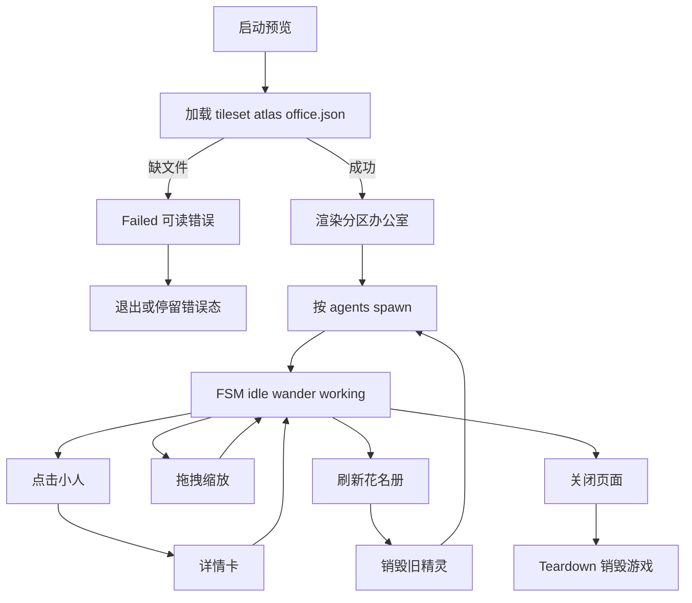
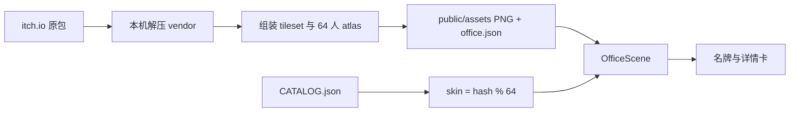
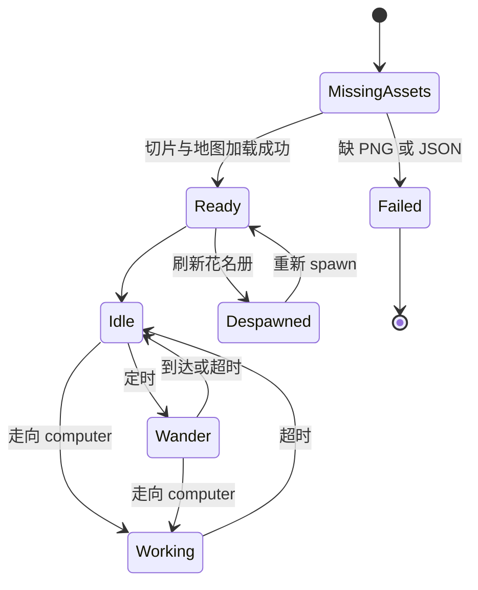

# PRD: 办公室素材重布（Office Asset Redesign）

| 属性 | 值 |
|------|------|
| 状态 | backlog |
| 范围 | 像素办公室视觉与人物素材；不改花名册语义与 CatalogSource |
| 关联文档 | `README.md`、`public/assets/CREDITS.md`、`src/game/OfficeScene.ts`、`scripts/gen-pixel-assets.mjs`、`src/catalog/mapPersona.ts` |
| 素材来源 | [Pixel Life: Office Essentials](https://christianperich.itch.io/pixel-life-office-essentials)；[PIPOYA FREE RPG Character Sprites 32x32](https://pipoya.itch.io/pipoya-free-rpg-character-sprites-32x32) |

## 背景与问题

当前大屏是 **16×16 程序生成** 的简陋办公室：

- `scripts/gen-pixel-assets.mjs` 画出 8 格瓦片 + 4 套色块小人；
- `OfficeScene` 中 `TILE = 16`、`SCALE = 3`，动画按「每皮肤 12 帧（4 向 × 3 帧）」硬编码；
- `mapPersona` 用 `skin % 4` 再 `hueTint` 区分角色；
- 地图约 40×28、约 21 张相同工位，观感不像工作室，也无法直接接入 32×32 第三方包。

要解决的问题：给大屏观众一套像「工作室」的像素办公室，每个数字员工有可辨认的行走小人；在不改动花名册业务语义与 FSM 交互的前提下，完成布局与人物的视觉升级。

## 目标与非目标

### 目标（MVP / Release 0）

- 接入 Pixel Life 地板、墙、桌椅、绿植、书柜，重做**分区工作室**地图（工位区 + 过道 + 点缀）。
- 接入 Pipoya **64 套**角色四向行走；按 workspace `id` hash 稳定分配外观。
- 瓦片与角色帧升级为 **32px**；建议 `SCALE = 2`（屏上约 64px）。
- 去掉 hue tint；多样性由 64 套外观承担。
- 保留 idle / wander / working、点击详情、名牌、刷新花名册、拖拽缩放。
- 更新 `CREDITS.md` 署名与许可；原始 zip/rar **不入库**。
- `pnpm gen:assets` **不得再覆盖**第三方 PNG。

### 非目标

- 闸机、监控站、服务器机柜等 Pixel Life 1.1 安全/IT 展示向布置。
- 坐下、会议交互、运行时换装、运行时地图编辑器。
- 实时任务状态监控、新 CatalogSource（SQLite/Postgres）。
- 把 itch 原包作为可下载资源再分发（违反两套素材「禁止再分发独立文件」条款）。
- Release 2 及更高版本能力（溢出项进开放项或独立 PRD）。

## 术语

| 术语 | 含义 |
|------|------|
| Pixel Life | Chris Perich 的 Office Essentials 32×32 办公室家具/建筑素材包（CC-BY 4.0） |
| Pipoya | Pipoya 免费 RPG 角色雪碧图 32×32（64 角色、四向走） |
| 分区工作室 | 工位簇 + 过道 + 绿植/书柜点缀的办公室布局，而非纯网格复制工位 |
| skin | `AgentPersona.skin`，角色外观索引；本期改为 `hash(id) % 64` |
| atlas | 供 Phaser 加载的角色/瓦片雪碧图（游戏用切片，非原包原样入库） |
| spawn / computer | 地图 objects 层中的出生点与工位锚点，驱动 FSM |
| TILE / SCALE | 格子像素边长与场景显示倍率 |

## 已拍板规则 / 取舍

| 议题 | 决议 | 说明 |
|------|------|------|
| 布局野心 | 分区工作室 | 工位够用、像真办公室；非纯换皮网格 |
| 人物池 | 64 套全用 | 含幻想/怪物；产品接受与办公室气质的冲突 |
| 染色 | 去掉 hue tint | 原画被染色会脏 |
| 原包入库 | 否 | zip/rar 本机解压；仅切片 PNG + atlas + `office.json` 入库 |
| 地图编辑 | 仓库维护 Tiled JSON | 无运行时编辑器 |
| FSM / 交互 | 不变 | idle / wander / working；详情、名牌、刷新、拖缩放 |
| 工位不足 | hash 复用 | 不报错、不排队 |
| gen:assets | 禁止覆盖第三方 PNG | 改为从 vendor 组装或仅生成地图 JSON |
| 像素与缩放 | TILE=32，SCALE≈2 | 相对现 16×3（48px）略大 |
| 遮挡 | R0 图层深度；R1 可做 Y 排序 | 闸机/坐下等不做 |

## 用户与角色

| 角色 | 目标 |
|------|------|
| 大屏观众（主） | 一眼看出「工作室」氛围；能分辨不同员工小人 |
| 游戏前端 / 验收（内部） | 按本 PRD 切片实现与验收；素材路径与 CREDITS 可维护 |
| 素材作者（Chris Perich、Pipoya） | 署名与许可被遵守；原包不被再分发 |

## 功能域

### 素材流水线

1. 用户从 itch 自行下载原包（Office Essentials 完整包可能需付费档）。
2. 本机解压到约定 vendor 目录（不入库）。
3. 组装 tileset / 64 人 atlas → 写入 `public/assets/`。
4. 维护 Tiled 兼容 `office.json`（32px；layer 名保持兼容）。
5. `CREDITS.md` 写明作者、链接、许可与禁止再分发。

### 场景与网格

- 更新 `OfficeScene`：`TILE`、spritesheet frame、walkable 换算、名牌 Y 偏移。
- 保留 layer：`ground` / `furniture` / `collision` / `objects`（`spawn_*`、`computer_*`）。
- 分区示例：上/下工位簇、中间过道、边缘墙门、过道两侧书柜与盆栽；工位数 **≥ 21**。
- R0 深度：地面 0、家具 1、小人 `10 + y/1000`。

### 角色与动画

- Pipoya 常见每角色 3×4（下/左/右/上 × 3 帧）。可重排 atlas 适配现有 `base = skin * 12 + dir * 3`，或改 `ensureAnims` 读真实行列。
- 方向枚举与现约定对齐：`0` 下 / `1` 左 / `2` 右 / `3` 上。
- `skin = hash(id) % 64`；不再调用 `setTint(hueTint(...))`（或等价禁用）。

### 生成器

- `pnpm gen:assets` 不得再写出覆盖第三方的 `tileset.png` / `characters.png`。
- 可选：从已解压 vendor 组装 atlas；或仅生成/校验地图 JSON。

## 用户故事地图与版本切片

### 旅程主干表

| 步骤 | 节点 | Entry / Exit | 说明 |
|------|------|--------------|------|
| 1 | 启动预览 | **Entry** | `pnpm dev` 或 `pixel-office` |
| 2 | 加载素材 | | 32px 地图 + 角色 atlas |
| 3 | 看见分区办公室 | | 工位簇、过道、点缀可见 |
| 4 | 小人出现 | | 工位附近 spawn；外观稳定 |
| 5 | 闲逛 / 工作 | | wander / working 走向 computer |
| 6 | 点选 | | 右侧详情卡 |
| 7 | 拖拽 / 缩放 | | 相机交互不变 |
| 8 | 刷新花名册 | | 同 id 外观不变 |
| 9 | 离开或关闭 | **Exit / Teardown** | 销毁游戏实例；无悬空逻辑 |

### 用户故事地图

#### 阶段 A：看见工作室

| 故事 | 验收要点 |
|------|----------|
| 作为大屏观众，我想要看到分区布置的像素办公室，以便立刻感到这是「工作室」而非色块网格 | 启动后可见至少两组工位簇、一条过道、墙/门或绿植/书柜点缀；瓦片为 32px 体系 |
| 作为大屏观众，我想要办公室可拖拽与缩放，以便浏览全貌 | 拖拽移动相机、滚轮缩放仍可用；像素对齐不严重糊边 |

#### 阶段 B：认出员工

| 故事 | 验收要点 |
|------|----------|
| 作为大屏观众，我想要每个员工有可辨认的小人外观，以便区分不同 workspace | `skin` 来自 `hash(id) % 64`；同一 id 刷新后外观不变；无 hue tint |
| 作为大屏观众，我想要小人能四向走动，以便办公室有「在工作」的动感 | idle / wander / working 仍切换；行走动画四向且方向与移动一致 |

#### 阶段 C：交互与数据

| 故事 | 验收要点 |
|------|----------|
| 作为大屏观众，我想要点击小人查看详情，以便了解 owns / blurb / siblings | 点击弹出详情卡；点空白取消选中 |
| 作为运营/开发，我想要空花名册与超量花名册都可接受，以便不因人数卡死 | 空：仅空办公室；人数 > 工位：hash 复用工位，不报错 |
| 作为开发，我想要素材缺失时失败可诊断，以便不白屏死锁 | 缺 PNG/JSON 时控制台或页面有可读错误；不进入无反馈挂死 |

#### 阶段 D：合规与工程卫生

| 故事 | 验收要点 |
|------|----------|
| 作为维护者，我想要 CREDITS 与入库边界正确，以便合规使用第三方素材 | `CREDITS.md` 含作者、链接、许可；原包 zip/rar 不在仓库；游戏用切片可入库 |
| 作为开发，我想要 `gen:assets` 不再毁掉第三方贴图，以便可重复构建 | 脚本不覆盖已接入的第三方 `tileset.png` / `characters.png` |

### Release 0（必选 / MVP）

**本期做：**

- Pixel Life 分区地图（32px）可走、可点；collision / spawn / computer 约定对齐。
- Pipoya 64 套行走；稳定 skin；无 tint。
- TILE/SCALE/动画/名牌偏移适配。
- CREDITS + 原包不入库。
- 旧生成器不再覆盖第三方 PNG。
- 空 / 超量花名册可接受。

**可验收结果：**

- 本地启动后办公室视觉明显区别于旧 16px 色块版。
- 至少抽查 3 个不同 id：外观不同且刷新不变。
- 点选、名牌跟随、拖缩放、刷新花名册均通过。
- `CREDITS.md` 与索引文档已更新。

**本期不做：** Y 排序遮挡、闸机/机柜、坐下、换装、失败态精美 UI。

### Release 1（可选 / 同 PRD 增强）

**本期做：**

- 家具与小人按 Y 排序遮挡。
- 过道装饰更密（仍用已有家具，非闸机/机柜专题）。
- 素材加载失败的页面级提示（不仅控制台）。

**本期不做：** 闸机/监控/服务器机柜展示、坐下、会议交互、运行时换装（仍属非目标）。

## 核心流程与状态机图

### 主业务流程图

### 素材与数据衔接（高层）

### 核心对象状态图

**死胡同预警：**

- `Failed` 必须有可读错误，禁止无反馈挂死。
- `Working` 在 `computers` 为空时不得卡住，应回退 idle。
- 每个旅程须有 Entry（启动）与 Exit（Teardown）；刷新走 Despawned → Ready，不悬空。

## 数据与 API 衔接

| 层 | 约定 |
|----|------|
| 花名册 | 仍只渲染 `workspaces[]`；字段映射不变（name / status / owns 等） |
| Persona | `skin: hash(id) % 64`；`tint` 可保留字段但 R0 **不用于渲染**（或废弃染色路径） |
| 静态资源 | `/assets/tileset.png`、`/assets/characters.png`（或等价命名）、`/assets/office.json` |
| 地图 layers | `ground` / `furniture` / `collision` / `objects`；objects 含 `spawn_*`、`computer_*` |
| CatalogSource | 不改；仍为 JsonFileSource |

## 假设与待确认 / 开放项

| 编号 | 项 | 状态 |
|------|-----|------|
| A1 | SCALE 最终取 2（可微调 1.5–2.5 以适配大屏分辨率） | 已定倾向；实现时可微调 |
| A2 | Pipoya 帧序与现 `dir` 枚举对齐方式（重排 atlas vs 改 ensureAnims） | 开放；工程择一，验收看四向正确 |
| A3 | vendor 本机路径约定（如 `temp/vendor/` 或文档说明） | 开放；写入 README/CREDITS 即可 |
| A4 | Office Essentials 是否使用付费档完整包 vs 免费 Desk Essentials | 开放；以能完成分区布局为准 |
| A5 | `tint` 字段是否从类型中删除或仅文档弃用 | 开放；R0 至少不调用染色 |
| A6 | 地图宽高是否仍约 40×28（32px 下物理更大） | 开放；以工位 ≥21 与可读性为准 |

## 修订记录

| 日期 | 说明 |
|------|------|
| 2026-09-10 | 初稿：由 `/team:product-manager` 落盘；分区办公室 + Pipoya 64 套；R0/R1 切片 |
