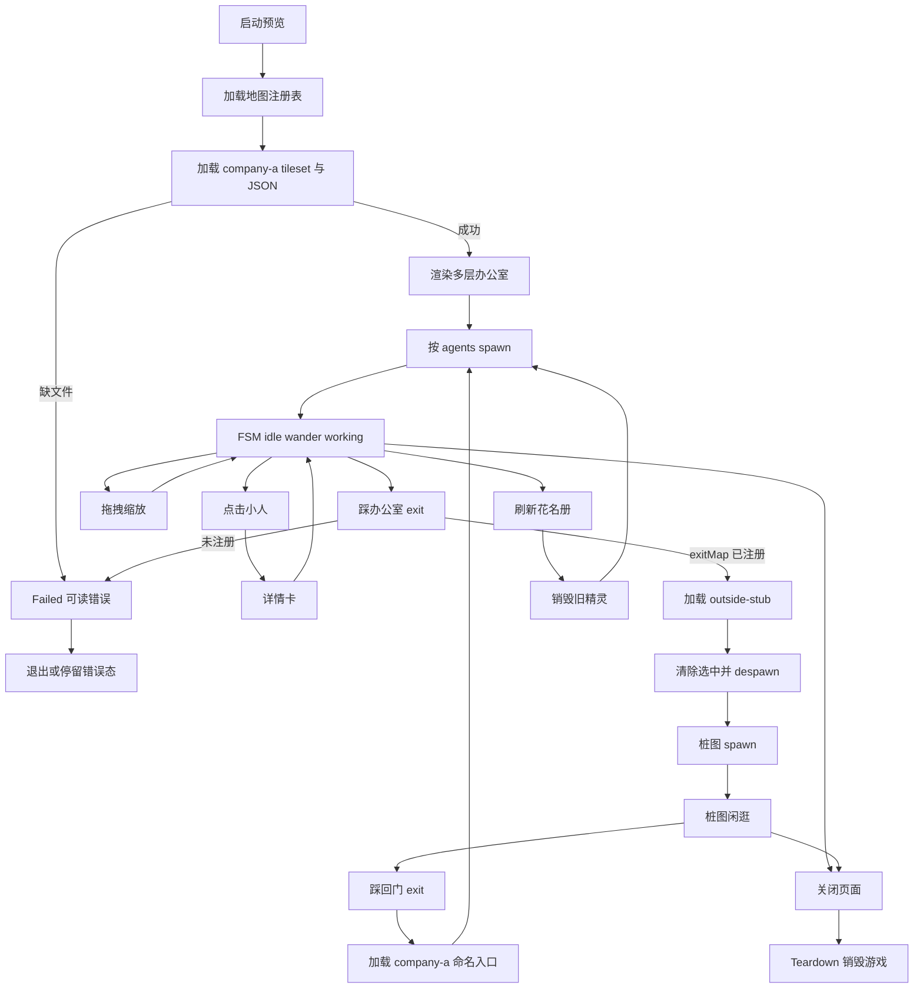
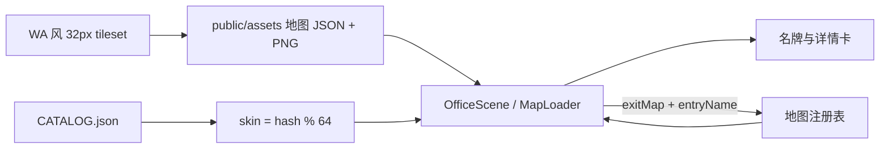
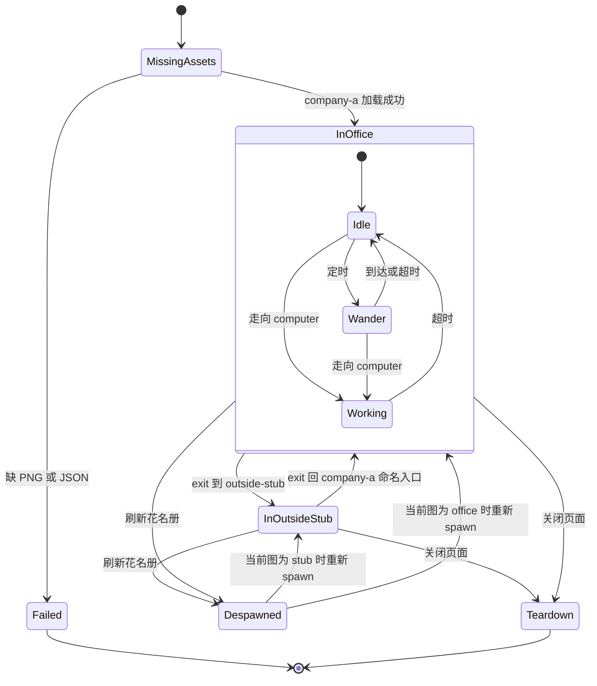

---

## name: prd-00002-tiled-office-world
sequence: 2
description: 换成 WA 风 32×32 瓦片 + Phaser Tiled 多层；一家公司多房间，可走出到室外桩图
status: accepted
created: 2026-09-11T01:46:31Z
implemented_at: 2026-09-11T02:15:25Z
implemented_scope: R0,R1
s2_status: skipped_manual
last_accepted_at: 2026-09-11T02:45:34Z
accepted_commit: a42e304
accepted_branch: main
accepted_scope: R0,R1

# PRD: Tiled 办公室世界

| 属性      | 值                                                                                                                                    |
| ------- | ------------------------------------------------------------------------------------------------------------------------------------ |
| 状态      | 工程：accepted（维护者确认结项；外置 S2 曾跳过；见文末「工程验收状态」）                                                                              |
| 范围      | 办公室地图引擎与美术；进出场景骨架；不改花名册语义与 CatalogSource                                                                                             |
| 关联文档    | `README.md`、`docs/dev-guide.md`、`docs/map-editing.md`、`public/assets/CREDITS.md`、`src/game/OfficeScene.ts`、`specs/prds/prd-00001-office-asset-redesign.md` |
| 参考项目根目录 | **绝对路径** `/Users/peng.zhi/Documents/Object/参考项目/workadventure`；相对本仓根 `../../参考项目/workadventure`（本仓不在 WA 子目录内，需本机已克隆该目录）              |

## 参考项目路径（工程师必读）

只学结构与美术布局，**禁止**复制 `play/` 后端、聊天、Jitsi、AGPL 源码进本仓。下列路径均相对于参考项目根目录；完整绝对路径 = 根目录 + 下表相对路径。

| 用途           | 相对路径（自参考根）                                                                                          | 绝对路径                                                                                               |
| ------------ | --------------------------------------------------------------------------------------------------- | -------------------------------------------------------------------------------------------------- |
| 参考根          | `.`                                                                                                 | `/Users/peng.zhi/Documents/Object/参考项目/workadventure`                                              |
| 主办公室地图（分层蓝本） | `maps/starter/map.json`                                                                             | `/Users/peng.zhi/Documents/Object/参考项目/workadventure/maps/starter/map.json`                        |
| 略大办公室样例      | `maps/starter/chatzone.json`                                                                        | `/Users/peng.zhi/Documents/Object/参考项目/workadventure/maps/starter/chatzone.json`                   |
| 办公室瓦片 PNG    | `maps/assets/tileset1.png`、`tileset1-repositioning.png`、`tileset5_export.png`、`tileset6_export.png` | `/Users/peng.zhi/Documents/Object/参考项目/workadventure/maps/assets/`                                 |
| 碰撞/功能色块瓦片    | `maps/assets/Special_Zones.png`                                                                     | `/Users/peng.zhi/Documents/Object/参考项目/workadventure/maps/assets/Special_Zones.png`                |
| 进出场景文档       | `docs/map-building/tiled-editor/entry-exit.md`                                                      | `/Users/peng.zhi/Documents/Object/参考项目/workadventure/docs/map-building/tiled-editor/entry-exit.md` |
| 地图硬约束文档      | `docs/map-building/tiled-editor/wa-maps.md`                                                         | `/Users/peng.zhi/Documents/Object/参考项目/workadventure/docs/map-building/tiled-editor/wa-maps.md`    |
| 多图出口对照（测试）   | `maps/tests/exit1.json`、`maps/tests/exit2.json`                                                     | `/Users/peng.zhi/Documents/Object/参考项目/workadventure/maps/tests/exit1.json` 等                      |
| 家具实体库（可选参考）  | `play/public/collections/FurnitureCollection.json`、`OfficeCollection.json`                          | `/Users/peng.zhi/Documents/Object/参考项目/workadventure/play/public/collections/`                     |
| 成品预览条        | `README-MAP.png`                                                                                    | `/Users/peng.zhi/Documents/Object/参考项目/workadventure/README-MAP.png`                               |

**本仓应对齐改动的落点（实现时）：**

| 用途        | 本仓路径                                                                      |
| --------- | ------------------------------------------------------------------------- |
| 当前办公室场景   | `src/game/OfficeScene.ts`                                                 |
| 游戏创建      | `src/game/createGame.ts`                                                  |
| 静态素材目录    | `public/assets/`（新 Tiled JSON + tileset 放此处或其子目录，如 `public/assets/maps/`） |
| 素材署名      | `public/assets/CREDITS.md`                                                |
| 布局生成/校验脚本 | `scripts/gen-pixel-assets.mjs`（本 PRD 改为校验 Tiled）                          |
| 角色组装      | `scripts/pack-office-assets.mjs` → `public/assets/characters.png`         |

若本机没有参考目录：向维护者索取同一路径克隆，或从 [WorkAdventure GitHub](https://github.com/workadventure/workadventure) 克隆后把本地根路径写回本表（改 PRD 修订记录即可）。

美术 / 工程师可视化改图、碰撞与出门工作流见 [`docs/map-editing.md`](../../docs/map-editing.md)。

## 背景与问题

当前大屏运行时用 `office.png` atlas + `office-layout.json`：棋盘格地板上铺约 21 张桌与垃圾桶，几乎没用 atlas 里的墙/门/会议/绿植。观感不像「能走进去的公司」。

上一代 `[specs/prds/prd-00001-office-asset-redesign.md](specs/prds/prd-00001-office-asset-redesign.md)` 已打通 Pipoya 64 套与 atlas 管道（工程 partial），但地图仍是程序生成的稀疏工位，且未采用真瓦片多层。

本 PRD 要对齐 WorkAdventure 的**视觉与地图骨架**（32×32 正交瓦片、分层构图、出门/回来），在本仓用 Phaser Tilemap 自研薄层实现；**不**引入 WA 多人、聊天、Jitsi、AGPL 后端。

## 目标与非目标

### 目标（MVP / Release 0）

- 运行时地图改为 **Tiled JSON + 32×32 tileset**；不再加载 `office.png` / `office-layout.json`。
- 一家公司主图：外墙 + 内隔断，至少含**工位区、会议室、休息角、前台/入口**。
- 图层约定（学 WA，可微调命名）：`floor` / `walls` / `furniture` / `above*` + 独立碰撞 + `start`；工位用 objects 或等价物提供 `spawn_*` / `computer_*`。
- **出门管道：** 从办公室大门踩 exit → 切到室外/园区**桩图** → 再从命名入口走回办公室门口（不是重置到办公室中心）。
- 地图用 **id 注册表**（如 `company-a`、`outside-stub`），exit 指向 map id，为未来多公司/超大图留扩展点。
- Pipoya 64 套、花名册映射、idle / wander / working、点击详情、拖拽缩放保留；`CHAR_SCALE` 倾向改为 **1**（对齐 32px 格）。
- `CREDITS.md` 写明瓦片来源与许可（若用 WA starter：CC-BY-SA 3.0）；`pnpm gen:assets` 改为校验 Tiled 地图，**不得覆盖第三方 PNG**。

### 非目标

- 校园级超级大地图、地图上**多家公司**、公司间传送（另立 PRD；本 PRD **禁止** Release 2+）。
- 复制 WorkAdventure `play/` 后端、聊天、Jitsi、`.wam` 运行时编辑器、AGPL 源码。
- HUD（顶栏 / 名牌 / 详情卡）像素风重做；坐下、开会、换装、实时任务状态。
- 改 `CATALOG.json` 增加 company 字段；新 CatalogSource（SQLite/Postgres）。
- 覆盖或重验收 00001 的 Pipoya 接入本身。

## 术语

| 术语            | 含义                                              |
| ------------- | ----------------------------------------------- |
| Tiled 地图      | Tiled 导出的正交 JSON（嵌入或同目录 tileset），32×32          |
| 地图注册表         | 本仓静态 map id → JSON 路径的映射；exit 只引用 id            |
| company-a     | 本期唯一公司主图 id                                     |
| outside-stub  | 室外/园区桩图：小、可走、有回门，不是超大图                          |
| exit / entry  | 踩瓦或区切图；命名入口让回来落在门口                              |
| floorLayer 语义 | WA 用 objectgroup 分角色上下；本仓可用 above 层或 Y 排序等价实现遮挡 |
| CHAR_SCALE    | 角色显示倍率；R0 倾向 1，使 Pipoya 站进 32px 格               |

## 已拍板规则 / 取舍

| 议题        | 决议                                         | 说明                                |
| --------- | ------------------------------------------ | --------------------------------- |
| 美术来源      | WA 风 32×32 正交瓦片                            | 放弃运行时斜侧 `office.png` atlas        |
| 引擎        | Phaser `tilemapTiledJSON` / `make.tilemap` | 不换引擎版本；不拷 WA 代码                   |
| 公司数量      | 本期只有一家                                     | 注册表可扩展，花名册不加 company              |
| 出门        | R0 必须有往返桩图                                 | 证明多场景管道，不是空注释                     |
| 超大图 / 多公司 | 非目标                                        | 写入开放项，另立 PRD                      |
| 角色        | Pipoya 不变                                  | `skin = hash(id) % 64`；无 hue tint |
| 缩放        | `CHAR_SCALE≈1`                             | 实现可微调；名牌偏移跟着改                     |
| exit 字段   | `exitMap` + `entryName`                    | 不必兼容 WA 公网 `exitUrl`              |
| 瓦片许可默认    | 先用 WA starter 可验收                          | CREDITS 写全；衍生地图 share-alike       |
| 切图相机      | 落到新图 start，仍自由拖拽                           | 大屏观众视角，不跟单人                       |
| HUD       | 本期不动                                       | 进非目标                              |

## 用户与角色

| 角色                  | 目标                                |
| ------------------- | --------------------------------- |
| 大屏观众（主）             | 看见像公司的瓦片办公室；能拖到会议/休息；看见小人出门再回来    |
| 游戏前端 / 验收（内部）       | 按 R0/R1 切片实现；地图 id、图层、CREDITS 可维护 |
| 维护者                 | 增地图 JSON 即可扩展，不改花名册 schema        |
| 素材作者（若用 WA starter） | CC-BY-SA 3.0 署名与 share-alike 被遵守  |

## 功能域

### 美术替换

1. 入库 Tiled 主图 + 桩图 JSON，及 32×32 tileset PNG。
2. `OfficeScene`（或拆出的地图加载模块）改为 `load.tilemapTiledJSON`，按层创建 TilemapLayer。
3. 旧 `office.png` / `office_core_atlas.json` / `office-layout.json`：R0 可留仓但**不再加载**；是否删除见开放项。
4. `CREDITS.md` 更新瓦片作者、链接、许可；禁止再分发独立素材包。

### 场景与网格

- 主图：外墙 + 内隔断；工位数 **≥ 21**；人数超额 hash 复用工位。
- 碰撞来自碰撞层或 tileset `collides`；门洞必须开口，禁止把 exit 封死。
- 角色深度：above 层或 `setDepth(y)`，与家具遮挡可读。

### 地图注册与出门

- 静态注册：`company-a` → 办公室 JSON；`outside-stub` → 桩图 JSON。
- 办公室门口 exit → `outside-stub` + 命名入口。
- 桩图回门 → `company-a` + 门口命名入口；缺命名入口时回退默认 `start`。
- 切图：销毁当前图精灵 → 加载目标图 → 在 entry/start spawn；详情卡若选中已销毁精灵则清除选中。
- 桩图**不**放第二家公司。

### 生成器 / 校验

- `pnpm gen:assets`：校验图层名、start、碰撞、spawn/computer、exit 目标 id 已注册；不覆盖第三方 PNG。
- `pnpm pack:assets`：仍只组装 Pipoya `characters.png`。

### 与工程文档冲突

`docs/dev-guide.md` 仍描述已弃用的 atlas / 旧 `office.json` 路径；**以实现本 PRD 为准**，实现阶段同步改文档。

## 用户故事地图与版本切片

### 旅程主干表

| 步骤  | 节点        | Entry / Exit        | 说明                          |
| --- | --------- | ------------------- | --------------------------- |
| 1   | 启动预览      | **Entry**           | `pnpm dev` 或 `pixel-office` |
| 2   | 加载注册表与主图  |                     | tileset + `company-a`       |
| 3   | 看见一家公司多房间 |                     | 工位 / 会议 / 休息 / 前台可读         |
| 4   | 小人 spawn  |                     | Pipoya；FSM 运行               |
| 5   | 点选 / 拖缩放  |                     | 详情卡、相机                      |
| 6   | 走出大门      |                     | exit → `outside-stub`       |
| 7   | 桩图闲逛      |                     | 小图可走                        |
| 8   | 走回门口      |                     | 命名入口落在办公室门，非地图中心            |
| 9   | 刷新花名册     |                     | 当前图内 despawn → spawn        |
| 10  | 关闭页面      | **Exit / Teardown** | 销毁游戏；无悬空逻辑                  |

### 用户故事地图

#### 阶段 A：看见瓦片公司

| 故事                                             | 验收要点                                                                |
| ---------------------------------------------- | ------------------------------------------------------------------- |
| 作为大屏观众，我想要看到 32×32 瓦片分层办公室，以便立刻感到这是「公司」而非棋盘格工位 | 启动后主图为 Tiled 渲染；可见外墙与至少工位/会议/休息/前台四区之一组可读分区；不再加载 `office.png` atlas |
| 作为大屏观众，我想要拖拽与缩放浏览全貌，以便扫完整间办公室                  | 拖拽移动相机、滚轮缩放仍可用；相机 bounds 等于当前地图                                     |

#### 阶段 B：员工仍可用

| 故事                                  | 验收要点                                                                  |
| ----------------------------------- | --------------------------------------------------------------------- |
| 作为大屏观众，我想要小人在瓦片格上四向走动，以便办公室有动感      | idle / wander / working 仍切换；碰撞挡墙不穿模；`skin = hash(id) % 64`；无 hue tint |
| 作为大屏观众，我想要点击小人看详情，以便了解 owns / blurb | 点击弹出详情卡；点空白取消；切图后旧选中清除                                                |

#### 阶段 C：走出再回来

| 故事                               | 验收要点                                    |
| -------------------------------- | --------------------------------------- |
| 作为大屏观众，我想要从大门走出办公室，以便感到世界不止一间屋   | 踩 exit 区后进入 `outside-stub`；镜头落到桩图 start |
| 作为大屏观众，我想要从外面走回同一扇门，以便空间连续       | 回门后出现在办公室门口命名入口；不是办公室中心默认 spawn         |
| 作为开发，我想要 exit 目标缺失时失败可诊断，以便不黑屏死锁 | 未注册 map id 时页面或控制台有可读错误；不进入无反馈挂死        |

#### 阶段 D：扩展点与合规

| 故事                                  | 验收要点                                                      |
| ----------------------------------- | --------------------------------------------------------- |
| 作为维护者，我想要地图用 id 注册，以便将来加第二家公司不必改花名册 | 存在静态注册表；exit 引用 id；本期仅注册 `company-a` 与 `outside-stub`     |
| 作为维护者，我想要 CREDITS 正确，以便合规使用瓦片       | `CREDITS.md` 含作者、链接、许可（CC-BY-SA 若用 WA starter）；原包 zip 不入库 |
| 作为开发，我想要校验脚本不毁掉第三方贴图，以便可重复构建        | `gen:assets` 不覆盖 tileset/characters PNG                   |

### Release 0（必选 / MVP）

**本期做：**

- WA 风 32×32 瓦片 + Tiled 多层 `company-a`（多房间、碰撞、spawn/computer）。
- 地图注册表 + `outside-stub` 往返（exit / 命名入口）。
- Phaser Tilemap 接入；停用 atlas 运行时路径；`CHAR_SCALE≈1`。
- Pipoya / FSM / 详情 / 拖缩放 / 刷新花名册保留。
- CREDITS + gen:assets 校验；空/超量花名册可接受。

**可验收结果：**

- 本地启动视觉明显区别于棋盘格 + 21 桌版。
- 能走出再走回门口至少一轮。
- 抽查 3 个不同 id：外观不同且刷新不变；点选与名牌可用。
- `CREDITS.md` 与本 PRD / 索引已登记。

**本期不做：** 第二家公司、超大图、HUD 重做、桩图精美园区、删除旧 atlas 文件（可留仓）。

### Release 1（可选 / 同 PRD 增强）

**本期做：**

- 桩图更像园区过道（仍非超大图、仍无第二公司）。
- 门口命名出入口与门瓦对齐；办公室装饰更密（仍用已选 tileset）。
- 切图失败 / 缺图的页面级提示更完整。

**本期不做：** 多家公司、校园超大图、HUD 重做、Jitsi / 坐下（仍属非目标）。

## 核心流程与状态机图

### 主业务流程图

### 素材与数据衔接（高层）

### 核心对象状态图

**死胡同预警：**

- `Failed` / 未注册 `exitMap` 必须可读错误，禁止无反馈黑屏。
- `Working` 在 computers 为空时回退 idle。
- 回来缺命名入口 → 回退默认 `start`，并记日志。
- 每个旅程有 Entry（启动）与 Exit（Teardown）；切图走 despawn → 新图 spawn，不悬空。

## 数据与 API 衔接

| 层             | 约定                                                                                                                 |
| ------------- | ------------------------------------------------------------------------------------------------------------------ |
| 花名册           | 仍只渲染 `workspaces[]`；字段映射不变；**不加** company 字段                                                                       |
| Persona       | `skin: hash(id) % 64`；不染色                                                                                          |
| 静态资源          | 地图 JSON + tileset PNG + `characters.png`；停用运行时 `office.png` / `office-layout.json`                                 |
| 地图注册          | id → 路径；本期 `company-a`、`outside-stub`                                                                              |
| 图层 / 对象       | floor / walls / furniture / above* / collision / start；objects 含 spawn / computer；exit 层或属性含 `exitMap`、`entryName` |
| CatalogSource | 不改；仍为 JsonFileSource                                                                                               |

## 假设与待确认 / 开放项

| 编号  | 项                                   | 状态                            |
| --- | ----------------------------------- | ----------------------------- |
| A1  | `CHAR_SCALE` 最终取 1（可微调）             | 已定倾向                          |
| A2  | 瓦片直接用 WA starter（CC-BY-SA）以便 R0 可验收 | 默认假设；若改自绘/另购须更新 CREDITS       |
| A3  | 工位目标仍约 21 vs 预留 40+                 | 开放；R0 至少 ≥21                  |
| A4  | 主图 Tiled 手摆 vs 脚本生成 JSON            | 开放；以可验收分区为准                   |
| A5  | 旧 `office.png` / layout 是否删除        | 开放；R0 可不加载即可                  |
| A6  | 切图相机落到 start 后仍自由拖拽                 | 已定默认                          |
| A7  | above 层 vs 纯 Y 排序实现遮挡               | 开放；工程择一，验收看可读遮挡               |
| A8  | 超级大地图 / 多公司                         | **非目标**；另立 PRD，本 PRD 仅留注册表扩展点 |

## 修订记录

| 日期         | 说明                                                                |
| ---------- | ----------------------------------------------------------------- |
| 2026-09-11 | 初稿：由 `/team:product-manager` 落盘；Tiled 多层 + WA 风瓦片 + 单公司出门桩图；R0/R1 |
| 2026-09-11 | 补「参考项目路径（工程师必读）」：WA 绝对/相对路径表 + 本仓落点                               |
| 2026-09-11 | 关联 `docs/map-editing.md`：Tiled 改图 / 碰撞 / exit 知识文                              |
| 2026-09-11 | S1 落地 R0+R1；外置 S2 按维护者要求跳过，status→implemented 待人工验收 |
| 2026-09-11 | 维护者确认结项验收：coverZoom + 墙瓦重刷后 status→accepted |

## 工程验收状态

> 由 `/team:prd-accept` 维护；勿手工编造「通过」。最后更新：2026-09-11T02:45:34Z，main@a42e304，范围：R0,R1。
> 外置 Claude S2 曾跳过；本次按维护者明确要求「结项验收」对照仓库实现回写 `accepted`。

### 总览

- 工程状态：`accepted`
- 验收判定：通过（R0+R1，维护者确认结项）
- 最近验收：main@a42e304
- 摘要：
  1. Phaser Tiled 多层 `company-a` / `outside-stub`；停用 `office.png` 运行时路径
  2. 地图注册表 + exit/entry 往返；`CHAR_SCALE=1`；Pipoya / FSM / 详情 / 拖缩放 / 刷新保留
  3. 工位 ≥21（桌+显示器+椅）；墙瓦 58/63/73/45；相机 `coverZoom` 禁止缩出黑边
  4. CREDITS CC-BY-SA；`gen:assets` 只校验；`pnpm build` 绿

### Release 交付

| Release | 状态 | 说明 |
| --- | --- | --- |
| R0 | 通过 | Tiled 主图、注册表、往返桩图、FSM/详情/拖缩放 |
| R1 | 通过 | 桩图园区感、门对齐、页面级错误横幅；后续缩放/墙瓦修补已合入 |

### 功能验收清单（Agent 优先读此表）

| ID | 能力摘要 | Release | 状态 | 证据 |
| --- | --- | --- | --- | --- |
| R0-1 | 32×32 Tiled 多层办公室，四区可读 | R0 | 通过 | `public/assets/maps/company-a.json`；`OfficeScene` tilemap |
| R0-2 | 停用 office.png 运行时路径 | R0 | 通过 | `OfficeScene.preload`：maps + characters |
| R0-3 | 地图注册表 + outside-stub 往返 | R0 | 通过 | `src/game/mapRegistry.ts`；exit `exitMap`/`entryName` |
| R0-4 | CHAR_SCALE≈1；FSM/点选/拖缩放/刷新 | R0 | 通过 | `OfficeScene.ts` `CHAR_SCALE=1`；`coverZoom` |
| R0-5 | CREDITS + gen:assets 校验不覆盖 PNG | R0 | 通过 | `CREDITS.md`；`scripts/gen-pixel-assets.mjs` |
| R1-1 | 桩图像园区过道 | R1 | 通过 | `outside-stub.json` |
| R1-2 | 门口命名入口与门对齐 | R1 | 通过 | `office-door` / `from-office` |
| R1-3 | 切图失败页面级提示 | R1 | 通过 | `App.tsx` assetsError 横幅 |

### 未完成与遗留

- 外置 S2 未出机器可读 `VERDICT`（维护者跳过）；本验收以仓库证据 + 维护者结项确认为准。
- 旧 `office.png` / layout 仍留仓、不加载（开放项 A5）。
- 美术精修另开迭代；本 PRD 非目标（多公司 / 超大图 / HUD 重做）未做。

### 质量检查

| 检查项 | 状态 |
| --- | --- |
| pnpm build | 通过 |
| pnpm lint | 通过（近期改动） |
| pnpm gen:assets | 通过 |
| 外置 S2 VERDICT | 跳过（维护者确认） |
| 文档同步 | 已更新 |

---
统计：通过 8 / 部分 0 / 未实现 0 / 范围外 0

