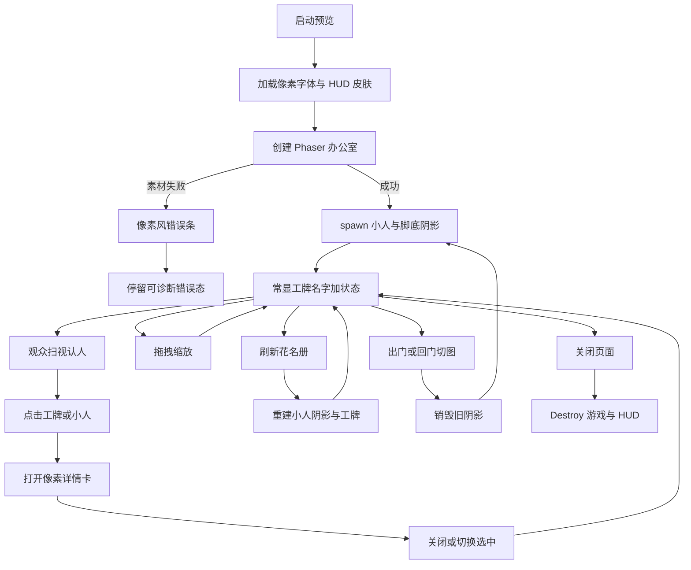
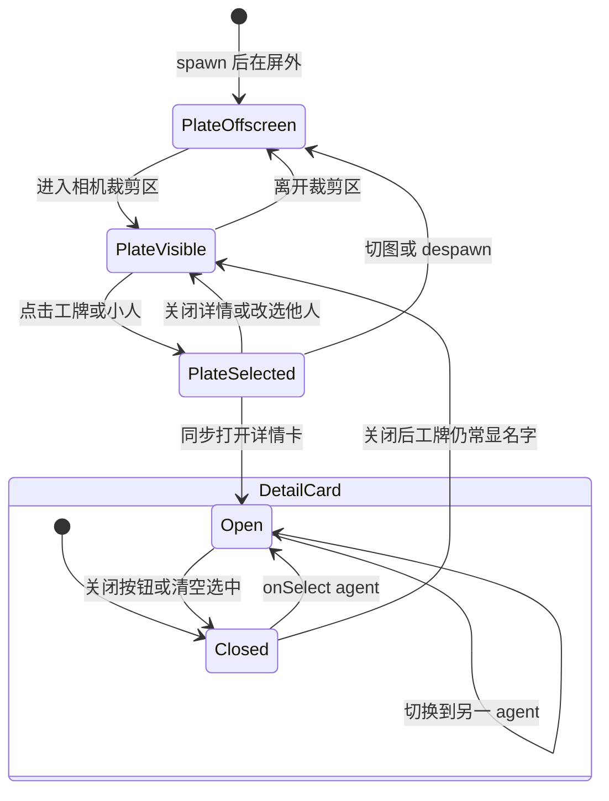
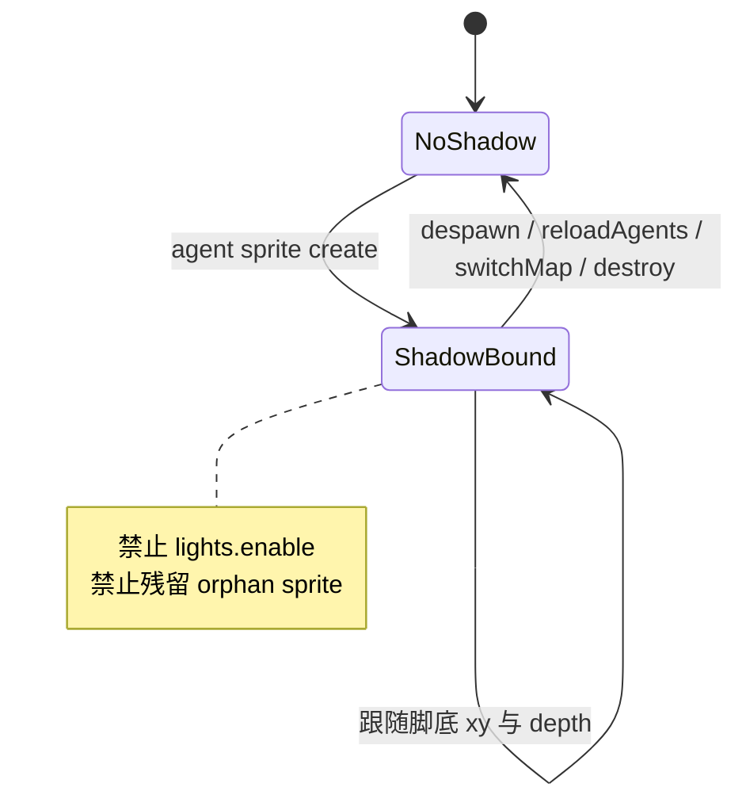

# PRD: 像素 HUD 与小人落地感

| 属性   | 值                                                                                                                                 |
| ---- | --------------------------------------------------------------------------------------------------------------------------------- |
| 状态   | 工程：accepted（维护者确认 R0 结项；外置 S2 跳过；见文末「工程验收状态」）                                                                              |
| 范围   | React HUD 皮肤（名牌 / 顶栏 / 详情卡 / 素材错误条）+ 中文像素字体；Phaser 小人脚底阴影；核实既有 `pixelArt`。不改花名册语义、Tiled 地图、FSM、CatalogSource                         |
| 关联文档 | `README.md`、`docs/dev-guide.md`、`public/assets/CREDITS.md`、`src/ui/NameplateLayer.tsx`、`src/ui/Toolbar.tsx`、`src/ui/AgentCard.tsx`、`src/index.css`、`src/game/createGame.ts`、`src/game/OfficeScene.ts`、`specs/prds/prd-00002-tiled-office-world.md` |

## 背景与问题

办公室世界已是 WA 风 32×32 瓦片 + Pipoya 小人（见 `prd-00002-tiled-office-world`），但 HUD 仍是现代 Web 皮肤：`IBM Plex Sans` / 系统黑体、圆角、半透明 `stone-950` 黑底。头顶「气泡」与侧栏、顶栏和像素地图极度不协调。

外部建议曾提出：用像素框 + emoji，**悬停再出详细文本**；以及 Phaser Light2D / 环境光。对本仓大屏场景：

- 观众需要**远距离扫视认人**，工牌名字必须**一直显示**（像工牌），不能做成 RPG 悬停气泡。
- `createGame.ts` **已开启** `pixelArt: true`、`antialias: false`、`roundPixels: true`，不必当新功能重复建设。
- 本仓瓦片**无法线贴图**；真 Light2D 容易变成整屏染色，**本期不做灯光**。

名牌架构已正确：Phaser 算屏幕坐标 → React `NameplateLayer` 常显名字 + 截断状态。问题在 **CSS / 字体 / 边框视觉**，以及小人缺脚底阴影导致「悬浮」。

## 目标与非目标

### 目标（MVP / Release 0）

- 引入可入库、许可清晰的**中文像素字体**；HUD（名牌、顶栏、详情卡、素材错误条）统一使用。
- 工牌改为**直角像素边框**（9-slice 或 `border-image`），去掉 `rounded-*` / `backdrop-blur` 等现代玻璃感。
- **名字常显**：每个可见员工头顶工牌持续显示名字（及一行截断状态，维持现状）；禁止「悬停才出名字」或「emoji 代替名字」。
- 选中工牌有可读的像素高亮（边框/底色变化），点击工牌或小人仍打开详情卡。
- 每个小人脚下有一块淡阴影 sprite，随角色移动与 depth，让角色「落地」。
- 自检：Phaser 配置中 `pixelArt` / `roundPixels` 仍为 true（已有则核实，不重做）。

### 非目标

- 悬停才显示名字；用 💬💡⌨️☕ 等 emoji 替代工牌文字。
- Phaser Light2D / 台灯 / 窗光 / 法线贴图 / 改瓦片材质。
- 把名牌迁入 Phaser `BitmapText`（继续 React overlay + `onNameplates`）。
- 名牌碰撞避让算法、随相机 zoom 缩放字号。
- 改花名册字段、实时任务状态监控、新 CatalogSource。
- 重做 Tiled 地图或角色 FSM。

## 术语

| 术语        | 含义                                                                 |
| --------- | ------------------------------------------------------------------ |
| 工牌 / 名牌   | 小人头顶 HTML overlay：名字 + 一行截断状态；本 PRD 要求常显、像素框                        |
| 像素 HUD    | 顶栏、工牌、详情卡、素材错误条同一套像素字体与直角边框皮肤                                     |
| 9-slice   | 九宫格拉伸像素边框（CSS `border-image` 或小 PNG 拼框）                            |
| 脚底阴影      | 角色脚下的半透明椭圆/像素块 Sprite，非 Light2D                                    |
| pixelArt  | Phaser 配置项；本仓已开，R0 仅核实                                             |

## 已拍板规则 / 取舍

| 议题           | 决议                                      | 说明                                      |
| ------------ | --------------------------------------- | --------------------------------------- |
| 名字显示         | **常显工牌**，永不因悬停策略隐藏名字                    | 外部「悬停再展示」仅作参考，不采纳                       |
| 名牌内容         | 名字 + 一行截断 `status`（现状）                  | 长文案仍在详情卡；不扩成多行气泡                        |
| HUD 范围       | 名牌 + 详情卡 + 顶栏 + 素材错误条                    | 三者原是同一套 black bubble，只改气泡仍割裂            |
| 渲染架构         | 继续 React overlay                        | 不改 `NameplateView` / `onNameplates` 数据流 |
| 字体           | 优先可商用入库中文像素字体（如缝合像素 / Ark Pixel OFL）    | Zpix 仅备选；许可不过关则不用；须写 `CREDITS.md`       |
| 视觉           | 直角像素框；去掉圆角与 backdrop-blur               | 可用 9-slice / border-image                |
| 重叠           | R0 不做避让；选中名牌 z-index 置顶                 | R1 可加强选中置顶稳定性                           |
| 相机缩放         | 名牌屏幕固定字号（现状）                            | 不随 zoom 变大变小                            |
| Phaser 增强    | **仅脚底阴影**                               | 灯光 / Light2D 明确不做                       |
| pixelArt 配置  | 已有则核实，不当新需求                             | `createGame.ts`                         |

## 用户与角色

| 角色            | 目标                                           |
| ------------- | -------------------------------------------- |
| 大屏观众（主）       | 远距离扫视认出每个员工名字；画面像一体的像素办公室，而非网页浮层贴在游戏上       |
| 运维 / 演示操作者    | 顶栏刷新花名册、读错误提示仍清晰；交互习惯不变（点小人/工牌看详情）          |
| 游戏前端 / 验收（内部） | 按 R0/R1 改 CSS/字体与阴影；不碰地图与花名册语义               |
| 维护者           | 字体许可与署名可审计；HUD 皮肤集中、可再调色                     |

## 功能域

### 字体

1. 选定字体文件放入 `public/`（建议 `public/fonts/`），`@font-face` 接入 [`src/index.css`](../../src/index.css)。
2. HUD 组件与全局 `body`（或明确的 HUD 作用域）使用该 `font-family`。
3. [`public/assets/CREDITS.md`](../../public/assets/CREDITS.md) 增加字体作者、链接、许可。

### 工牌（NameplateLayer）

1. 像素边框 + 像素底；去掉圆角与强模糊玻璃感。
2. 可见小人：名字与状态行**持续渲染**（`visible` 仍由屏幕裁剪控制）。
3. 选中态高亮；点击仍 `onSelect`。
4. 保留 lifecycle 色点（或等价像素指示），不改为 emoji 图标体系。

### 顶栏 / 详情卡 / 错误条

1. [`Toolbar.tsx`](../../src/ui/Toolbar.tsx)、[`AgentCard.tsx`](../../src/ui/AgentCard.tsx)、`App.tsx` 内素材错误条共用同一皮肤 token（边框、底色、字号阶梯）。
2. 交互不变：刷新花名册、关闭详情卡、字段结构（title / owns / blurb / siblings）不变。

### 脚底阴影（OfficeScene）

1. 每个 agent sprite 配套阴影 GameObject（椭圆或小 PNG）。
2. 每帧（或与移动同步）跟随脚底位置；`depth` 略低于角色，避免盖住身体。
3. despawn / 切图 / `reloadAgents` 时同步销毁阴影，禁止泄漏。
4. **不**调用 `this.lights.enable()`，不改 tileset。

### 与工程文档

实现后同步 [`docs/dev-guide.md`](../../docs/dev-guide.md)「常见改动落点」中名牌/顶栏/详情卡说明，注明像素皮肤与字体路径。

## 用户故事地图与版本切片

### 旅程主干表

| 步骤 | 节点           | Entry / Exit        | 说明                                      |
| -- | ------------ | ------------------- | --------------------------------------- |
| 1  | 启动预览         | **Entry**           | `pnpm dev` / `pixel-office`             |
| 2  | 看见像素风顶栏      |                     | 字体与直角框已加载                               |
| 3  | 扫视办公室        |                     | 每个可见小人头顶工牌显示名字（可带截断状态）                  |
| 4  | 认人           |                     | 不悬停即可读出名字                               |
| 5  | 点击工牌或小人      |                     | 打开像素风详情卡                                |
| 6  | 关闭详情 / 点另一人  |                     | 选中高亮切换；旧卡关闭或替换                          |
| 7  | 拖拽缩放         |                     | 工牌跟屏幕坐标；字号不随 zoom 漂                       |
| 8  | 刷新花名册        |                     | 工牌与阴影随 spawn 重建                         |
| 9  | 切图出门/回门      |                     | 阴影不残留；工牌跟新图小人                           |
| 10 | 关闭页面         | **Exit / Teardown** | 销毁游戏与 HUD；无悬空阴影                         |

### 用户故事地图

#### 阶段 A：像素 HUD 一体感

| 故事                                                    | 验收要点                                                                 |
| ----------------------------------------------------- | -------------------------------------------------------------------- |
| 作为大屏观众，我想要顶栏像像素 UI 而非现代网页条，以便和办公室同调                       | 顶栏使用像素字体与直角边框；无 backdrop-blur 玻璃条观感                                  |
| 作为大屏观众，我想要详情卡与工牌同一皮肤，以便点开后不跳出「另一套产品」                      | 详情卡边框/字体/底色与工牌、顶栏一致；字段内容仍完整可读                                        |
| 作为维护者，我想要字体许可写进 CREDITS，以便合规演示                          | `CREDITS.md` 含字体名、来源链接、许可；字体文件在 `public/` 可构建                        |

#### 阶段 B：工牌认人

| 故事                                                  | 验收要点                                                                  |
| --------------------------------------------------- | --------------------------------------------------------------------- |
| 作为大屏观众，我想要每个员工头顶一直显示名字，以便远距离认人、不必悬停                    | 启动后无需 hover；视野内每个 agent 工牌含名字；名字不因「气泡策略」隐藏                           |
| 作为大屏观众，我想要点击工牌打开详情，以便快速查 owns / blurb                 | 点击工牌与点击小人效果一致；选中工牌高亮可读                                                |
| 作为大屏观众，我想要状态行仍简短，以便工牌不挡半个屏幕                           | 状态仍为一行截断；长文案在详情卡                                                      |

#### 阶段 C：小人落地

| 故事                                                | 验收要点                                                                  |
| ------------------------------------------------- | --------------------------------------------------------------------- |
| 作为大屏观众，我想要小人脚下有淡阴影，以便角色落在地板上而非悬浮                    | 每个小人有可见脚底阴影；行走时阴影跟随；切图/刷新后无残留阴影                                      |
| 作为开发，我想要核实 pixelArt 仍开启，以便像素缩放不糊                     | `createGame` 配置仍含 `pixelArt: true` 与 `roundPixels: true`               |

### Release 0（必选 / MVP）

**本期做：**

- 中文像素字体接入 + CREDITS 署名。
- 工牌 / 顶栏 / 详情卡 / 素材错误条像素皮肤；工牌名字常显。
- 选中工牌高亮；交互与数据流不变。
- 小人脚底阴影（无 lights）。
- 核实既有 `pixelArt` / `roundPixels`。

**可验收结果：**

- 硬刷新后，HUD 视觉明显区别于圆角黑气泡版，且与瓦片办公室更协调。
- 抽查 ≥3 个可见小人：不悬停即可读出名字；点工牌可开详情卡。
- 行走中阴影跟随；刷新花名册与出门回门后无阴影泄漏。
- `CREDITS.md` 含字体条目。

**本期不做：** Light2D、悬停气泡策略、名牌避让、名牌迁 Phaser、改地图/花名册。

### Release 1（可选 / 同 PRD 增强）

**本期做：**

- 多名牌重叠时，选中工牌 z-index / 绘制顺序更稳（仍不做完整避让算法）。
- 空花名册、加载中等文案与像素皮肤对齐（若 R0 已覆盖则可标完成）。

**本期不做：** 灯光、法线、emoji 工牌、随 zoom 缩放字号（仍属非目标）。

## 核心流程与状态机图

### 主业务流程图

### 工牌与详情卡状态图

### 脚底阴影生命周期

## 数据与 API 衔接

- 无新后端 API；花名册仍 `/api/catalog`。
- `NameplateView` 字段保持：`id` / `name` / `status` / `lifecycle` / `screenX` / `screenY` / `visible`。
- 阴影为纯前端 GameObject，不进 catalog。

## 假设与待确认 / 开放项

### 默认假设（产品已拍板，实现按此执行）

1. 工牌常显名字 + 一行截断状态；不采用悬停策略。
2. HUD 全套像素化；脚底阴影做、灯光不做。
3. 继续 React overlay；相机缩放下工牌字号固定。
4. R0 不做名牌避让，仅选中置顶。

### 开放项

| 项 | 说明 | 建议 |
| -- | --- | --- |
| 字体最终选型 | 缝合像素 / Ark Pixel / 其他 OFL 中文像素字体 | 实现前确认许可与字重；Zpix 仅备选 |
| 9-slice 资源 | CSS 纯边框 vs 小 PNG 边框 | 优先少依赖；观感不够再加 PNG |
| 阴影形态 | 椭圆 Graphics vs 1 张小阴影 PNG | 实现自选，须淡、不抢戏 |
| 深色主题 token | 是否抽成 CSS 变量 / Tailwind `@theme` | R0 可硬编码同类色值；R1 可整理 |

### 冲突与决议需求

- `prd-00002` 将「HUD 像素风重做」列为非目标；**本 PRD 正式立项覆盖该项**，实现以本文件为准。
- 外部建议中的 Light2D / 悬停气泡：**明确拒绝**，勿在实现阶段回潮。

## 成功标准（可度量）

- 视野内 100% 可见 agent 在无 hover 时可读出名字（抽查 ≥5 人，若花名册不足则全员）。
- HUD 三件套（顶栏、工牌、详情卡）使用同一像素字体族；无圆角玻璃条作为主皮肤。
- 连续操作：刷新花名册 → 出门 → 回门 → 再刷新，场景中阴影数量与 agent 数量一致（无残留）。
- `CREDITS.md` 含字体署名；`pnpm build` 可通过。

## 依赖与风险

| 风险           | 缓解                                      |
| ------------ | --------------------------------------- |
| 中文字体文件过大拖慢首屏 | 选子集或合适字重；仅 HUD 用，不强制全站 bitmap           |
| 工牌过多遮挡地图     | 保持截断与小字号；R0 不做避让；开放项可另立 PRD             |
| 阴影与家具 depth 冲突 | 阴影 depth 略低于角色；抽查工位区与门口                  |
| 字体许可争议       | 入库前读 LICENSE；写 CREDITS；争议则换 OFL 替代      |

## 修订记录

| 日期         | 说明                                                                 |
| ---------- | ------------------------------------------------------------------ |
| 2026-09-11 | 初稿：像素 HUD 全套 + 工牌常显；脚底阴影；拒绝悬停气泡与 Light2D；R0/R1 切片                 |
| 2026-09-11 | R0 实现合入；维护者人工验收通过；外置 S2 跳过；文末工程验收状态回写 `accepted`（范围 R0） |

## 工程验收状态

> 由 `/team:prd-accept` 维护；勿手工编造「通过」。最后更新：2026-09-11T08:06:00Z，main，范围：R0。
> 外置 Claude S2 按维护者要求跳过；本次以仓库实现 + 维护者人工验收确认结项。

### 总览

- 工程状态：`accepted`
- 验收判定：通过（R0；维护者确认结项）
- 最近验收：main（本变更合入）
- 摘要：
  1. Fusion Pixel 12px zh_hans 入库 + `@font-face`；CREDITS OFL 署名
  2. 顶栏 / 工牌 / 详情卡 / 素材错误条共用 `.hud-panel` 直角像素皮肤；工牌常显；选中高亮置顶
  3. `OfficeScene` 椭圆脚底阴影随移动与 `clearAgents` 销毁；未启用 Light2D
  4. `createGame` 仍 `pixelArt` / `roundPixels`；`pnpm build` 绿

### Release 交付

| Release | 状态 | 说明 |
| --- | --- | --- |
| R0 | 通过 | 像素字体、HUD 四件套皮肤、工牌常显、脚底阴影、CREDITS |
| R1 | 范围外 | 本期未纳入；多名牌重叠稳定性 / 空花名册文案对齐仍属后续 |

### 功能验收清单（Agent 优先读此表）

| ID | 能力摘要 | Release | 状态 | 证据 |
| --- | --- | --- | --- | --- |
| R0-1 | 中文像素字体接入 + CREDITS | R0 | 通过 | `public/fonts/fusion-pixel-12px-proportional-zh_hans.woff2`；`src/index.css`；`CREDITS.md` |
| R0-2 | 顶栏直角像素皮肤、无玻璃条 | R0 | 通过 | `Toolbar.tsx` + `.hud-panel` |
| R0-3 | 工牌常显名字 + 选中高亮 | R0 | 通过 | `NameplateLayer.tsx`（无悬停隐藏） |
| R0-4 | 详情卡与工牌/顶栏同皮肤 | R0 | 通过 | `AgentCard.tsx`；`App.tsx` 错误条 |
| R0-5 | 脚底阴影跟随且切图/刷新无泄漏 | R0 | 通过 | `OfficeScene.ts` `shadows` + `clearAgents` |
| R0-6 | 核实 pixelArt / roundPixels | R0 | 通过 | `createGame.ts` |
| R1-1 | 多名牌重叠选中更稳 | R1 | 范围外 | — |
| R1-2 | 空花名册等文案对齐 | R1 | 范围外 | — |

### 未完成与遗留

- 外置 S2 未出机器可读 `VERDICT`（维护者跳过人工验收）。
- R1（重叠 z-index 加强、空态文案）未做。
- 非目标未做：Light2D、悬停气泡、名牌避让、名牌迁 Phaser。

### 质量检查

| 检查项 | 状态 |
| --- | --- |
| pnpm build | 通过 |
| pnpm lint | 通过 |
| 文档与 CREDITS 同步 | 通过 |

---
统计：通过 6 / 部分 0 / 未实现 0 / 范围外 2
