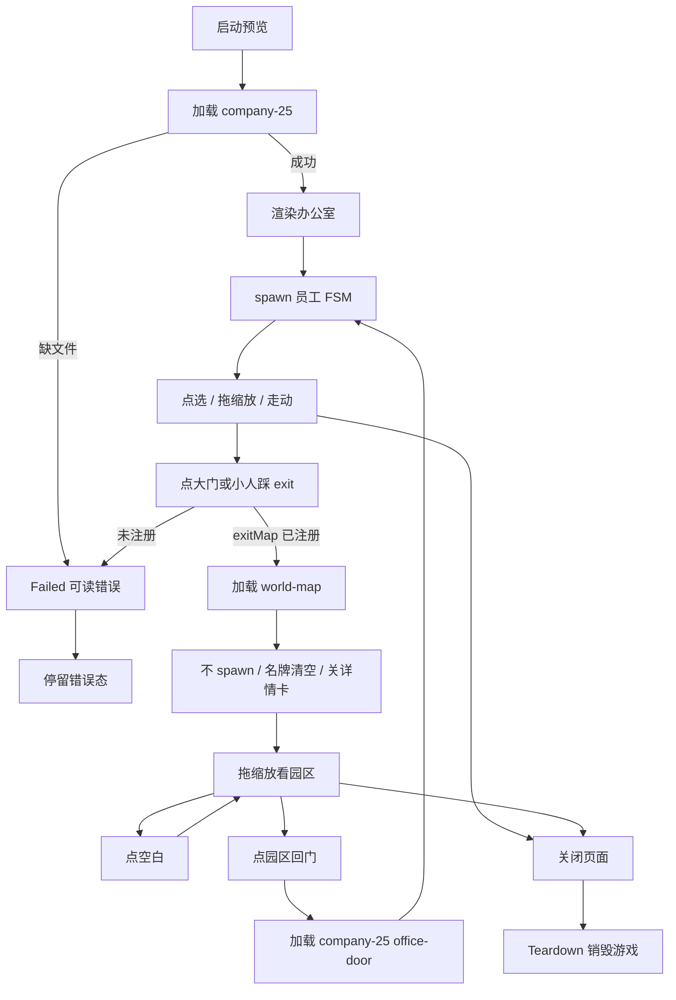
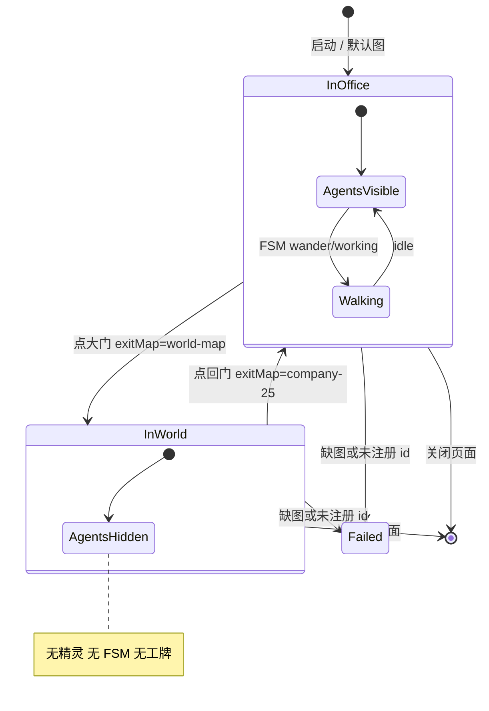

# PRD: 世界地图

| 属性      | 值                                                                                                                                                                                                 |
| ------- | ------------------------------------------------------------------------------------------------------------------------------------------------------------------------------------------------- |
| 状态      | 工程：backlog                                                                                                                                                                                         |
| 范围      | 出门场景从桩图升级为 WA Village 园区世界图；世界图不显示员工；地图注册表 `kind`；不改花名册语义与 CatalogSource                                                                                                                        |
| 关联文档    | `README.md`、`docs/dev-guide.md`、`docs/map-editing.md`、`docs/wa-reference.md`、`docs/doc_index.md`、`public/assets/CREDITS.md`、`src/game/OfficeScene.ts`、`src/game/mapRegistry.ts`、`specs/prds/prd-00002-tiled-office-world.md`、`specs/prds/prd-00003-pixel-hud.md` |
| 参考项目根目录 | **村庄仓** `/Users/peng.zhi/Documents/Object/参考项目/wa-village`（相对本仓根 `../../参考项目/wa-village`）；**引擎仓** `/Users/peng.zhi/Documents/Object/参考项目/workadventure`（相对本仓根 `../../参考项目/workadventure`）                   |

## 参考项目路径（工程师必读）

本仓 **没有** WA Live Demo 世界图。引擎仓 `workadventure` 里也没有。文件在并列仓 **wa-village（已克隆）**。

只导入地图 JSON + 运行所需瓦片 PNG。**禁止**复制 `play/` 后端、聊天、Jitsi、AGPL 源码、`src/` 地图脚本、`scavenger/`。

### 村庄仓 wa-village（世界图蓝本）

| 用途            | 相对路径（自 wa-village 根）                         | 绝对路径                                                                                          |
| ------------- | ---------------------------------------------- | --------------------------------------------------------------------------------------------- |
| 参考根           | `.`                                            | `/Users/peng.zhi/Documents/Object/参考项目/wa-village`                                            |
| 主图            | `wa-headquarters.tmj`                          | `/Users/peng.zhi/Documents/Object/参考项目/wa-village/wa-headquarters.tmj`                        |
| 缩略图           | `map.png`                                      | `/Users/peng.zhi/Documents/Object/参考项目/wa-village/map.png`                                    |
| 瓦片目录          | `tilesets/`                                    | `/Users/peng.zhi/Documents/Object/参考项目/wa-village/tilesets/`                                  |
| 户外地面 / 上层     | `tilesets/GroundWorld.png`、`AboveWorld.png`     | 同上                                                                                            |
| 楼与装饰          | `tilesets/office-building.png`、`overlay-village.png`、`trees.png`、`grounds-assets.png` | 同上                                                                          |
| 许可文件          | `LICENSE.map`、`LICENSE.assets`、`LICENSE.code`   | `/Users/peng.zhi/Documents/Object/参考项目/wa-village/`                                           |
| 不导入           | `src/`、`scavenger/`、`wa-headquarters_WINTER`    | —                                                                                             |

主图规格：正交 32×32，**200×120 格**（约 6400×3840 px）。图层含 `GroundWorld`、`aboveGroundWorld0–3`、`AboveWorld`、`collision`、`start`、`roof*`、`sign*` 等。

### 引擎仓 workadventure（对照，不提供世界图）

| 用途         | 相对路径（自 workadventure 根）      | 说明                          |
| ---------- | ------------------------------ | --------------------------- |
| 室内办公室蓝本    | `maps/starter/map.json`        | 本仓 `company-25` 已用          |
| 教程户外岛      | `maps/Tuto/tutoV3.json`        | 不是 Live Demo；本期不用作主蓝本      |
| 进出文档       | `docs/map-building/tiled-editor/entry-exit.md` | 概念对照；本仓仍用 `exitMap` 而非公网 URL |

### 本仓落点（实现时）

| 用途         | 本仓路径                                                                 |
| ---------- | -------------------------------------------------------------------- |
| 办公室场景      | `src/game/OfficeScene.ts`                                            |
| 地图注册表      | `src/game/mapRegistry.ts`、`public/assets/maps/registry.json`         |
| 世界图 JSON    | `public/assets/maps/world-map.json`（由 `wa-headquarters.tmj` 导入改写）    |
| 村庄瓦片       | `public/assets/maps/tilesets/village/`（或等价子目录）                       |
| 校验          | `scripts/gen-pixel-assets.mjs`（世界图图层规则与办公室分档）                       |
| 署名          | `public/assets/CREDITS.md`                                           |
| 改图说明        | `docs/map-editing.md`、`docs/wa-reference.md`（实现时改「禁止整图拷贝」与本 PRD 对齐） |

若本机没有 wa-village：向维护者索取同一路径克隆，或从 [workadventure/wa-village](https://github.com/workadventure/wa-village) 克隆后把本地根写回本表。

## 背景与问题

[`specs/prds/prd-00002-tiled-office-world.md`](specs/prds/prd-00002-tiled-office-world.md) 已打通办公室 Tiled 多层与出门管道，但室外是 `outside-stub`：24×16 **木地板小房间**，不像园区。

更严重的是切图行为：`OfficeScene.switchMap` 会清掉小人再 **全体 `spawnAgents`**，FSM 继续 idle / wander / working。观众点大门进入「世界」后，员工仍在户外乱跑，还可能踩回 `exit` 来回弹。本产品 **没有主角**；员工属于各自办公室，进了户外就不该看见他们。

本仓 `public/assets/maps/` **没有** WA 世界图文件。参考仓 wa-village **有** `wa-headquarters.tmj`。本期本地测试 **直接导入原图**，不自绘替代园区。

## 目标与非目标

### 目标（MVP / Release 0）

- 从本机 wa-village 导入 `wa-headquarters.tmj` + 运行所需 tileset PNG，注册为 map id **`world-map`**，替换 `outside-stub` 作为出门目标。
- `company-25` 大门 `exitMap=world-map`；世界图回门 `exitMap=company-25`、`entryName=office-door`（落到办公室门口，不是地图中心）。
- **世界图不显示员工**：`kind === 'world'` 时不 `spawnAgents`、不画名牌；无玩家角色。
- 进出靠 **点击** exit 瓦片（世界图无人可踩）；办公室侧保留现有点门 / 小人踩门。
- 进世界后关闭详情卡；回办公室后员工重新 spawn 并恢复 FSM。
- 地图注册表增加 `kind: 'office' | 'world'`。
- `CREDITS.md` 注明村庄图来源与「本地测试导入」。

### 非目标

- 可操控主角、多公司楼可进、第二家公司、季节变体（`wa-headquarters_WINTER`）。
- 复制 `src/` 脚本、scavenger、Jitsi、website、audio、AGPL `play/`。
- 改花名册字段、实时任务状态、新 CatalogSource。
- 重做像素 HUD（见 [`specs/prds/prd-00003-pixel-hud.md`](specs/prds/prd-00003-pixel-hud.md)）。
- 正式发布前的版权替换图（开放项，不挡本期测试）。
- Release 2 及更高版本。

## 术语

| 术语            | 含义                                                                 |
| ------------- | ------------------------------------------------------------------ |
| 世界地图 / world-map | 出门后的园区场景；map id `world-map`；导入自 wa-village 总部图                    |
| 办公室 / company-25 | 员工所在室内主图；有小人、工位、FSM                                               |
| kind          | 注册表字段：`office` 显示员工；`world` 不显示员工                                  |
| outside-stub  | 旧室外桩图（24×16 木地板）；本 PRD 用 `world-map` 替换，不保留双室外图                    |
| exit / entry  | 本仓切图：层属性 `exitMap` + `entryName`；不是 WA 公网 `exitUrl`               |
| wa-village    | Live Demo 村庄参考仓；主图 `wa-headquarters.tmj`                            |

## 已拍板规则 / 取舍

| 议题        | 决议                                           | 说明                                      |
| --------- | -------------------------------------------- | --------------------------------------- |
| 有没有世界图    | 本仓没有；wa-village 有                           | 不是「有文件因版权没拷」；测试阶段导入原图                   |
| 版权        | **本期本地测试忽略**                                 | 开放项：公开仓库 / 商用前再换图或授权；仍不拷脚本与 scavenger |
| 员工        | 世界图 **不生成、不绘制**                              | 没有主角；人都在屋子里                             |
| 进出        | R0 点大门进、点园区回门回；不做顶栏切换按钮                      | 世界图无人踩 exit                             |
| 其它建筑      | 纯装饰，只有一扇门回 `company-25`                      | 不能进会议室楼 / 玻璃房等                          |
| 回来落点      | `office-door`                                | 不是办公室中心                                 |
| 名牌        | 世界图隐藏；顶栏花名册统计仍可显示                            | 进世界关详情卡                                 |
| 地图尺寸      | R0 **用原图 200×120**                            | 卡顿再裁切，见开放项                              |
| 旧桩图       | 实现时用 `world-map` 替换，不保留 `outside-stub` 运行时路径 | 文件可删或移出注册表                              |
| 切图相机      | contain 整图后仍可拖缩放                              | 大屏观众视角                                  |

## 用户与角色

| 角色        | 目标                              |
| --------- | ------------------------------- |
| 大屏观众（主）   | 从办公室走到园区；户外看到建筑而非乱跑的员工          |
| 维护者       | Tiled 改世界图回门位置；对照 wa-village 原图 |
| 开发        | 导入 JSON、注册 `kind`、隐藏 spawn     |
| 无玩家角色     | 本产品没有可操控小人                      |

## 功能域

### 导入与图层

- 将 `wa-headquarters.tmj` 转为 Phaser 可读 JSON（本仓习惯 `.json`），瓦片进 `public/assets/maps/tilesets/village/`。
- 剥离 `script`、`exitUrl`、website、audio、Jitsi 类物件。
- 对齐本仓约定：补 `exit` 层（`exitMap` + `entryName`）；`collision` 映射为 `collisions`（或加载器同时认两种名字）。`GroundWorld` 可当视觉 floor；校验脚本对 `kind: world` **不要求** 办公室那套 `walls` / `furniture` / `objects`。
- `TILESET_ASSETS` 登记村庄图所用 PNG。

### 注册表与切图

- `MAP_REGISTRY['world-map']`：`json`、`label`、`kind: 'world'`。
- `company-25` 的 `exit`：`exitMap=world-map`，`entryName` 指向世界图 `from-office`（或 `start`）。
- 世界图 `exit`：`exitMap=company-25`，`entryName=office-door`。
- `switchMap`：若目标 `kind === 'world'`，mount 后 **不** `spawnAgents`；若目标为 office，照常 spawn（回办公室时用命名入口）。

### 世界图交互

- 点击 exit 瓦片切回办公室（沿用现有 pointer 逻辑）。
- 点空白不切图；拖拽缩放仍可用。
- `onNameplates` 在无人时给空数组，HUD 不残留工牌。

## 用户故事地图与版本切片

### 旅程主干表

| 步骤 | 节点           | Entry / Exit        | 说明                                      |
| -- | ------------ | ------------------- | --------------------------------------- |
| 1  | 启动预览         | **Entry**           | `pnpm dev` / `pnpm dev:office`          |
| 2  | 看见办公室与员工     |                     | `company-25`；FSM 走动                      |
| 3  | 点办公室大门       |                     | exit → `world-map`                      |
| 4  | 进入世界地图       |                     | 镜头框住园区；**无小人、无名牌**                      |
| 5  | 拖看草地 / 河 / 楼 |                     | 其它建筑不可进                                 |
| 6  | 点空白          |                     | 不切图                                     |
| 7  | 点园区回门        |                     | exit → `company-25`#`office-door`       |
| 8  | 回到办公室门口      |                     | 员工重新出现并走动                               |
| 9  | 关闭页面         | **Exit / Teardown** | 销毁游戏；无悬空切图                              |

### 用户故事地图

#### 阶段 A：出门看到园区

| 故事 | 验收要点 |
| --- | --- |
| 作为大屏观众，我想要从办公室大门走到世界地图，以便感到公司坐落在园区里 | 点大门后进入 `world-map`；画面为 wa-village 园区（草地/河/楼），不是 `outside-stub` 木地板小房间 |
| 作为大屏观众，我想要拖缩放看全貌，以便扫完园区 | 相机 bounds 等于 200×120 图；contain 后仍可拖、滚轮缩放 |

#### 阶段 B：户外没有员工

| 故事 | 验收要点 |
| --- | --- |
| 作为大屏观众，我想要进世界后看不见员工乱跑，以便符合「人都在屋子里」 | 世界图 0 个角色精灵；无 wander；工牌层为空 |
| 作为大屏观众，我想要进世界后详情卡关掉，以便不对着空气看工牌 | 切到 `world-map` 时 `onSelect(null)` |
| 作为大屏观众，我想要顶栏仍能看到花名册人数，以便知道公司还在 | 顶栏统计不因切图清零（数据仍来自 catalog，只是图上不画人） |

#### 阶段 C：回来连续

| 故事 | 验收要点 |
| --- | --- |
| 作为大屏观众，我想要点园区里本公司楼/回门回到办公室，以便空间连续 | 点击世界图 exit 后进入 `company-25` 的 `office-door`，不是地图中心 |
| 作为大屏观众，我想要回来后员工重新走动，以便办公室恢复动感 | 回办公室后 spawn + idle/wander/working |
| 作为观众，我想要点世界图空白处不要被传送，以便安心拖镜头 | 非 exit 格点击不 `switchMap` |

#### 阶段 D：工程可维护

| 故事 | 验收要点 |
| --- | --- |
| 作为开发，我想要地图用 `kind` 区分办公室与世界，以便以后加图不必改花名册 | `MAP_REGISTRY` 含 `kind`；`world` 不 spawn |
| 作为开发，我想要未注册 exitMap 时失败可读，以便不黑屏 | 沿用现有错误横幅 |
| 作为维护者，我想要 CREDITS 写明测试导入来源，以便以后换图有据 | `CREDITS.md` 含 wa-village 路径与「本地测试」 |

### Release 0（必选 / MVP）

**本期做：**

- 导入 `wa-headquarters.tmj` + 所需 PNG → `world-map`。
- 替换 `outside-stub` 往返；世界图不显示员工。
- `kind` + 点击回门；回办公室落到 `office-door`。
- 校验脚本支持世界图图层分档；CREDITS 注明测试导入。

**可验收结果：**

- 点大门进园区，无人乱跑。
- 画面是 Village 俯瞰风，不是木地板桩图。
- 点回门回到办公室门口，员工重新出现。
- `pnpm gen:assets` 对 `world-map` 与 `company-25` 均通过。

**本期不做：** 顶栏「回办公室」按钮、建筑名标签、裁切缩小图、版权替换素材。

### Release 1（可选 / 同 PRD 增强）

**本期做：**

- 顶栏「回办公室」按钮（世界图无人时的第二退出）。
- 可选：本公司楼附近短标签。
- 若 200×120 预览明显卡顿：裁切或降层，仍保持园区可读。

**本期不做：** 进其它楼、主角、多公司、正式版权换图（仍属开放项 / 非目标）。

## 核心流程与状态机图

### 主业务流程图

### 核心对象状态图

无死胡同：世界图必须有可点击回门；失败态停留错误横幅，不进入空白 Phaser。

## 数据与 API 衔接

- 不改 `CATALOG.json` / CatalogSource。
- `registry.json` 与 `mapRegistry.ts` 同步：`world-map` 路径、`kind`。
- exit 只引用已注册 id，禁止公网 URL。
- 花名册人数只影响办公室选图 `selectOfficeMapId`，不影响世界图（世界图固定一张）。

## 假设与待确认 / 开放项

- **版权：** 本地测试已拍板忽略 100 Roads / WA-only 条款。公开 git / 商用前须换图或取得授权。
- **与 `docs/wa-reference.md` 冲突：** 该文仍写「禁止 village 整图原样拷进本仓」。本 PRD 覆盖测试导入；实现时改文档与本 PRD 对齐。
- **性能：** 200×120 + 多张大 PNG 可能卡顿；先跑通，卡再裁。
- **回门瓦位置：** 导入后需人工在 Tiled 标一格可点的本公司楼门，对准 `office-door`。
- **校验：** `gen:assets` 的 `REQUIRED_LAYERS` 目前按办公室写死；世界图需分档，否则导入后校验失败。

## 修订记录

| 日期 | 说明 |
| --- | --- |
| 2026-09-11 | 初稿：由 `/team:product-manager` 落盘；导入 wa-village 原图替换桩图；世界图不显示员工；版权测试忽略 |
