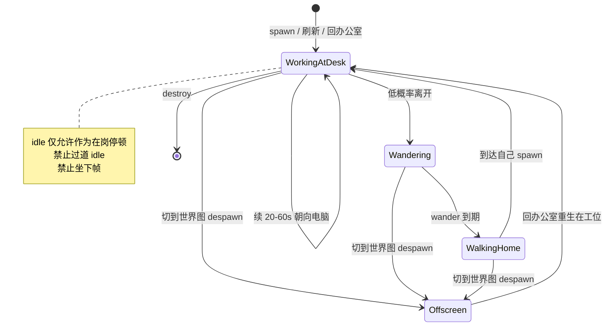

# PRD: 团队在岗


| 属性   | 值                                                                                                                                 |
| ---- | --------------------------------------------------------------------------------------------------------------------------------- |
| 状态   | 工程：backlog                                                                                                                          |
| 范围   | `company-25` 真工位铺满；工位一对一分配；FSM 改为工作默认；在岗朝向电脑；工牌一行 `owns` 状态。不改花名册 schema、CatalogSource、世界图玩法、HUD 皮肤                                                          |
| 关联文档 | `README.md`、`docs/dev-guide.md`、`docs/map-editing.md`、`public/assets/CREDITS.md`、`src/game/agentFsm.ts`、`src/game/OfficeScene.ts`、`src/catalog/mapPersona.ts`、`src/ui/NameplateLayer.tsx`、`scripts/gen-pixel-assets.mjs`、`specs/prds/prd-00002-tiled-office-world.md`、`specs/prds/prd-00003-pixel-hud.md`、`specs/prds/prd-00004-world-map.md` |


## 背景与问题

大屏的产品一句话是：把 `CATALOG.json` 花名册变成「我的 AI 团队在各自干活」。现在观众看到的是另一句话：一群人在走廊里闲逛。

现状（实现事实，不是观感形容）：

- `nextMode()` 纯随机：**35% idle / 40% wander / 25% working**；working 只持续 **4–8 秒**，然后又走掉。
- `workstationFor` 对工位做 `hashPick`：约 21 个 agent 抢大约 **8 张可视桌**，人叠人。
- `company-25` 校验要求 ≥25 对 `spawn_*` / `computer_*`，但多数点落在空地板上，没有桌子。
- working 走到电脑附近后播站立 `idle`，朝向写死为上（`dir = 3`），看起来不像办公。
- `NameplateView.status` 已由 `deriveStatus`（优先 `owns[0]`）算好，**工牌 UI 只画了名字**，扫视读不出他在做什么。
- 花名册没有 CEO / 职位字段；`siblings` 只在详情卡里，地图未用。

地图和 FSM 是同一件事：工位不够，人只能叠；人会走，工位再多也像失业。本期两件事一起做。

## 目标与非目标

### 目标（MVP / Release 0）

- **工作是默认，走动是例外。** 启动后每人在自己的工位、脸朝电脑；大部分时间待在工位上（一次待几十秒）；闲逛短暂且少见。
- **一人一桌。** `company-25` 铺满 ≥25 张**可视工位**（桌 + 椅 + `spawn_N`/`computer_N` 成对）；人数 ≤ 工位数时禁止 hash 复用叠人。
- **在岗一眼能看出来。** 人停在工位朝向屏幕；工牌常显名字 + 一行截断 `status`（即 `owns[0]` / 既有 `deriveStatus`）。
- 从世界图回办公室后，员工回到**各自工位**，不要把 `agents[0]` 扔在门口。
- `pnpm gen:assets` 能拦住「只有空点、没有成对电脑」的假工位；椅子格可站，避免 `snapToWalkable` 把人吸到过道。

### 非目标

- 坐下 / 新坐下帧 / 打字骨骼（Pipoya atlas 无坐下帧；柜子背面的漆，另立 PRD）。
- CEO / 老板精灵 / 组织架构图 / 花名册加职位字段。
- 按 `siblings` 把相关项目排到邻近座位。
- `company-10` / `company-100` 分档图；50 人专用图。
- 复刻 WorkAdventure（大世界玩法、Jitsi、气泡聊天、可操控主角）。
- 实时任务状态监控、改 `CATALOG.json` schema、新 CatalogSource。
- 世界图显示员工、改 PRD 00004 的 `kind: world` 语义。
- Light2D、名牌避让算法、人人互撞。

## 术语


| 术语        | 含义                                                                 |
| --------- | ------------------------------------------------------------------ |
| 在岗 / working | 人在自己工位、朝向 `computer_*`、播站立 idle；这是默认态                               |
| 闲逛 / wander | 短时离开工位走到可走格（休息角亦可）；结束后走回自己工位                                       |
| 工位        | 同一数字 N 的 `spawn_N` + `computer_N`，且 spawn 落在椅子侧可走点、电脑在桌面侧           |
| 可视工位      | 工位附近 furniture 层有桌椅，不是空地板上的孤儿 object                                  |
| 一对一分配     | 人数 ≤ 工位数时，每个 agent 独占一张桌；超出才允许复用                                   |
| 工牌状态行     | `deriveStatus` 的截断文案（优先 `owns[0]`），常显在名字下方                            |


## 已拍板规则 / 取舍


| 议题           | 决议                                      | 说明                                      |
| ------------ | --------------------------------------- | --------------------------------------- |
| 产品定义         | 「我的 AI 团队在各自干活」                         | 不是元宇宙，不是组织架构图                           |
| 默认态          | **working**                             | 闲逛是呼吸，不是职业                              |
| 时间配比（R0）     | 时间占用约 **80%+ 在岗**；单次 working **20–60s**；wander **6–12s** 且低概率 | 禁止再出现 4s 上班再溜达                          |
| idle         | 只允许发生在自己工位上（朝电脑的短暂停顿）                   | 过道发呆视为缺陷                                |
| 坐下           | **R0 不做**                               | 站在工位朝屏幕即可                               |
| CEO          | **不做**                                  | 团队感来自各就各位                               |
| siblings 排座  | **本期不做**                                | 详情卡保持现状                                 |
| 工位不够         | 先铺满 `company-25`，禁止用假 spawn 凑数          | 与 FSM 同一 PRD                            |
| 人 > 桌        | 超出部分才 hash 复用；≤ 桌数必须一对一                 | 当前演示约 21 人，目标 ≥25 桌                     |
| 工牌           | 名字 + 一行 status **常显**                   | 数据已有；UI 须画出                             |
| 动态摆桌         | 仍禁止运行时生成桌子                              | 静态 Tiled JSON                           |
| 回门           | 镜头可落门口；人回工位                             | 覆盖 `spawnAgents` 把 agent[0] 放门口的现状        |


## 用户与角色


| 角色            | 目标                                           |
| ------------- | -------------------------------------------- |
| 大屏观众（主）       | 扫一眼：这是我的团队，他们在工位上干活，工牌能读出在做什么               |
| 运维 / 演示操作者    | 刷新花名册后仍各就各位；出门再回来人在工位，不堆门口                    |
| 游戏前端 / 验收     | 改 FSM、分配、朝向、工牌状态行；铺/校验 `company-25` 工位         |
| 维护者           | 工位约定可校验；不引入 CEO 字段、不坐下、不碰世界图员工语义               |


## 功能域

### 1. 地图：铺满 25 人真工位

1. `public/assets/maps/company-25.json` 提供 **≥25** 组可视工位（桌椅 + 成对 objects）。现图过小（31×17）则 **Resize** 后复制工位岛，不要从空白重画瓦片库。
2. 每组：`spawn_N` 在椅子侧可走格（椅瓦 **不** `collides`）；`computer_N` 在桌面/屏幕侧；两者距离应像「人坐在电脑前」（建议欧氏距离约 0.5–2 格）。
3. 人少时空桌留在图上。禁止再靠空地板补 `spawn_*` 凑满 25。
4. `pnpm gen:assets`：`company-25` 除 ≥25 对名字外，要求 **成对**（同一 N 同时有 spawn 与 computer）；建议校验 spawn↔computer 距离上限，避免电脑在房间另一头。
5. 日常仍 Tiled Save JSON；可用脚本 stamp 工位岛，但产出必须是静态 JSON。

### 2. 分配：一人一桌

1. 工位列表按 N 稳定排序。
2. agent 按 `id` 稳定排序后依次独占工位 0..k-1。
3. 仅当 `agents.length > workstations.length` 时，多出的人 `hashPick` 复用已有桌。
4. 同一桌被复用时允许重叠（超额失败态），但 21≤n≤25 且桌≥25 时验收禁止重叠。

### 3. FSM：工作默认

1. **出生**：`mode = working`，坐标 = 自己的 `spawn`（须可走，禁止被吸到过道）。
2. **nextMode**：从 working 高概率续 working（刷新 20–60s）；低概率进入 wander（6–12s）。wander 结束 **必须** 回 working（走回自己 spawn）。
3. `idle` 若保留：只能在已到达自己工位时触发，朝向不变；不得把过道 idle 当在岗。
4. 世界图仍 0 员工（00004）；回办公室后按第 1 条重生，**不要** `entryName && i===0` 把第一人放门口。门口只服务镜头/命名入口。

建议概率（实现可微调，验收看时间占用不是看随机种子）：

| 从 \ 到 | working | wander |
| --- | --- | --- |
| working 到期 | ~0.85 续 working | ~0.15 wander |
| wander 到期 | 1.0 回工位 working | 0 |

### 4. 朝向与「在干活」

1. 到达工位后根据 `spawn` → `computer` 的主轴选四向之一（现有 `dir` 0 下 / 1 左 / 2 右 / 3 上），面向屏幕。禁止写死 `dir = 3`。
2. 在岗动画：现有 `idle-{skin}-{dir}` 即可。不新增 atlas 帧。
3. 工牌：`NameplateLayer` 在名字下（或同块内第二行）常显截断 `status`；lifecycle 色点保留。详情卡字段不变。

### 5. 闲逛（呼吸，不是职业）

R0：随机可走点，避开他人 `computer_*` 所在格（不要站到别人桌上）。到期走回自己工位。  
R1：若地图有休息区（沙发/咖啡），优先把 wander 目标落到该区；无标注则保持 R0。

## 用户故事地图与版本切片

### 旅程主干表


| 步骤 | 节点           | Entry / Exit        | 说明                                      |
| -- | ------------ | ------------------- | --------------------------------------- |
| 1  | 启动预览         | **Entry**           | `pnpm dev` / `dev:office`               |
| 2  | 第一眼          |                     | 绝大多数小人在工位朝电脑，不是挤在过道                     |
| 3  | 扫视认人         |                     | 工牌名字 + 一行 owns/status 可读                |
| 4  | 观察一段时间       |                     | 少数人起身走动，随后回自己的桌                         |
| 5  | 点小人/工牌       |                     | 详情卡仍是 title / owns / blurb / siblings    |
| 6  | 刷新花名册        |                     | 人仍一对一回工位 working                        |
| 7  | 出门世界图        |                     | 世界图无员工（既有）                              |
| 8  | 回办公室         |                     | 人在各自工位，不堆门口                             |
| 9  | 关闭页面         | **Exit / Teardown** | 销毁游戏与 HUD                               |


### 用户故事地图

#### 阶段 A：各就各位


| 故事                                                    | 验收要点                                                                 |
| ----------------------------------------------------- | -------------------------------------------------------------------- |
| 作为大屏观众，我想一开场就看见每人守着一张桌子，以便立刻感到这是团队而不是游乐场            | 启动后 3 秒内，抽查可见小人：≥80% 位于自己工位附近（脚底距 spawn ≤ 1 格）                      |
| 作为大屏观众，我不想看见两个人叠在同一张桌上（人未超过 25），以便一人一桌可读              | 花名册人数 ≤ 工位数时，任意两 agent 不得共用同一 workstation 索引                        |
| 作为维护者，我想要 25 张看得见的桌子，以便 21 人演示不再抢 8 桌                   | `company-25` ≥25 对完整 spawn+computer；抽查工位旁有桌椅瓦，不是空地打点                 |


#### 阶段 B：在干活


| 故事                                                  | 验收要点                                                                  |
| --------------------------------------------------- | --------------------------------------------------------------------- |
| 作为大屏观众，我想要在岗的人脸朝电脑，以便看出他们在办公而不是罚站                    | working 且已到达工位时，朝向由 spawn→computer 决定，不是全局 `dir=3`                     |
| 作为大屏观众，我想不悬停就读出他在做什么，以便工牌代替「他们在干什么」                  | 视野内工牌含名字 + 一行截断 status；与 `deriveStatus` 一致                              |
| 作为大屏观众，我想要他们大部分时间待在工位，以便闲逛像休息而不是失业                     | 连续观察 ≥30s：同一批可见小人在岗时间占比明显高于乱走（目标观感 80%+；允许短暂走路回家）                   |


#### 阶段 C：进出与刷新不拆台


| 故事                                                | 验收要点                                                                  |
| ------------------------------------------------- | --------------------------------------------------------------------- |
| 作为演示者，我想刷新花名册后团队仍在岗，以便演示不被 FSM 打回闲逛                   | 刷新后出生为 working + 自己的桌                                                |
| 作为观众，我想从园区回来仍看到各就各位，以便出门不是把人倒进门口                     | 回 `company-25` 后无人被放到 `office-door` 当唯一出生点；全体回工位                      |


### Release 0（必选 / MVP）

**本期做：**

- `company-25` 铺满 ≥25 可视工位；成对 objects；椅格可站。
- 一对一工位分配；超额才 hash 复用。
- FSM：出生 working；20–60s 在岗；低概率短闲逛后回家。
- 在岗朝向电脑；工牌常显 status 行。
- 回办公室回工位，不把 agent[0] 扔门口。
- 同步 `docs/dev-guide.md` FSM 段、`docs/map-editing.md` 工位约定。

**可验收结果：**

- 硬刷新后第一眼是「在上班」，不是「在走廊开会」。
- 抽查 ≥5 个可见小人：在工位、工牌有名字和状态行。
- 21 人演示无人无桌可去（桌≥人数时）。
- `pnpm gen:assets` 与 `pnpm build` 通过。

**本期不做：** 坐下、CEO、siblings 排座、10/100 人分档图、实时任务、世界图改员工语义。

### Release 1（可选 / 同 PRD 增强）

**本期做：**

- wander 目标优先休息角/咖啡区（若图上可识别；否则保持随机可走点）。
- 在岗时可有极弱「还活着」变化（偶发切 idle 帧），仍无新坐下帧。

**本期不做：** 坐下、CEO、siblings 排座、分档新图（仍属非目标 / 独立 PRD）。

## 核心流程与状态机图

### 主业务流程图

```mermaid
flowchart TD
  startNode[启动预览] --> loadMap[加载 company-25]
  loadMap --> assignDesks[按 id 一对一分配工位]
  assignDesks --> spawnWork[全体出生 working 在 spawn]
  spawnWork --> scan[观众扫视工牌名字加 status]
  scan --> stay{在岗到期}
  stay -->|高概率续 working| spawnWork
  stay -->|低概率 wander| walkAway[走到可走点避开他人电脑]
  walkAway --> walkHome[到期走回自己 spawn]
  walkHome --> spawnWork
  scan --> click[点击工牌或小人]
  click --> card[打开详情卡]
  card --> scan
  scan --> refresh[刷新花名册]
  refresh --> assignDesks
  scan --> leave[出门 world-map]
  leave --> emptyWorld[世界图 0 员工]
  emptyWorld --> back[回办公室]
  back --> spawnWork
  scan --> teardown[关闭页面]
  teardown --> destroy[Destroy 游戏与 HUD]
```

### 在岗状态图



## 数据与 API 衔接

- 无新后端 API；花名册仍 `/api/catalog`。
- **不改** `AgentPersona` 字段；`status` 继续 `deriveStatus`（`owns[0]` → blurb → 待命）。
- `NameplateView.status` 已存在，R0 必须在 `NameplateLayer` 渲染。
- 工位仍是地图 objects，不进 catalog。
- 禁止为 CEO / 排座新增 catalog 字段。

## 假设与待确认 / 开放项

### 默认假设（产品已拍板，实现按此执行）

1. 不坐下、不加 CEO、不按 siblings 排座。
2. 地图 + FSM 同一迭代；先铺 `company-25`，不做 10/100 新图。
3. 时间配比以观感 80%+ 在岗为准；表中 0.85 / 0.15 可微调。
4. 工牌第二行用既有 `status`，不新设计 emoji 工牌。
5. 回门：人回工位，镜头可落 `office-door`（若现切图相机逻辑已落入口，保持相机、改的是人）。
6. 用户声明「把以下三件事作为下一 PRD 并实现」，本文件按上述假设落盘。

### 开放项

| 项 | 说明 | 建议 |
| --- | --- | --- |
| 工位岛 stamp 手段 | Tiled 手刷 vs 构建时脚本写 JSON | 工程师自选；产物必须是静态 `company-25.json` |
| spawn↔computer 距离阈值 | 校验多严 | R0 建议 ≤2 格；过严则假阳性 |
| wander 是否避开所有 spawn | 避免踩别人椅子 | R0 至少避开 computer 格 |
| 名牌两行是否挡桌 | 状态行增加高度 | 保持小字号截断；R0 仍不做避让 |
| experiment lifecycle | 是否更爱闲逛 | R0 与 active 同一 FSM |

### 冲突与决议需求

- `prd-00001` / `prd-00002` 将「坐下」列为非目标：**本 PRD 维持不做坐下**，用站立朝向电脑满足「在干活」。
- `prd-00003` 要求工牌常显名字 + 一行截断 status；当前 UI 只画了名字。**本 PRD 把状态行视为必须补齐**，不算新 HUD 皮肤。
- `OfficeScene.spawnAgents` 在有 `entryName` 时把 `i===0` 放到门口：与「全体在岗」冲突，**以本 PRD 为准**（人回工位）。
- `prd-00004` 世界图不显示员工：不变。本 PRD 只约束回办公室后的出生点。
- `AGENTS.md` `not` 含「实时任务状态监控」：工牌 status 仍是花名册静态 `owns`，不是 live 任务流。

## 成功标准（可度量）

- 花名册人数 ≤ 工位数时：工位分配一对一；抽查无双人同桌（允许走路途中短暂靠近）。
- 启动后 3 秒：抽查 ≥5 个可见 agent，≥4 个脚底在自己 spawn 的 1 格内，且朝向电脑。
- 连续 30 秒观察：可见角色大部分时间在工位（观感 80%+），wander 会回家。
- 视野内工牌含名字 + 非空 status 行（`deriveStatus` 为「待命」时允许显示「待命」）。
- 刷新花名册 → 出门 → 回门：回办公室后全体在工位，门口不出现「只有第一个人」的堆人。
- `pnpm gen:assets`、`pnpm build` 通过。

## 依赖与风险


| 风险           | 缓解                                      |
| ------------ | --------------------------------------- |
| 扩图后碰撞/门被封    | 椅不 collides；`walkableAtDoor` 仍校验         |
| snapToWalkable 把人吸离工位 | spawn 必须落在可走椅格；验收盯「人在过道」                 |
| 工牌两行遮挡过密     | 截断 28 字既有逻辑；R0 不做避让                      |
| 真桌子摆不够 25     | 复制现有工位岛，禁止空地点位凑数                         |
| 与 00004 回门镜头冲突 | 改人的出生，不改 map id / exit 属性                |


## 修订记录


| 日期         | 说明                                                                 |
| ---------- | ------------------------------------------------------------------ |
| 2026-09-11 | 初稿：在岗默认 + 一人一桌铺满 company-25 + 工牌 status 行；明确不做坐下/CEO/siblings 排座 |
