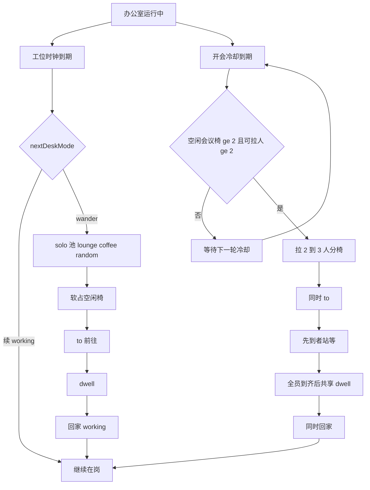
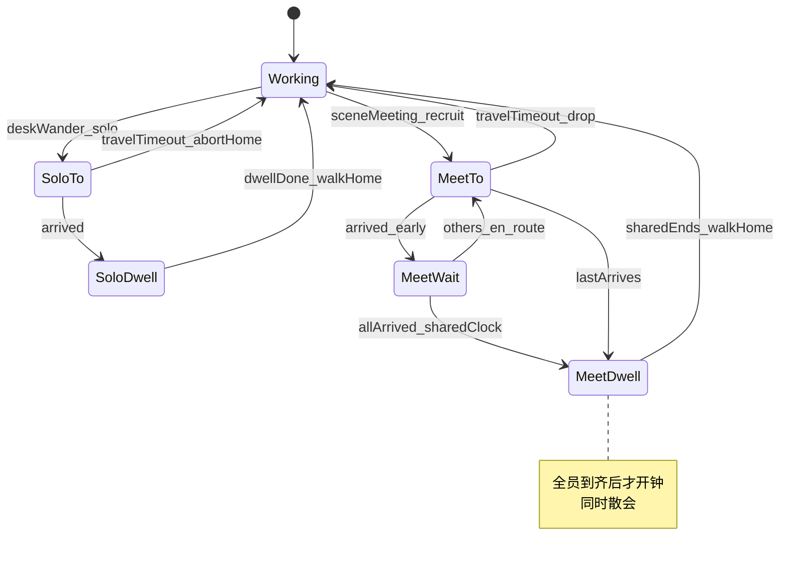

# PRD: 有意义闲逛事件

| 属性   | 值                                                                                                                                 |
| ---- | --------------------------------------------------------------------------------------------------------------------------------- |
| 状态   | 工程：accepted（见文末「工程验收状态」）                                                                                                          |
| 范围   | 办公室闲逛语义：arity（solo/group）× place（POI kind）；R0 落地 lounge/coffee 个人差事 + meeting 集体事件。不改花名册、世界图、坐下帧、HUD                         |
| 关联文档 | `docs/map-poi.md`、`docs/dev-guide.md`、`docs/map-editing.md`、`src/game/agentFsm.ts`、`src/game/OfficeScene.ts`、`specs/prds/prd-00005-team-at-work.md` |

## 背景与问题

PRD 00005 把默认态改成「在岗」。之后接了 POI 与到站停留，观众能看见人去沙发/咖啡/会议旁。新问题不是「走不走路」，是**故事讲不通**：

- 多人叠在同一把会议椅 / 同一沙发点上。
- 「开会」经常变成**一个人**走进会议室发呆——真实办公室不会这样。
- 工位时钟触发的 wander 把 `lounge` / `coffee` / `meeting` 混在同一随机池，arity（几个人该去）与 place（去哪）没有拆开。

产品一句话要升级为：**人离开工位是有理由的——一个人去办差事，一伙人去开会。**

## 目标与非目标

### 目标（MVP / Release 0）

- **高维模型落地**：闲逛事件只有两轴——`arity`（solo | group）与 `place`（`poi_<kind>_*`）。不发明第三套范式。
- **个人差事**：工位时钟触发的外出只走 solo 池（`lounge` / `coffee` / `random`）；软占一椅，优先空闲点。
- **集体开会**：`meeting` **禁止**由单人 wander 选中；场景冷却触发，拉 2–min(3, 空闲会议椅, 可拉人数) 同时出发，每人不同 `poi_meeting_*`。
- **文档**：`docs/map-poi.md` / `docs/dev-guide.md` 写清两类语义。
- `pnpm build` 绿；硬刷新可验收「不孤身开会、差事少叠椅」。

### 非目标

- 坐下帧、喝咖啡/开会专用动画、发言气泡、会议 UI / 详情卡改文案。
- 硬互斥队列、占椅失败动画、人人物理互撞。
- R0 **不**往地图加 `poi_print_*` / `poi_trash_*`（扩展点见开放项 / R1）。
- 不做「集体扔垃圾」等伪集体事件。
- 不改 `CATALOG.json` schema、实时任务同步、世界图员工语义。
- 不引入 A* / 新寻路库（沿用既有 8 向 BFS）。

## 术语

| 术语 | 含义 |
| ---- | ---- |
| arity | 事件人数语义：`solo`（个人差事）或 `group`（集体事件） |
| place / POI kind | 差事地点种类：`lounge` / `coffee` / `meeting`（及未来 print/trash） |
| 个人差事 | arity=solo；一人从工位出发 → 到站 dwell → 回家 |
| 开会事件 | arity=group；场景拉多人几乎同时去不同 meeting 椅 |
| 软占 / claim | `poiClaimKey`：前往与停留期间认领该格；优先避开已占用点；全满时 solo 可回退 random |
| 可拉在岗 | `mode=working` 且已在工位附近、未在 wander 的人 |

## 已拍板规则 / 取舍

| 议题 | 决议 | 说明 |
| ---- | ---- | ---- |
| 高维拆分 | **仅** arity × place | 打印机/垃圾桶 = 新 solo place，不另起系统 |
| group 种类 | R0 **仅** meeting | 其它 kind 一律 solo |
| 单人 meeting | **禁止** | 工位时钟 wander 池不含 meeting |
| meeting 人数 | 2 … min(3, 空闲椅, 可拉人) | 同时出发、分椅 |
| meeting 结束钟 | **全员到齐后共享** | 先到者站等；全员到预定椅位后才 `dwellMs('meeting')`，同时散会 |
| 软占策略 | 优先空闲；全满 → 换 kind 或 random | 不硬堵导致无人走动 |
| 冷却 | 开会事件约 40–80s 随机 | 避免会议室永动机 |
| print / trash | R0 不做点；R1 可进 solo 池 | 扩展不改范式 |

## 用户与角色

| 角色 | 目标 |
| ---- | ---- |
| 大屏观众（主） | 看出「有人倒水/休息」「有人在开会」，而不是梦游或叠人 |
| 演示操作者 | 硬刷新即可演示；无需点按钮开大会 |
| 游戏前端 | 改选点 / 认领 / 场景开会调度；同步 map-poi 文档 |
| 地图维护者 | 继续用 `poi_<kind>_<n>`；meeting 点 = 会议席位 |

## 功能域

### 1. 模型：arity × place

1. Runtime / 选点逻辑显式区分 solo 与 group。
2. place 仍解析自地图 `poi_<kind>_<n>`（见 `docs/map-poi.md`）。
3. 扩展新 place（如 print）：加 kind + 地图点 + 进 solo 池即可，**不必**新 FSM 模式名。

### 2. 个人差事（solo）

1. `nextDeskMode` → wander 时调用 `pickSoloWanderTarget`：仅 `lounge` / `coffee` / `random`。
2. `poiClaimKey`：出发时写入；dwell 保持；回家 / 取消清空。
3. 选点优先不在 `busyPoiKeys` 内的同类点；无空闲 → 另一 solo kind 或 `random`。
4. 既有 to → dwell → 回家相位与停留时间表保持（lounge/coffee/random）。

### 3. 开会事件（group / meeting）

1. 场景级 `tryStartMeeting(now)` + `meetingCooldownUntil`（约 40–80s）。
2. 前置：空闲 `poi_meeting_*` ≥2，可拉在岗 ≥2。
3. `k = randomInt(2, min(3, freeSeats, freeAgents))`；每人不同会议椅；同时 `beginWanderTrip`（`poiKind=meeting`）。
4. 跳过已在 wander 的人；先到者站等；**全员到齐后**共享 `dwellMs('meeting')`，同时回家。

### 4. 文档

1. `docs/map-poi.md`：solo vs group；meeting 不是单人闲逛点。
2. `docs/dev-guide.md`：FSM 一句带过两类外出。

## 用户故事地图与版本切片

### 旅程主干表

| 步骤 | 节点 | Entry / Exit | 说明 |
| -- | ---- | ------------ | ---- |
| 1 | 启动办公室预览 | **Entry** | `pnpm dev` / `dev:office` |
| 2 | 默认在岗 | | 多数人在工位（00005） |
| 3 | 个人差事 | | 偶有一人去咖啡/沙发，椅子不叠满 |
| 4 | 开会事件 | | ≥2 人几乎同时走向不同 meeting 椅并停留 |
| 5 | 散会回家 | | 各自回 spawn 继续 working |
| 6 | 长时间观察 | | 会议室冷却后再来一轮；少见孤身开会 |
| 7 | 关闭页面 | **Exit / Teardown** | 销毁场景 |

### 用户故事地图

#### 阶段 A：个人差事可读

| 故事 | 验收要点 |
| ---- | -------- |
| 作为观众，我想看见有人去喝水/休息，以便办公室有「生活」而不只是罚站 | 连续观察 ≥60s，至少出现一次 solo 外出到 lounge 或 coffee（或 random） |
| 作为观众，我不想三人叠同一沙发点，以便差事像真的 | 同 kind 有空闲点时，新出发者优先占空闲；抽查少见多人同 `poiClaimKey` |
| 作为观众，我不想看见一个人去「开会」，以便会议有集体感 | 工位时钟触发的 wander 目标 kind ≠ meeting |

#### 阶段 B：开会像开会

| 故事 | 验收要点 |
| ---- | -------- |
| 作为观众，我想看见至少两个人一起去会议室，以便读出「开会」 | 一次成功的开会事件中，出发人数 ≥2，且各自 claim 不同 `poi_meeting_*` |
| 作为观众，我想他们到站后停一会儿再走，以便不是闪进闪出 | 每人到站后有可见 dwell（meeting 停留范围既有 4–10s） |
| 作为观众，我不想会议室永动机，以便节奏像真实办公室 | 两次开会事件之间有冷却（约 40–80s 量级） |

#### 阶段 C：可维护可扩展

| 故事 | 验收要点 |
| ---- | -------- |
| 作为维护者，我想文档写清 solo/group，以便加打印机不必重写 FSM | `map-poi.md` 含 arity × place 与 R0 行为；`dev-guide` 有一句 |
| 作为开发，我想 R0 不强制改图，以便现有 3 meeting 椅可验收 | 不依赖新 tileset；沿用现有 `poi_*` |

### Release 0（必选 / MVP）

**本期做：**

- Solo 选点池排除 meeting；软占 `poiClaimKey`。
- `tryStartMeeting`：2–3 人分椅 + 冷却。
- 同步 `docs/map-poi.md`、`docs/dev-guide.md`。
- `pnpm build` 通过。

**可验收结果：**

- 硬刷新：咖啡/沙发基本一人一椅。
- 会议室出现 ≥2 人几乎同时到不同 `poi_meeting_*`。
- 几乎看不到「孤身一人开会」。

**本期不做：** print/trash 地图点、坐下、气泡、硬排队。

### Release 1（可选 / 同 PRD 增强）

**本期做：**

- 地图增加 `poi_print_*` / `poi_trash_*`（仍 arity=solo），写入 solo 池与 dwell 表。
- 文档 kind 表扩列；`gen:assets` 仍不强制数量。

**本期不做：** 新集体事件类型、坐下帧、实时任务绑定（→ 非目标或独立 PRD）。

## 核心流程与状态机图

### 主业务流程图

### 外出状态图

## 数据与 API 衔接

- 无新后端 API；不改 `AgentPersona` / catalog schema。
- POI 仍来自地图 objects；运行时增加 `poiClaimKey`（及场景 `meetingCooldownUntil` / 会议会话集合与 `meetingEndsAt`）。
- 停留时长继续用既有 `dwellMs(kind)`；meeting 拉人与全员到齐开钟仅在 `OfficeScene`。

## 假设与待确认 / 开放项

### 默认假设（已授权按此写 PRD）

1. group 仅 meeting；其它 kind 一律 solo。
2. meeting 拉人 2–3，**全员到齐后**共享开会时长并同时散会（非各自独立 dwell）。
3. 全椅占用时 solo 改 random，不硬堵。
4. print/trash 只进扩展表，不进 R0 实现。

### 开放项

- R1：是否为 print/trash 单独微调 dwell 秒数。
- 人极少（&lt;2）时开会事件永久跳过——可接受；是否在 HUD 提示「人太少开不了会」→ **不做**（大屏无运营文案需求）。
- 是否与 PRD 00005 工牌 status 行联动显示「开会中」→ 独立小项 / 另议（本 PRD 非目标）。

## 修订记录

| 日期 | 说明 |
| ---- | ---- |
| 2026-09-12 | 初稿：arity × place；R0 solo 软占 + meeting 集体事件；R1 print/trash 扩展 |
| 2026-09-12 | meeting 结束钟：改为全员到齐后共享 dwell、同时散会（避免先到先走 / 刚到即散） |

## 1. 工程验收状态

> 由 `/team:prd-accept` 维护；勿手工编造「通过」。最后更新：2026-09-12T15:48:31Z，main@6357e87，范围：R0。人确认现场效果良好。

### 总览

- 工程状态：`accepted`
- 验收判定：Release 0 通过；Release 1 本次未纳入（范围外）
- 最近验收：2026-09-12T15:48:31Z（人确认 UI 效果 + 对照仓库实现）
- 代码提交：`main@6357e87`（工作区含未提交 R0 实现时以路径证据为准）
- 摘要：
  - solo 池仅 lounge/coffee/random，软占 `poiClaimKey`
  - `tryStartMeeting` 拉 2–3 人分椅 + 40–80s 冷却
  - 全员到齐后共享 `meetingEndsAt`，同时散会
  - `map-poi.md` / `dev-guide.md` 已写清 arity × place

### Release 交付

| Release | 状态 | 说明 |
| ------- | ---- | ---- |
| R0 | 通过 | solo 软占 + meeting 集体事件（含全员到齐开钟） |
| R1 | 范围外 | print/trash 地图点未纳入本次验收 |

### 功能验收清单（Agent 优先读此表）

| ID | 能力摘要 | Release | 状态 | 证据 |
| -- | -------- | ------- | ---- | ---- |
| F1 | arity × place：desk wander 仅 solo | R0 | 通过 | `src/game/agentFsm.ts`：`SOLO_POI_KINDS` / `pickSoloPoi`；`OfficeScene.pickSoloWanderTarget` |
| F2 | 软占 `poiClaimKey`，优先空闲椅 | R0 | 通过 | `AgentRuntime.poiClaimKey`；`busyPoiKeys`；出发写入 / 回家清空 |
| F3 | meeting 禁止单人 desk wander | R0 | 通过 | solo 池不含 meeting；会议仅 `tryStartMeeting` |
| F4 | 开会拉 2–3 人分椅 + 冷却 | R0 | 通过 | `tryStartMeeting` + `meetingSize` + `meetingCooldownMs`；人确认现场 |
| F5 | 全员到齐后共享 dwell、同时散会 | R0 | 通过 | `meetingMemberIds` / `meetingArrivedIds` / `meetingEndsAt` / `beginMeetingSession`；人确认现场 |
| F6 | 文档 solo vs group | R0 | 通过 | `docs/map-poi.md`、`docs/dev-guide.md`、`docs/doc_index.md` |
| F7 | 沿用现有 `poi_*`，不强制改图 | R0 | 通过 | `company-25.json` 既有 lounge/coffee/meeting 点 |
| A1 | 观众可见 solo 差事 | R0 | 通过 | 人确认硬刷新观察 |
| A2 | 少见叠椅 | R0 | 通过 | 软占优先空闲；人确认效果良好 |
| B1–B3 | 开会集体感 / dwell / 冷却 | R0 | 通过 | 人确认；代码与 PRD 拍板一致 |
| R1-1 | `poi_print_*` / `poi_trash_*` | R1 | 范围外 | 本次 `--release R0` |

### 未完成与遗留

- R1 print/trash 未做（开放项 / 可选增强）
- 非目标未做：坐下帧、气泡、硬排队、HUD「开会中」文案

### 质量检查

| 检查项 | 状态 |
| ------ | ---- |
| pnpm build | 通过 |
| pnpm lint | 通过 |
| 文档与 OpenAPI 同步 | 通过（无 OpenAPI；map-poi / dev-guide 已同步） |

---
统计：通过 10 / 部分 0 / 未实现 0 / 范围外 1

