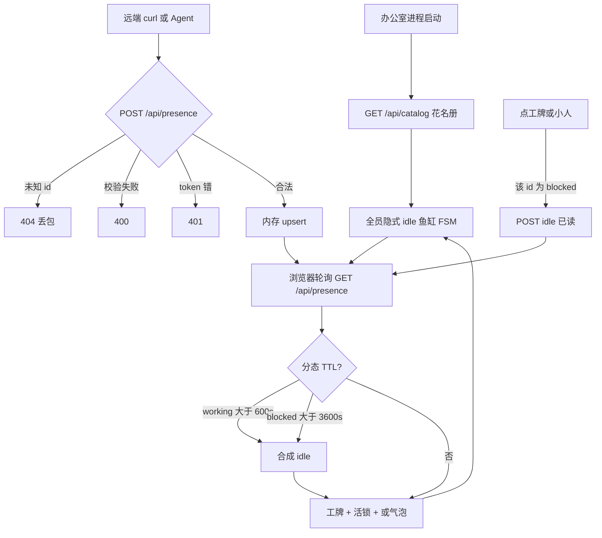
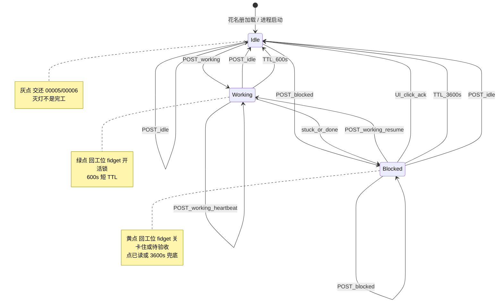

# PRD: 实时出勤（Live Presence）


| 属性   | 值                                                                                                                                 |
| ---- | --------------------------------------------------------------------------------------------------------------------------------- |
| 状态   | 工程：accepted（见文末「工程验收状态」）                                                                                                                          |
| 范围   | 本仓办公室：`POST /api/presence`；内存出勤表 + 分态 TTL（working 600s；blocked 3600s）；工牌点/summary；**黄灯大屏点击已读灭灯**；活锁；稀疏气泡。不改花名册 schema、不解析 IDE 日志、不加角色动画帧；不绑 Cursor 灭灯义务 |
| 关联文档 | `AGENTS.md`、`README.md`、`docs/dev-guide.md`、`src/game/agentFsm.ts`、`src/game/OfficeScene.ts`、`src/ui/NameplateLayer.tsx`、`src/cli/vite-plugin-catalog.ts`、`src/cli/run.mjs`、`specs/prds/prd-00003-pixel-hud.md`、`specs/prds/prd-00005-team-at-work.md`、`specs/prds/prd-00006-meaningful-wander-events.md` |


## 背景与问题

大屏要回答的两句话是：**谁在干活**，以及 **谁在喊我**（卡住或做完等验收）。现在回答的是另一句：花名册上的人会走路、会开会、会倒咖啡。那是编排过的忙碌（PRD 00005 / 00006），不是出勤。

若把「任务做完」直接报成 `idle`，黄灯永不亮、灰灯却在最该汇报的一秒点亮——**完工 ≠ 收工**。本 PRD 把 `blocked` 定为「需要老板」的唯一黄灯（中途卡住 **或** 正常做完待验收，靠 `summary` 区分）；`idle` 只表示灭灯。

现状（实现事实）：

- 数据源只有 `GET /api/catalog`（`JsonFileSource` 读 `CATALOG.json`）。`deriveStatus` 吃 `owns[0]` / blurb /「待命」，刷新花名册才变。
- `NameplateView.status` 已有字段，**工牌 UI 只画名字**；圆点表示花名册 `lifecycle`（experiment / active），不是在不在干活。
- 角色 atlas 只有四向走 + 站立。所谓 working 是站在工位朝电脑，外加 fidget（侧头 / 闪走路中间帧）。没有坐下、打字、说话嘴型。
- `AGENTS.md` 能力声明 `not` 含「实时任务状态监控」。本 PRD 开一条**窄例外**：跨机报到出勤，不是任务系统。
- 部署意图：办公室**一台机器**跑大屏；**多台机器**上的 Agent 自己 POST。解析本机 JSONL 物理上够不到别的硬盘。

要做的不是新动画，是 **插座 + 灯**：插座是 POST；灯是工牌、回工位、偶尔一朵气泡。


## 目标与非目标

### 目标（MVP / Release 0）

- **三态出勤。** 机器状态只有 `working` | `blocked` | `idle`。不拆第四态「待验收」。
- **语义合同。** `working`=在干；`blocked`=需要老板（卡住 **或** 做完待验收）；`idle`=灭灯/收工。**任务正常结束必须 POST `blocked`，禁止 Agent 在「刚做完」直接 `idle`。**
- **跨机 POST。** 任意能 HTTP 的客户端向办公室进程 `POST /api/presence`；对得上花名册 `id` 则 upsert，对不上丢包（不长幽灵员工）。
- **工牌能扫视。** 圆点改指出勤（灰 / 绿 / 黄）；名字下常显一行文案：有活 summary 用 summary，否则退回花名册 `deriveStatus`。黄灯细区别靠 summary，不靠第二色。
- **活信号覆盖鱼缸。** `working` / `blocked` 的人必须回自己的桌、朝电脑；`blocked` 关掉 fidget。无活信号（`idle`，或分态 TTL 合成 idle）把 00005/00006 的闲逛时钟还回去。
- **稀疏气泡。** 仅当该人工牌 summary **发生变化** 时冒 3 秒；同时全场最多 3 朵；心跳/重复 POST 且文案不变不冒。
- **分态 TTL。** `working`：10 分钟无新包 → 合成 `idle`（防假绿）。`blocked`：**1 小时（3600s）**无新包 → 合成 `idle`（兜底收起黄灯；**不是** 10 分钟短偷灭）。
- **大屏已读灭黄（R0）。** 观众点击该员工**工牌或小人** = 已读汇报/求助 → 将该 id 置 `idle`（黄变灰）。未点则黄灯保持，直到 1h 兜底、再 POST `working`、显式 POST idle、或进程重启。

### 非目标

- MCP server / tool 封装（插头，独立 PRD）。
- 改 evo-agent 母版 `AGENTS.md`「开始工作前」打卡义务（跨仓，独立 PRD）。
- **绑定 Cursor/脚手架必须**在人看过之后 POST `idle`（大屏点击已闭环；远端钩子另议）。
- 解析 Cursor `agent-transcripts` / `state.vscdb`、Codex `rollout-*.jsonl`。
- `thinking` / `reading` / `writing` / `searching` 等工具态枚举；第四态 `needs_review`。
- 坐下、打字、新角色帧；工位电脑亮屏；人人冒泡聊天。
- 改 `CATALOG.json` schema、新 CatalogSource、SQLite/Postgres。
- 世界图显示员工（仍遵守 PRD 00004）。
- 任务看板、审批闸、远程控制 Agent。
- 悬停才显示的 RPG 气泡（PRD 00003 已拒绝；本 PRD 的气泡是 **summary 变化 toast**，非常显名牌）。


## 术语


| 术语 | 含义 |
| ---- | ---- |
| 花名册 / catalog | `CATALOG.json` 映射出的 `AgentPersona`；决定**谁在办公室** |
| 出勤 / presence | 跨机报到的瞬时状态；决定**此刻像不像在干活 / 是否在喊老板** |
| 在场状态 `state` | 仅 `working` \| `blocked` \| `idle` |
| `working` | 绿：正在干；可心跳续命 |
| `blocked` | 黄：**需要老板**——中途卡住 **或** 任务正常结束待验收（同一灯，靠 `summary`） |
| `idle` | 灰：灭灯 / 无活信号；**不是**「任务完成」事件 |
| 打卡 | 事件：POST `working`（从 idle/blocked 转入或续报） |
| 汇报 / 喊人 | 事件：POST `blocked`（卡住或**做完**）；Agent **不得**在刚做完时改发 `idle` |
| 灭灯 / 收工 | **大屏点击已读**（工牌/小人 → idle）；或 `blocked` **3600s** 兜底；或显式 POST `idle`；或 **working 600s** 合成 idle；或进程重启。不是「任务完成」 |
| `id` | 花名册 `AgentPersona.id`（workspace dirname），不是 conversation uuid |
| `summary` | ≤40 字人话，工牌第二行与气泡文案；区分「卡在 X」与「请验收 Y」 |
| 鱼缸 / 剧场 FSM | 00005/00006 的 working/wander（solo/meeting）；无活信号时仍跑 |
| 活锁 | 该 id 为 `working` 或 `blocked` 时，禁止鱼缸把他拉去开会/倒咖啡 |
| 稀疏气泡 | summary 变化触发的短暂 overlay，不是对话框 |
| 已读 ack | 观众在大屏点该员工 = 看过黄灯内容 → 灭黄 |


## 已拍板规则 / 取舍


| 议题 | 决议 | 说明 |
| ---- | ---- | ---- |
| 状态数量 | **三个**：working / blocked / idle | 不拆第四态 needs_review |
| 三态含义 | 绿=在干；黄=要老板；灰=灭灯 | 完工 ≠ 收工 |
| `blocked` 范围 | 卡住 **与** 待验收共用黄灯 | 细区别只靠 summary |
| 完工上报 | **必须** POST `blocked` | **禁止** Agent 刚做完直接 `idle` |
| 灭黄（主） | **大屏点工牌或小人** | 已读 → 该 id `idle`；R0 必做 |
| 灭黄（兜底） | blocked **3600s** → idle | 未点也收起；防黄灯永久挂 |
| TTL | working **600s**；blocked **3600s** | 禁止用 10min 偷灭黄灯 |
| 续干 | blocked 上再 POST working | 绿；再做完再黄 |
| 协议形态 | HTTP `POST /api/presence` JSON | MCP 后做；Agent 不传动画名/坐标 |
| 未知 `id` | **丢包**（4xx），不生成小人 | 办公室不是开放世界 |
| 同一 id 多会话 | **后写覆盖** | 大屏一桌一人 |
| 花名册 vs 出勤 | **两张表** | catalog 仍 `GET /api/catalog`；出勤另存 |
| 工牌圆点 | **改指出勤** | `lifecycle=experiment` 只留详情卡徽章 |
| 工牌第二行 | 活 summary 优先，否则 `deriveStatus` | 补齐 00005 未做的 UI，并让活信号盖住 owns |
| 活锁 vs 闲逛 | 活信号 **覆盖** 00006 | 报 working/blocked 的人若在开会，散会回家 |
| 气泡 | summary **变化**才冒；同时 ≤3；约 3s | 禁止常驻对话云 |
| 角色动画 | **不扩 atlas** | 回工位 + fidget 开关 + 工牌 |
| 浏览器同步 | R0 **短轮询** GET | SSE 放 R1 |
| 鉴权 | 环境变量 token；未设则本机开放 | 见功能域；局域网自担风险 |
| AGENTS.md `not` | 本 PRD 落地时改能力声明 | 窄例外写进 owns；not 改为「不做任务系统/解析 IDE 日志」 |
| Agent 脚手架义务（合同） | 开干 working；要人/做完 blocked | 灭灯以大屏点击为主；Cursor 钩子非 R0 |


## 用户与角色


| 角色 | 目标 |
| ---- | ---- |
| 大屏观众（主） | 扫一眼谁在干活/喊我；**点黄灯员工 = 已读灭黄** |
| 办公室机器操作者 | 一台预览进程；把 URL/token 给其它机器 curl |
| 远端 evo agent / 演示者 | POST 开干/喊人；**做完报 blocked**；不必会 MCP |
| 游戏前端 | 出勤表、工牌、活锁、气泡、**点击 ack**；鱼缸逻辑可复用 |
| 脚手架/其它仓 | 本期不被本 PRD 强制改代码；消费公开 POST 合同（含完工→blocked） |


## 功能域

### 1. 出勤协议

请求：`POST /api/presence`

```json
{
  "id": "pixel-office",
  "state": "working",
  "summary": "改 mapProp 站位垫",
  "ts": "2026-09-13T14:12:00Z"
}
```

| 字段 | 约束 |
| ---- | ---- |
| `id` | 必填；必须已在当前花名册 `agents[].id` |
| `state` | 必填；仅 `working` \| `blocked` \| `idle` |
| `summary` | 可选；字符串，trim 后最长 40 字（超长截断 + `…`）；空或缺省 = **不改**已存 summary |
| `ts` | 可选 RFC3339；缺省用服务器收到时间。只用于展示/排序，**TTL 以服务器收到时间为准**（防客户端乱钟） |

响应：`200` + 规范化后的该条出勤记录。校验失败 `400`；未知 id `404`；token 错 `401`。

鉴权：`Authorization: Bearer <token>`。环境变量 `EVO_PRESENCE_TOKEN`：有值则校验；无值则 R0 不拦（便于 `pnpm dev`）。文档写明：办公室挂局域网时应当设 token。

预检：`OPTIONS` 放行；`Access-Control-Allow-Origin: *`（或回显 Origin）挂在 presence 路由上，方便别的源 `fetch`。curl 不依赖 CORS。

### 2. 出勤表（内存）

进程内 `Map<id, PresenceRecord>`：

- `state`、`summary`、`updatedAt`（服务器时间）
- 缺省：花名册里每个人都是隐式 `idle`、summary 空（工牌退回 catalog）
- **TTL（分态，读时合成即可，不必另写 job）**  
  - `state === working` 且 `updatedAt` 距今 ≥ **600s** → 视为 `idle`（防假绿）  
  - `state === blocked` 且 `updatedAt` 距今 ≥ **3600s** → 视为 `idle`（黄灯兜底收起；**禁止**用 600s）  
  - `state === idle` → 已是灭灯
- POST `idle`：立即 idle；summary 按字段规则（curl / 大屏已读共用）
- POST `blocked`：立即黄灯；续命更新 `updatedAt`（重置 1h 兜底计时）
- **不落盘**。重启办公室 = 全员 idle（含清掉未 ack 的黄灯）。可接受。
- 刷新花名册后：id 已不在 catalog 的出勤行删除；新 id 从 idle 起

`GET /api/presence`：返回当前花名册全员的有效出勤（含分态 TTL 合成）。给大屏轮询，也给 curl 自检。

开发态与 `pixel-office` CLI **同一套路径与语义**（对齐现有 catalog 插件/静态服务双通道）。

**Agent 侧合同（文档约定，跨仓落地可另 PRD）：** 开干 → `working`；中途要人 **或** 任务正常结束 → `blocked` + 人话 summary；**禁止**在「刚做完」发 `idle`。

### 3. 工牌与已读点击

`NameplateView` 增加出勤（或等价字段）。`NameplateLayer`：

1. **圆点**  
   - `idle`：灰（无活信号）  
   - `working`：绿，允许轻微闪  
   - `blocked`：黄，允许闪  
   不再用圆点表示 `lifecycle`。
2. **第一行**：名字（不变）。
3. **第二行**：活 summary 非空则显示；否则 `persona.status`（即既有 `deriveStatus`）。截断与现工牌宽度一致（约 40 字视觉上限）。

详情卡：保留 catalog 的 owns / lifecycle；另显一行「此刻」= 出勤 state + summary（idle 可写「未报到」）。

**已读灭黄（R0）：**

- 当该 id 有效态为 `blocked` 时，点击其**工牌或小人** → 浏览器对该 id `POST /api/presence` `{ state: "idle" }`（或等价同进程 API），黄变灰。
- 点击是**已读灭灯**，不是对话。可与详情卡并存：点开详情时若当前为 blocked，**同时**执行 ack。
- `working` / `idle` 上的点击不改变出勤（详情卡行为保持现状即可）。
- curl `POST idle` 与点击等价，便于无 UI 验收。

### 4. 活锁与鱼缸 FSM

不推翻 00005/00006 的 `AgentMode`。加一层 **presence 覆盖**：

| 有效出勤 | 身体 | 鱼缸时钟 |
| ---- | ---- | ---- |
| `working` | 若未在自己工位：取消 POI claim，走路回家，朝电脑，**打开** fidget | 暂停对该人的 desk wander / 开会拉人 |
| `blocked` | 同上回家朝电脑，**关闭** fidget（站着等） | 同上暂停 |
| `idle`（含分态 TTL / 已读 ack） | 交还 00005/00006 | 可被拉去 solo / meeting |

拉开会事件的「可拉在岗」：**额外排除**活锁中的人。已在 meeting 途中的人若突然 `working`：按 00006 取消/回家路径清 claim，再走回自己的桌。

世界图仍不显示员工；出勤表照常更新，回办公室时按当前出勤摆。

### 5. 稀疏气泡

- 触发：某 id 的展示用 summary 相对上次已展示值 **发生变化**（含从空到有、从 A 到 B）。纯 state 切换、相同 summary 的心跳 **不**触发。
- 时长：约 3s 后消失。
- 并发：全场同时可见 ≤ **3**；超出则丢掉更旧的，或丢掉新来的——R0 取 **丢掉新来的**（已在看的三朵不被挤掉）。
- 载体：React overlay（与工牌同层），不要迁 Phaser 文本。不要做成可点对话。
- 与 PRD 00003：工牌名字仍常显；气泡不是悬停策略，也不是名牌本体。

### 6. 大屏接入

浏览器每 **1–2s** `GET /api/presence`（页面可见时；隐藏可降频或停）。把结果交给 `OfficeGameHandle`（新方法，如 `applyPresence`）+ 工牌层。不要把出勤写进 `AgentPersona` 污染花名册。

验收捷径（办公室机器）：

```bash
# 开干 → 绿
curl -sS -X POST http://127.0.0.1:5173/api/presence \
  -H 'Content-Type: application/json' \
  -d '{"id":"<某个 agents[].id>","state":"working","summary":"curl 试出勤"}'

# 做完 / 喊人 → 黄（勿用 idle 表示做完）
curl -sS -X POST http://127.0.0.1:5173/api/presence \
  -H 'Content-Type: application/json' \
  -d '{"id":"<某个 agents[].id>","state":"blocked","summary":"改完站位垫，请验收"}'

# 灭灯 → 灰（等价于大屏已读点击）
curl -sS -X POST http://127.0.0.1:5173/api/presence \
  -H 'Content-Type: application/json' \
  -d '{"id":"<某个 agents[].id>","state":"idle"}'
```

对应小人 ≤2s 内：working 绿点回桌；blocked 黄点停 fidget；idle 灰点、允许闲逛。大屏上点黄灯员工应同样灭黄。


## 用户故事地图与版本切片

### 旅程主干表


| 步骤 | 节点 | Entry / Exit | 说明 |
| -- | ---- | ------------ | ---- |
| 1 | 启动办公室 | **Entry** | `pnpm dev` / `pixel-office`；花名册加载 |
| 2 | 默认鱼缸 | | 全员隐式 idle；00005 在岗 + 00006 闲逛仍跑 |
| 3 | 远端打卡 | | 其它机器 POST `working` + summary |
| 4 | 看见干活 | | 绿点、第二行、回工位、可选气泡 |
| 5 | 卡住或做完汇报 | | POST `blocked` + summary；黄点、停 fidget（**做完也走这条，不走 idle**） |
| 6 | 续报 | | 同 summary 不冒泡；改 summary 再冒；黄灯不因 10min 变灰 |
| 7 | 已读灭黄 | | **点工牌/小人** → idle；灰点、还鱼缸 |
| 7b | working 超时 | | working 10min 无包 → 合成 idle |
| 7c | 黄灯兜底 | | blocked **1h** 未点未续报 → 合成 idle（断头路有底） |
| 7d | 黄后再干 | | POST working → 绿；再做完再黄 |
| 8 | 关页 / 杀进程 | **Exit / Teardown** | 内存出勤丢弃 |


### 用户故事地图

#### 阶段 A：协议可测


| 故事 | 验收要点 |
| ---- | -------- |
| 作为演示者，我想用 curl 给一个真实花名册 id 报到，以便不写 Agent 也能验收 | POST 合法 body → 200；GET `/api/presence` 能读到该 id 的 state/summary |
| 作为办公室，我不想陌生 id 长出小人，以便花名册仍是权威 | 未知 id → 404；场景人数不变 |
| 作为演示者，我想空 summary 不把上一句抹掉，以便心跳只续命 | 第二次 POST 省略 summary 后，GET 仍是上一句 |
| 作为操作者，我想设了 token 后挡住乱报，以便挂局域网 | `EVO_PRESENCE_TOKEN` 有值时无/错 Bearer → 401 |


#### 阶段 B：工牌可读


| 故事 | 验收要点 |
| ---- | -------- |
| 作为观众，我想扫视看出谁在干活、谁在喊我，以便不再只看见「都会走」 | working 绿点；blocked 黄点；idle 灰点；experiment 不占圆点 |
| 作为观众，我想读到他在干什么 / 为何喊我，以便工牌第二行是活的 | 有 summary 时第二行是 summary（含「请验收」）；idle 且无活 summary 时退回 catalog `deriveStatus` |
| 作为观众，我想做完的人短时仍是黄而不是灰，以便汇报不被 10min 偷灭 | POST blocked 后 ≥10min 仍黄（未点、未满 1h） |
| 作为观众，我想点一下黄灯员工就算看过了，以便灭黄 | blocked 时点工牌或小人 → 变 idle/灰 |
| 作为观众，我若一直不点，不想黄灯永久挂着，以便有兜底 | blocked 满 1h（可用测时加速或拨钟测）→ 合成 idle |
| 作为观众，我不想 25 朵对话云，以便大屏还能看 | 同时气泡 ≤3；未改 summary 的 POST 不冒泡 |


#### 阶段 C：身体跟出勤


| 故事 | 验收要点 |
| ---- | -------- |
| 作为观众，我想正在报 working 的人待在自己桌，以便「干活」不是在沙发上 | 活锁期间该人不到 coffee/lounge/meeting；若在途则回家 |
| 作为观众，我想没人报到时办公室仍像现在，以便没有 curl 时不是集体罚站 | 全员 idle 时 00006 的差事/开会仍会发生 |
| 作为观众，我想 blocked 的人明显在等我，以便黄点可扫视 | blocked 在工位、朝电脑、无 fidget（卡住与待验收同一身体表现） |


#### 阶段 D：可维护


| 故事 | 验收要点 |
| ---- | -------- |
| 作为开发，我想 dev 与 CLI 同一 API，以便预览和开发不分裂 | Vite 插件与 `pixel-office` 均有 POST/GET `/api/presence` |
| 作为开发，我想纯逻辑可单测，以便不测 Phaser 画布 | upsert / working-600s TTL / blocked-3600s TTL / 未知 id / summary 合并 / 活锁判定有 `src/**/*.test.ts` |
| 作为维护者，我想能力声明不再撒谎，以便其它 Agent 读得懂 | 落地时更新 `AGENTS.md` owns/not 与 `docs/dev-guide.md` 一句 |


### Release 0（必选 / MVP）

**本期做：**

- `POST` / `GET /api/presence` + 内存表 + **分态 TTL**（working 600s；blocked 3600s）+ 可选 Bearer。
- 工牌圆点改出勤；第二行 live summary / catalog 回退；详情卡「此刻」一行。
- **blocked 时点工牌/小人 → POST idle（已读灭黄）**。
- 活锁覆盖 00006 拉人与 desk wander；working fidget 开、blocked fidget 关。
- summary 变化稀疏气泡（3s，同时 ≤3）。
- 浏览器 1–2s 轮询；文档：curl 验收、点击灭黄、token、Agent 完工合同。
- 单测协议与分态 TTL、活锁谓词；`pnpm test` / `lint` / `build` 绿。
- 同步 `AGENTS.md` 能力声明窄例外、`docs/dev-guide.md` 数据流。

**可验收结果：**

- 无任何 POST：办公室看起来仍是 00005/00006；工牌灰点 + catalog 第二行。
- curl working：≤2s 绿点、第二行、人回自己桌；改 summary 冒一朵泡。
- curl blocked：黄点；≥10min 仍黄；点工牌/小人 → 灰。
- blocked 满 1h（测时）未点 → 合成灰。
- curl idle：灰点、可被闲逛拉走。
- curl 未知 id：4xx，场上人数不变。

**本期不做：** MCP、SSE、母版 AGENTS 打卡段、IDE 日志、新动画、Cursor 强制灭灯钩子、第四态。

### Release 1（可选 / 同 PRD 增强）

**本期做：**

- `GET /api/presence` 改为 SSE（或 WS）推送，浏览器可停轮询。
- 顶栏展示 working / blocked 计数。
- `EVO_PRESENCE_TOKEN` 在 `pixel-office` 默认建议必填（文档 + 启动警告；无 token 仍能起，但打 stderr）。

**本期不做：** MCP、跨仓脚手架强制义务定稿、任务系统、世界图员工。


## 核心流程与状态机图

### 主业务流程图



### 出勤状态图



打卡 = 进入 `Working`。汇报/喊人 = 进入 `Blocked`（含正常做完）。灭灯 = 进入 `Idle`（大屏已读点击、blocked 1h 兜底、显式 POST idle、或 working 600s TTL）。


## 数据与 API 衔接

| 路径 | 职责 |
| ---- | ---- |
| `GET /api/catalog` | 不变；谁在办公室 |
| `POST /api/presence` | 报到 |
| `GET /api/presence` | 全员有效出勤快照 |

不改 `CatalogSource`、不改 `CATALOG.json`。`AgentPersona.status` 仍是花名册派生。出勤是平行结构。

建议类型（工程可改名，语义锁定）：

```ts
type PresenceState = 'working' | 'blocked' | 'idle'

interface PresenceRecord {
  id: string
  state: PresenceState
  summary: string
  updatedAt: number
}
```

落点：`src/cli/` 与 Vite 插件共用一份纯函数（upsert/TTL/校验），场景与 React 只消费快照。禁止把 POST 处理写进 Phaser。


## 假设与待确认 / 开放项

### 默认假设（用户要求基于既有讨论直接写 PRD）

1. 在场状态恰好三个：`working` / `blocked` / `idle`；黄灯不拆；完工必 blocked。
2. 部署是办公室一机大屏 + 多机 POST；不解析本机 IDE 日志。
3. R0 用短轮询，不用 SSE/MCP。
4. 气泡做进 R0，但是稀疏 toast，不是聊天。
5. 无 token 时本机 dev 可 POST；挂网由操作者自己设 `EVO_PRESENCE_TOKEN`。
6. working TTL 10 分钟；blocked TTL **1 小时**兜底；主灭黄 = 大屏点击；重启丢出勤。
7. 活锁覆盖闲逛；无报到时 00006 保持。
8. evo-agent 母版开工打卡、MCP、Cursor 灭灯钩子 → **独立 PRD / 开放项**；大屏点击已闭环 R0。

### 开放项

- Cursor/脚手架是否在「人在 IDE 里看过」后也 POST `idle`（与大屏点击双通道）：本期不做强制。
- blocked 1h 是否改为可配置环境变量：R0 写死 3600s 即可。
- 端口：dev 默认 5173、CLI 默认 3780，文档用「当前预览 origin」，不写死单一端口。
- `blocked` 是否要声音/顶栏角标：R0 不做，有需求另开。
- 花名册刷新时正在 working/blocked 的人：出勤行若 id 仍在则保留（假设）。
- 世界图期间 POST：表更新、回办公室再生效（假设）。
- 与 `AGENTS.md` `not: 实时任务状态监控` 的措辞：落地时改成「不做任务队列/IDE 日志解析；做出勤 POST」。


## 头脑风暴收敛（阶段 1 归档）

**必做：** 三态（完工→blocked）、POST、未知 id 丢包、工牌点+第二行、活锁、分态 TTL、**点击已读灭黄**、dev/CLI 同 API、稀疏气泡。  
**应做（R1）：** SSE、顶栏计数、token 启动警告。  
**可做/本期不做：** MCP、母版 AGENTS 义务、Cursor 灭灯钩子、工具态枚举、电脑亮屏、第四态。  
**不做：** 本地 JSONL、坐下帧、对话系统、幽灵员工、任务看板、黄灯 10min 短偷灭。

破坏者 / 断头路：非法 JSON、未知 id、token、working TTL、blocked 1h 兜底、进程重启清黄、花名册减员、活锁与开会冲突、summary 未变刷屏、25 人同时改 summary、世界图无小人、CORS、时钟作弊、Agent 误报完工 idle、误点 working 员工（不得乱灭）。

关键决策（已拍板，见上表）：三态、完工必黄、点击已读、blocked 3600s 兜底、HTTP 非 MCP、活锁覆盖、气泡稀疏、圆点改指出勤。


## 冲突与决议需求

| 来源 | 冲突 | 本 PRD 决议 |
| ---- | ---- | ---- |
| `AGENTS.md` not 实时任务状态监控 | 本功能就是跨机状态 | 窄例外：出勤不是任务监控；落地改能力声明 |
| PRD 00003 不做悬停气泡 | 本 PRD 有气泡 | 非常显、非悬停；summary 变化 toast |
| PRD 00005 工牌 status=owns | 活 summary 要占第二行 | 有活 summary 时覆盖；idle 退回 owns |
| PRD 00005/00006 默认 working 鱼缸 | 无 POST 时「工作」仍是假的 | 鱼缸保留；**绿点**才表示真出勤。术语上鱼缸 `AgentMode.working` ≠ 出勤 `state=working` |
| PRD 00006 可拉在岗 = 鱼缸 working | 活锁人不应被拉去开会 | 可拉集合排除活锁 |


## 成功标准

- 另一台机器（或本机 curl 冒充）能使**一个**花名册小人在 2s 内完成：绿点 + summary + 回桌。
- curl `blocked` 后黄点可扫视；≥10min 仍黄；**点击**该员工后变灰。
- blocked 1h 兜底可单测（拨钟 / 注入 updatedAt）。
- 零 POST 时行为回归 00005/00006，不出现全员罚站。
- 未知 id 与坏 token 不改变场景人数与既有出勤。
- `pnpm test && pnpm lint && pnpm build` 通过。


## 依赖与风险

| 风险 | 缓解 |
| ---- | ---- |
| 模型忘了 POST / 误报完工 idle | R0 办公室保持鱼缸；合同写进文档；跨仓脚手架另 PRD |
| 无人点击导致黄灯挂很久 | 3600s 兜底；重启清表 |
| 误点把还在求助的灭掉 | 产品接受：点=已读；可再靠 Agent 重报 blocked |
| 局域网裸 POST | token 文档；R1 启动警告 |
| 活锁与 00006 抢人 | 单测谓词；实现时同一 tick 先应用出勤再跑开会招募 |
| 工牌第二行与圆点信息过载 | 圆点只指出勤；lifecycle 离开圆点 |


## 修订记录

| 日期 | 说明 |
| ---- | ---- |
| 2026-09-13 | 初稿：三态出勤 + POST + 工牌/活锁/稀疏气泡；MCP 与 IDE 解析列为非目标 |
| 2026-09-13 | 修订：完工必 `blocked`；`idle` 仅灭灯；黄灯曾豁免短 TTL；灭灯驱动方开放项 |
| 2026-09-13 | 再修订：大屏点击已读灭黄（R0）；blocked **3600s** 兜底；working 仍 600s |


## 1. 工程验收状态

> 由 `/team:prd-accept` 维护；勿手工编造「通过」。最后更新：2026-09-14T06:28:15Z，main@6557f94，范围：R0。工作区含未提交 R0 实现时以路径证据为准；人确认侧栏「消息」与出勤 UI 可用。

### 总览

- 工程状态：`accepted`
- 验收判定：Release 0 通过；Release 1（SSE / 顶栏计数 / token 启动警告）本次未纳入（范围外）
- 最近验收：2026-09-14T06:28:15Z（对照仓库实现 + `pnpm test` / `lint` / `build`）
- 代码提交：`main@6557f94`（出勤相关改动多在工作区未提交）
- 摘要：
  - `POST/GET /api/presence` 内存表 + 分态 TTL（working 600s / blocked 3600s）+ 可选 Bearer
  - 工牌出勤标记（齿轮/信封）、稀疏气泡、blocked 点击已读灭黄
  - 活锁回桌；working 开 fidget / blocked 关；详情卡「此刻」+「消息」全文
  - Vite 与 `pixel-office` 同 API；`AGENTS.md` / `dev-guide` / README 已同步

### Release 交付

| Release | 状态 | 说明 |
| ------- | ---- | ---- |
| R0 | 通过 | 协议 + HUD + 活锁 + 气泡 + 轮询 + 单测 + 文档 |
| R1 | 范围外 | SSE、顶栏 working/blocked 计数、`pixel-office` token 启动警告 |

### 功能验收清单（Agent 优先读此表）

| ID | 能力摘要 | Release | 状态 | 证据 |
| -- | -------- | ------- | ---- | ---- |
| F1 | POST/GET `/api/presence` + 未知 id 404 | R0 | 通过 | `src/cli/presence-store.mjs`、`presence-http.mjs`；Vite `vite-plugin-catalog.ts`；CLI `run.mjs` |
| F2 | 分态 TTL working 600s / blocked 3600s | R0 | 通过 | `WORKING_TTL_MS` / `BLOCKED_TTL_MS`；`presence-store.test.ts`「keeps blocked yellow past 600s」 |
| F3 | summary 合并（空不抹）+ ≤40 截断 | R0 | 通过 | `truncateSummary` / upsert omit summary；同测文件 |
| F4 | 可选 `EVO_PRESENCE_TOKEN`；同源 ack 可免 Bearer | R0 | 通过 | `authorizePresencePost`；`presence-store.test.ts` authorize 用例 |
| F5 | 工牌出勤可扫视（绿干 / 黄喊 / idle 灭） | R0 | 通过 | `NameplateLayer.tsx` + `public/assets/hud/{gear,email}.svg`（UX：图标代圆点；idle 不画灰点） |
| F6 | summary 可读（气泡 + 详情「消息」全文） | R0 | 通过 | `liveLock.ts` 气泡队列；`AgentCard.tsx`「消息」；工牌**非常驻**第二行（相对 PRD 原文的 UX 修订） |
| F7 | blocked 点工牌/小人 → POST idle 已读灭黄 | R0 | 通过 | `App.tsx` `selectAgent`；`presence-http` 同源免 token |
| F8 | 活锁回桌；working fidget 开 / blocked 关 | R0 | 通过 | `OfficeScene.applyPresence`；`isLiveLocked`；拉人排除活锁 |
| F9 | 稀疏气泡：summary 变化；同时 ≤3 | R0 | 通过 | `nextPresenceBubbles`；`liveLock.test.ts`；持有约 3–5s + 淡出（相对「约 3s」略宽） |
| F10 | 浏览器 1–2s 轮询 `applyPresence` | R0 | 通过 | `App.tsx` poll；`createGame.ts` / `OfficeScene.applyPresence` |
| F11 | 单测协议 / TTL / 活锁 / 气泡 | R0 | 通过 | `presence-store.test.ts`、`liveLock.test.ts`；`pnpm test` 92 passed |
| F12 | 文档与能力声明 | R0 | 通过 | `AGENTS.md` owns；`docs/dev-guide.md`；`README.md` 出勤段 |
| R1-1 | SSE 替代轮询 | R1 | 范围外 | 未实现 |
| R1-2 | 顶栏 working/blocked 计数 | R1 | 范围外 | 未实现 |
| R1-3 | pixel-office 无 token 启动 stderr 警告 | R1 | 范围外 | 未实现 |

### 未完成与遗留

- R1：SSE、顶栏计数、token 启动警告（可选增强，未纳入本次验收）
- 开放项 / 非目标未做：MCP、母版 AGENTS 打卡义务、Cursor 灭灯钩子、IDE 日志、第四态、新动画
- 相对 PRD 原文的 HUD 修订（产品已接受）：工牌无常显第二行；idle 无灰点；标记为齿轮/信封；详情拆「此刻」/「消息」

### 质量检查

| 检查项 | 状态 |
| ------ | ---- |
| pnpm build | 通过 |
| pnpm lint | 通过 |
| pnpm test | 通过（9 files / 92 tests） |
| 文档与 OpenAPI 同步 | 通过（无 OpenAPI；dev-guide / README / AGENTS 已同步） |

---
统计：通过 12 / 部分 0 / 未实现 0 / 范围外 3
