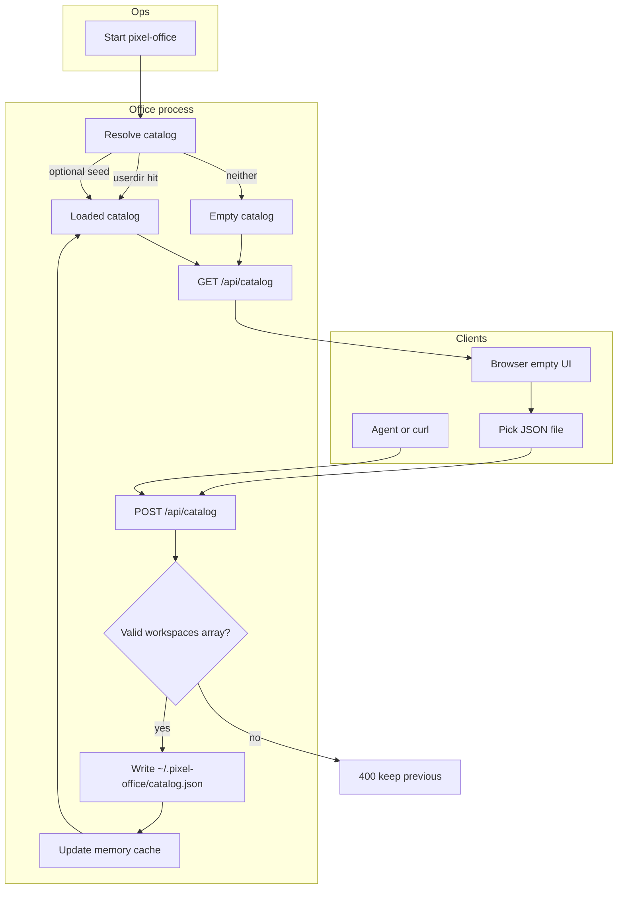
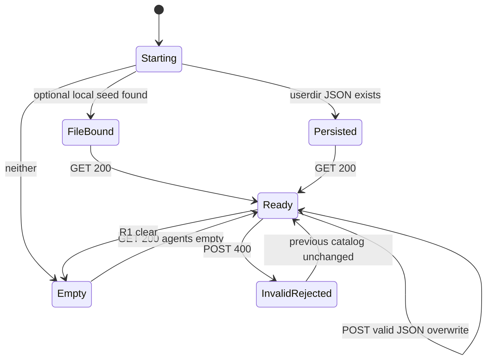

# PRD: 运行时花名册（Runtime Catalog）


| 属性   | 值                                                                                                                                 |
| ---- | --------------------------------------------------------------------------------------------------------------------------------- |
| 状态   | 工程：accepted（见文末「工程验收状态」；范围 R0）                                                                                                      |
| 范围   | 本仓办公室：无本地 `CATALOG.json` 也可启动；`POST /api/catalog` 整表写入；顶栏选文件打同一 POST；用户目录 `~/.pixel-office/catalog.json` 跨进程重启保留。不改 CATALOG schema、不上 SQLite、不用 localStorage、不回写 AgentWikiIndex |
| 关联文档 | `AGENTS.md`、`README.md`、`docs/dev-guide.md`、`docs/openapi.md`、`src/cli/catalog.mjs`、`src/cli/run.mjs`、`src/cli/vite-plugin-catalog.ts`、`src/cli/openapi.mjs`、`src/App.tsx`、`src/ui/Toolbar.tsx`、`specs/prds/prd-00007-live-presence.md` |


## 背景与问题

像素办公室大屏依赖 AgentWikiIndex 的 `CATALOG.json` 决定**谁在办公室**。现状实现把「启动」与「本机磁盘上有这份 JSON」绑死：

- `resolveCatalogPath` 找不到 `--catalog` / `EVO_AGENT_CATALOG` / cwd `CATALOG.json` / `../AgentWikiIndex/CATALOG.json` 就 **throw**。
- `pixel-office` CLI 启动失败直接 `process.exit(1)`；Vite 开发插件在第一次 `GET /api/catalog` 同样 500。
- 只有 `GET /api/catalog`；OpenAPI 无写入合同。`CatalogSource` 仅 `JsonFileSource`。
- 分发形态是 **npx `pixel-office`**：目标机工作目录里通常**没有**这份花名册；远端 Agent 也无法靠启动参数把 JSON「塞」进进程。

出勤（PRD 00007）已是跨机 `POST` + 内存表，但花名册仍是「启动前必须有文件」。结果是：能在无本地 wiki 的服务器上跑大屏，却**进不了办公室**——耦合在启动阶段，而不是运行时。

要解决的是：**解耦启动与花名册来源**；运行时注入；下次再启动仍在；对 npx 零新依赖。


## 目标与非目标

### 目标（MVP / Release 0）

- **无文件可启动。** `pixel-office` / `pnpm dev` 在找不到本地 `CATALOG.json` 时**不退出**；进程起来，办公室可渲染，花名册为空（0 agents）。
- **唯一写入：`POST /api/catalog`。** Body 为现有 `CATALOG.json` 形状（必须含 `workspaces` 数组）；校验失败 `400`，旧数据保留。
- **一能力、两客户端。** Agent/curl 与大屏「选文件」都打同一 POST；界面只是读 File → POST 的薄客户端（浏览器不能持久化本地路径）。
- **用户目录持久化。** 合法 POST 后写入 `~/.pixel-office/catalog.json`（纯 `fs`，无 SQLite / 无 localStorage）；下次启动优先读该文件。
- **热更新。** POST 成功后内存缓存与大屏刷新，**不必**重启进程。
- **空态可理解。** 0 人时仍画办公室地图；顶栏/空态提示「选文件或让 Agent POST」；**不**内置假花名册。
- **OpenAPI。** `GET /api/openapi.json` 声明 `POST /api/catalog`；`pnpm gen:openapi` 防漂移。

### 目标（Release 1，可选）

- `--catalog` / `EVO_AGENT_CATALOG` 作为**可选只读种子**（启动时若用户目录尚无持久化文件，可从种子拷贝进用户目录；有持久化则种子不覆盖）。
- 显式清空 API（或等价操作）回到空态并删除用户目录副本。
- Body 大小上限与鉴权文案打磨（与出勤 token 对齐）。

### 非目标

- localStorage 存花名册（服务端 `GET` / 跨机 Agent 读不到）。
- SQLite / Postgres 建表（与 `AGENTS.md` `not` 冲突；单 blob 过重；npx 原生模块麻烦）。
- multipart / 上传压缩包；多花名册切换 / 多租户。
- 回写 AgentWikiIndex 磁盘上的源 `CATALOG.json`。
- 改 `CATALOG.json` / `AgentPersona` 字段 schema（仍用 `workspaces[]` 映射）。
- MCP server / tool 封装（独立 PRD）。
- 内置 demo 名单或 LLM「编」花名册（「Agent 初始化」= 读 OpenAPI 后 POST 真数据）。
- 改出勤语义（仍遵守 PRD 00007）。


## 术语


| 术语 | 含义 |
| ---- | ---- |
| 花名册 / catalog | `CATALOG.json` 映射出的 `AgentPersona[]`；决定**谁在办公室** |
| 运行时花名册 | 进程启动后可通过 POST 写入、并跨重启保留的那份花名册 |
| 种子 / seed | 可选本地路径（`--catalog` / `EVO_AGENT_CATALOG` / 探测路径）；**不再是启动前置** |
| 用户目录副本 | `~/.pixel-office/catalog.json`；POST 成功后的权威落盘 |
| 空态 / empty | `agents.length === 0`；地图可渲染；提示注入花名册 |
| 整表覆盖 | 一次合法 POST 替换整份花名册（非按人 patch） |
| 薄客户端 | 界面选文件：浏览器读内容 → `POST /api/catalog`，不绑磁盘路径 |


## 已拍板规则 / 取舍


| 议题 | 决议 | 说明 |
| ---- | ---- | ---- |
| 入口数量 | **1 个写 API + 2 个客户端** | POST 唯一写入；Agent 与界面选文件共用 |
| 持久化 | **用户目录 JSON** | `~/.pixel-office/catalog.json`；不用 localStorage / SQLite / 纯内存 |
| 启动 | **无文件不退出** | 空态 `GET /api/catalog` → 200 + `agents: []` |
| POST 语义 | **整表覆盖** | 校验通过后替换；失败 400，保留旧表 |
| 启动顺序 | 可选种子（若存在且策略命中）→ 用户目录副本 → 空态 | R0：用户目录优先于「无种子」；R1 细化种子 vs 持久化冲突 |
| 种子回写 | **不**写回 wiki 源文件 | 只写用户目录 |
| 空态地图 | **仍画办公室** | 0 人；提示选文件 / POST |
| 鉴权 | 复用出勤思路 | 设了 `EVO_PRESENCE_TOKEN`（或后续统一 catalog token）则 POST 需 Bearer；未设本机开放 |
| schema | **不改** | 仍要求 `workspaces` 数组；映射逻辑复用 `mapCatalogJson` |
| 与出勤 | 两张表不变 | 花名册变后 `retainIds`；消失的 id 出勤行删除 |
| AGENTS.md | 实现阶段更新 owns | 增加运行时注入；`not` 仍写 SQLite/Postgres 建表 |


## 用户与角色


| 角色 | 目标 |
| ---- | ---- |
| 大屏观众 / 老板（主） | npx 起大屏；可从界面选一份 `CATALOG.json` 看到团队 |
| 远端 Agent / 自动化 | 无本地文件也能 `POST` 整份花名册，再报出勤 |
| 运维 | `npx pixel-office` 不带路径即可起服务；重启后花名册仍在 |
| 本地开发者 | 可选继续用 `EVO_AGENT_CATALOG` 种子，不必每次 POST |
| 游戏前端 | 空态 UI、选文件、热刷新；不解析路径 |


## 功能域

### 1. 启动与解析顺序

进程启动（CLI 与 Vite 插件同源语义）：

1. **R0：** 若用户目录存在合法 `catalog.json` → 加载为当前花名册。  
2. 否则若探测到可选本地种子路径且文件合法 → 可加载（R0 允许直接用种子进内存；**推荐** R1：首次拷贝到用户目录后再读，避免「只读了种子却重启丢失」）。  
3. 否则 → **空态**；`GET` 返回空 agents；**不** `process.exit(1)`。

`resolveCatalogPath` 从「找不到就 throw」改为「找不到返回 null / 走空态」；错误只在**显式种子路径存在但非法**时启动失败（可选：非法种子也降级空态并打日志——实现时二选一，默认**非法显式路径 fail-fast**）。

### 2. `POST /api/catalog`

请求：`Content-Type: application/json`；body = 完整 `CATALOG.json` 对象。

```json
{
  "wiki_index_version": "1",
  "generated_at": "2026-09-14T00:00:00Z",
  "workspaces": [
    {
      "dirname": "pixel-office",
      "title": "像素办公室 — 大屏",
      "lifecycle": "active",
      "owns": ["runtime catalog"],
      "blurb": "…"
    }
  ]
}
```

| 规则 | 说明 |
| ---- | ---- |
| 校验 | 可解析 JSON；根对象；`workspaces` 为数组（可为空数组 = 清空花名册但保留「已注入」语义，或 R1 用专用 clear） |
| 成功 | `200` + 映射后的 `CatalogPayload`；写用户目录；更新内存缓存；`presence.retainIds` |
| 失败 | `400` + `{ error }`；**不**改内存、**不**改磁盘 |
| 鉴权 | 与出勤对齐：有 token 则需 Bearer；同源大屏选文件可走同一规则（未设 token 则开放） |
| 大小 | R0 建议硬上限（如 2–5 MiB）；超限 `413` 或 `400` |
| 不支持 | multipart；只传文件路径字符串当权威 |

`sourcePath` 响应字段：可标为用户目录绝对路径，或字面量如 `runtime:~/.pixel-office/catalog.json`，便于顶栏展示。

### 3. 界面选文件（薄客户端）

顶栏增加「选择花名册」：

- `<input type="file" accept="application/json,.json">`
- 读文本 → `JSON.parse`（前端可做粗检）→ `POST /api/catalog`
- 成功后复用现有 `applyPayload` / 刷新逻辑
- **不**保存本机路径；刷新页后权威仍在服务端用户目录

空态时同一入口；有花名册时再选 = 整表覆盖（可二次确认，R0 可选）。

### 4. 持久化路径

| 项 | 值 |
| ---- | ---- |
| 目录 | `~/.pixel-office/`（`os.homedir()` + `.pixel-office`） |
| 文件 | `catalog.json`（原始 CATALOG 形状或已规范化均可；实现选一种并文档化） |
| 依赖 | 仅 Node `fs`；**零**新 npm 依赖 |
| 与 npx | 数据在 homedir，不跟 npx cache 消失 |

### 5. OpenAPI 与文档

- `POST /api/catalog` 写入 [`src/cli/openapi.mjs`](../../src/cli/openapi.mjs)；落盘 `pnpm gen:openapi`。
- README / openapi.md：去掉「必须启动前指定 JSON」的硬性表述；补 curl 示例与空态说明。
- 实现阶段更新 `AGENTS.md` owns（本 PRD 只定产品，不强制同步改 AGENTS）。

### 6. 与出勤衔接

- 花名册 id 集合变化后调用既有 `retainIds`。
- 未知 id 的 `POST /api/presence` 仍 404（PRD 00007）。
- 空花名册时出勤表为空；Agent 应先 catalog 后 presence。


## 用户故事地图与版本切片

### 旅程主干


| 步骤 | 节点 | 说明 |
| ---- | ---- | ---- |
| Entry | 运维/开发启动进程 | `npx pixel-office` 或 `pnpm dev`，可不带 `--catalog` |
| 1 | 解析花名册 | 用户目录 →（可选）种子 → 空态 |
| 2 | 打开大屏 | `GET /api/catalog` 200；空或已有 agents |
| 3a | Agent 注入 | `GET /api/openapi.json` → `POST /api/catalog` |
| 3b | 老板选文件 | 顶栏选 JSON → 同一 POST |
| 4 | 校验与落盘 | 合法则写 `~/.pixel-office/catalog.json` + 热更新 |
| 5 | 使用办公室 | 小人出现；可再 POST 出勤 |
| 6 | 重启进程 | 再启动读用户目录；花名册仍在 |
| Exit / Teardown | 可选清空（R1）或覆盖 POST | 无强制「卸载」；停进程即可 |


### 用户故事地图


| 阶段 | 目标 | 故事 | 验收要点 |
| ---- | ---- | ---- | ---- |
| 启动 | 无本地文件也能跑 | 作为运维，我想不指定 JSON 就启动 pixel-office，以便在无 wiki 的机器上开大屏 | 无 CATALOG 时进程不 exit(1)；浏览器可打开办公室页 |
| 空态 | 知道下一步 | 作为老板，我想在空办公室看到明确提示，以便知道要选文件或让 Agent POST | 顶栏或空态文案含「选文件」与 POST/`/api/catalog` 指引 |
| 注入（Agent） | 跨机塞花名册 | 作为远端 Agent，我想 POST 完整 CATALOG JSON，以便办公室出现 workspaces 对应小人 | curl POST 合法 body → 200；`GET /api/catalog` agents 非空且 id 对齐 dirname |
| 注入（UI） | 本机不用 curl | 作为老板，我想从界面选择本地 JSON 文件，以便同样完成注入 | 选文件后办公室刷新；网络层为 POST `/api/catalog` |
| 校验 | 坏数据不毁场 | 作为运维，我想非法 JSON 被拒绝，以便旧花名册不被破坏 | 缺 `workspaces` 或坏 JSON → 400；磁盘与内存仍为旧内容 |
| 持久化 | 重启还在 | 作为运维，我想停掉再启动后仍是同一批员工，以便不必每次重传 | 杀进程再开；`GET` 与上次一致；文件在 `~/.pixel-office/catalog.json` |
| 热更新 | 不必重启 | 作为 Agent，我想 POST 后大屏立刻换人，以便演示流畅 | POST 后无需重启；刷新花名册或自动 reload agents |
| 出勤衔接 | 先有人再报到 | 作为 Agent，我想在注入花名册后再 POST presence，以便绿/黄灯有效 | 先 catalog 后 presence；空 catalog 时 presence 对未知 id 404 |
| 种子（R1） | 本地开发省事 | 作为开发者，我想可选 `--catalog` 作种子，以便不必每次 POST | 无用户目录文件时种子可进办公室；有用户目录时 POST 优先 |
| 清空（R1） | 回到空办公室 | 作为运维，我想显式清空花名册，以便演示「从零注入」 | 清空后 agents=[]；用户目录副本删除或置空；下次启动仍空 |


### Release 0（必选）— 可验收结果

- [x] 无本地 `CATALOG.json` 时 `pixel-office` / dev **可启动**。
- [x] `GET /api/catalog` 空态 200，`agents: []`；办公室地图可渲染。
- [x] `POST /api/catalog` 合法 body → 200 + 持久化到用户目录；非法 → 400 且旧数据保留。
- [x] 顶栏「选择花名册」走同一 POST。
- [x] 进程重启后花名册仍在。
- [x] OpenAPI 含 POST；`pnpm gen:openapi` + 测试防漂移。
- [x] 花名册变更后出勤 `retainIds` 行为正确。

### Release 1（可选）— 本期做 / 本期不做

| 本期做 | 本期不做 |
| ---- | ---- |
| `--catalog` / env 作只读种子；与用户目录冲突策略文档化 | SQLite / Postgres |
| 显式清空（API 或 UI） | localStorage；多花名册切换 |
| Body 上限与 token 文案与出勤完全统一 | MCP；回写 AgentWikiIndex；multipart |

**禁止 Release 2+。** 溢出能力进 §非目标或独立 PRD。


## 核心流程与状态机图

### 主流程（泳道）



### 花名册状态图



**断头路扫描：** 非法 POST 不得进入「半写磁盘」；启动不得因缺文件卡死；空态必须有 Exit（选文件或 POST），禁止只有「请设置环境变量再重启」一条路。


## 数据与 API 衔接


| 方法 | 路径 | 说明 |
| ---- | ---- | ---- |
| GET | `/api/catalog` | 现有；空态合法；`?refresh=1` 重读用户目录/当前源 |
| POST | `/api/catalog` | **新增**；整表写入 + 持久化 |
| GET | `/api/openapi.json` | 合同含 POST |
| GET/POST | `/api/presence` | 不变；依赖当前 catalog ids |

实现落点（工程阶段，非本 PRD 交付）：

- [`src/cli/catalog.mjs`](../../src/cli/catalog.mjs) — 空态、用户目录路径、校验、可选 Memory/Persisted source
- [`src/cli/run.mjs`](../../src/cli/run.mjs) / [`src/cli/vite-plugin-catalog.ts`](../../src/cli/vite-plugin-catalog.ts) — 启动不退出；挂 POST
- [`src/cli/openapi.mjs`](../../src/cli/openapi.mjs) — 合同
- [`src/App.tsx`](../../src/App.tsx) / [`src/ui/Toolbar.tsx`](../../src/ui/Toolbar.tsx) — 空态 + 选文件

`CatalogSource` 可扩展为「内存 + 用户目录落盘」实现；**不必**引入 `kind: sqlite`。


## 假设与待确认 / 开放项


| ID | 项 | 默认假设 | 备注 |
| ---- | ---- | ---- | ---- |
| O1 | 用户目录路径名 | `~/.pixel-office/catalog.json` | 可用 `PIXEL_OFFICE_HOME` 覆盖（开放） |
| O2 | 鉴权变量名 | 复用 `EVO_PRESENCE_TOKEN` | 或日后统一 `EVO_OFFICE_TOKEN` |
| O3 | R0 种子行为 | 探测到种子可直接加载进内存 | R1 改为「首次拷入用户目录」更不易丢 |
| O4 | 空 `workspaces: []` | R0 允许作为合法 POST（等价清空花名册） | 若与 R1 clear 重复，实现时合并 |
| O5 | Windows homedir | `os.homedir()` | 文档写清 |
| O6 | AGENTS.md owns 文案 | 实现 PR 时改 | 本 PRD 不强制同步改文件 |


## 成功标准（可度量）

- 干净机器无 `CATALOG.json`：`npx`/`pixel-office` 启动成功率 100%（相对「缺文件必挂」基线）。
- 合法 POST 后重启，`GET /api/catalog` 的 `agents[].id` 集合与 POST 前一致。
- 非法 POST 后，用户目录文件内容与 POST 前一致（字节或语义等价）。
- 界面选文件与 curl POST 产生同一持久化结果。


## 依赖与风险


| 风险 | 缓解 |
| ---- | ---- |
| 用户误覆盖花名册 | R0 可选确认对话框；文档强调整表覆盖 |
| 局域网无 token 被写花名册 | 文档：挂局域网应设 token（对齐出勤） |
| 种子与用户目录双源困惑 | R1 写清优先级；顶栏展示 `sourcePath` |
| 大 JSON OOM | Body 大小上限 |


## 修订记录


| 日期 | 说明 |
| ---- | ---- |
| 2026-09-14 | 初稿：一 API 两客户端；用户目录 JSON 持久化；无文件可启动；R0/R1；禁止 R2 |
| 2026-09-14 | R0 工程验收通过（S2 VERDICT: PASS）；见文末「工程验收状态」 |


## 1. 工程验收状态

> 由 `/team:prd-accept` 维护；勿手工编造「通过」。最后更新：2026-09-14T07:40:22Z，main@1d35b28，范围：R0。

### 总览

| 项 | 值 |
| --- | --- |
| 工程状态 | accepted |
| 验收判定 | 通过（R0 矩阵全部达到声明档；S2 `VERDICT: PASS`） |
| 最近验收 | 2026-09-14；外置 claude Validator；base `http://127.0.0.1:3791`（临时空态 `pixel-office` + `PIXEL_OFFICE_HOME`） |
| 代码提交 | 实现尚未单独 commit（工作树）；验收对照实现落点见下表 |
| 摘要 | 无文件可启动空态；`POST /api/catalog` 整表写入并原子落盘用户目录；顶栏选文件同 API；OpenAPI 含 POST；重启后花名册仍在；非法 POST 保留旧表；空 catalog 时 presence 404 |

### Release 交付

| Release | 状态 | 说明 |
| --- | --- | --- |
| R0 | 通过 | 启动空态、POST 持久化、UI 选文件、OpenAPI、retainIds / presence 404 |
| R1 | 范围外 | 种子拷入用户目录、显式清空 API、token 文案与出勤完全统一——本期不做 |

### 功能验收清单（Agent 优先读此表）

| ID | 能力摘要 | Release | 状态 | 证据 |
| --- | --- | --- | --- | --- |
| S2-1 | 无本地 CATALOG 办公室页可开 | R0 | 通过 | UI-see：`agent-browser snapshot` 顶栏 + Canvas（base 3791） |
| S2-2 | 空态文案含选择花名册与 POST /api/catalog | R0 | 通过 | UI-see：顶栏/空态条 snapshot |
| S2-3 | 顶栏选择花名册后 agents 非空 | R0 | 通过 | UI-click：`input[type=file]` 上传 sample → 顶栏 2 agents |
| S2-4 | 合法 POST → 200；GET id=dirname | R0 | 通过 | HTTP：curl POST + GET |
| S2-5 | 非法 POST → 400；磁盘/内存旧表不变 | R0 | 通过 | HTTP：缺 workspaces / 坏 JSON；stat+shasum 不变 |
| S2-6 | 杀进程再开花名册仍在 | R0 | 通过 | HTTP：同 `PIXEL_OFFICE_HOME` 重启后 GET id 集合一致 |
| S2-7 | OpenAPI 含 POST /api/catalog | R0 | 通过 | HTTP：`GET /api/openapi.json` |
| S2-8 | 空花名册 presence 未知 id → 404 | R0 | 通过 | HTTP：POST `workspaces:[]` 后 presence |
| R0-retain | 花名册变更后 retainIds | R0 | 通过 | 单测 `catalog.test.ts` + POST 后 presence 行为 |
| R0-build | pnpm build 绿 | R0 | 通过 | Validator 自跑 `pnpm build` |

实现落点：`src/cli/catalog.mjs`（RuntimeCatalog）、`src/cli/catalog-http.mjs`、`src/cli/run.mjs`、`src/cli/vite-plugin-catalog.ts`、`src/cli/openapi.mjs`、`src/ui/Toolbar.tsx`、`src/App.tsx`、`public/openapi.json`、文档与 `AGENTS.md` owns。

### 未完成与遗留

- R1：`--catalog` / env 首次拷入用户目录（R0 种子仅进内存，重启可能丢，除非已 POST）。
- R1：显式清空 API / UI（R0 可用 `workspaces: []` 覆盖）。
- R0 可选：选文件覆盖确认对话框（未做）。
- 无 catalog 轮询：远端 Agent POST 后大屏需点「刷新花名册」（选文件路径已即时 applyPayload）。

### 质量检查

| 检查项 | 状态 |
| --- | --- |
| pnpm build | 通过 |
| pnpm lint | 通过 |
| pnpm test | 通过（110） |
| 文档与 OpenAPI 同步 | 通过（`pnpm gen:openapi` + 防漂移测试） |

---
统计：通过 10 / 部分 0 / 未实现 0 / 范围外 1（R1）
