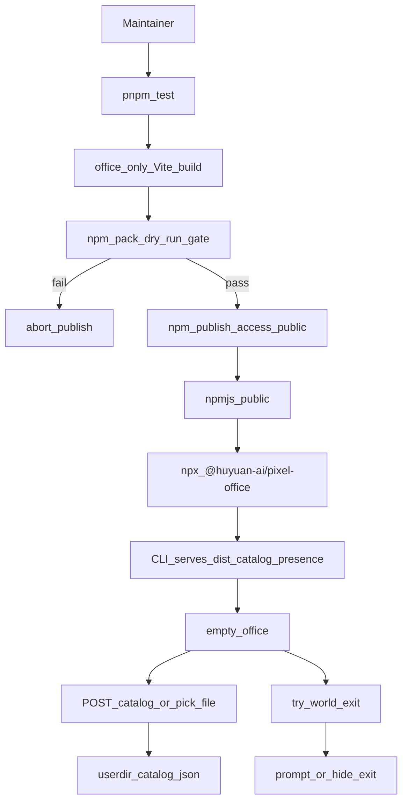
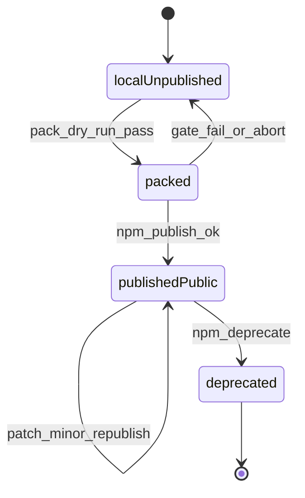

# PRD: NPX 公开发布（npx-publish）

| 属性   | 值 |
| ---- | --- |
| 状态   | 工程：accepted（R0；见文末「工程验收状态」） |
| 范围   | 把本仓可运行的像素办公室以公开 npm 包分发；用户 `npx @huyuan-ai/pixel-office` 无需 clone / `pnpm install` / 先 `pnpm build`。R0 tarball 含办公室（`company-25`）+ **25×25 色块世界桩图**；**不含** wa-village 园区大图；village 仅办公室用到的两 PNG。不改花名册 schema、出勤语义、不上 SQLite。 |
| 关联文档 | `AGENTS.md`、`README.md`、`docs/dev-guide.md`、`docs/openapi.md`、`public/assets/CREDITS.md`、`package.json`、`bin/pixel-office.mjs`、`src/cli/run.mjs`、`specs/prds/prd-00007-live-presence.md`、`specs/prds/prd-00008-runtime-catalog.md` |

## 背景与问题

像素办公室已具备本地一键预览能力：`bin/pixel-office` 托管 `dist/` + 运行时花名册（PRD 00008）+ 出勤 API（PRD 00007）。产品与文档多处按 **npx** 叙述使用方式，但发布路径**不存在**：

- [`package.json`](../../package.json) 为 `"private": true`、`"name": "evo-agent-team"`；无法 `npm publish`。
- [`AGENTS.md`](../../AGENTS.md) 能力声明 `not` 含「发布 npm registry」。
- CLI（[`bin/pixel-office.mjs`](../../bin/pixel-office.mjs) → [`src/cli/run.mjs`](../../src/cli/run.mjs)）要求仓库根下已有 `dist/index.html`；`dist/` 在 `.gitignore`，干净 clone 必须先 `pnpm build`。
- 无 `files` / `.npmignore` / `LICENSE` / publish CI；`art/` 作者工作区与村图瓦片若误进包，体积与许可均失控（当前完整 `dist` 约 71MB，其中 `tilesets/village/` 约 57MB；CREDITS 写明世界图公开分发前须换图或授权）。

要解决的是：**任意有 Node 的机器，一条 npx 起大屏**；花名册仍走用户目录 + `POST /api/catalog`；首发包体积可控、许可可辩护。

## 目标与非目标

### 目标（MVP / Release 0）

- **公开 scoped 包。** npmjs.com 上发布 `@huyuan-ai/pixel-office`（`publishConfig.access=public`）；bin 名仍为 `pixel-office`。
- **一条命令起服。** 干净机器：`npx @huyuan-ai/pixel-office` → 打开浏览器本地 origin（默认端口与现 CLI 一致 `3780`，可 `-p`）；无本地 `CATALOG.json` 时空办公室（对齐 PRD 00008）。
- **预构建进 tarball。** 包内含 `bin/`、运行 CLI 所需的 `src/cli/*.mjs`、**office-only** `dist/`；用户 **不必** 在目标机执行 Vite build。
- **瘦运行时依赖。** npx 安装只需 CLI 运行时依赖（当前实质为 `open`）；Phaser / React 打进 `dist`，从 `dependencies` 挪到 `devDependencies`（本地 `pnpm dev` 不变）。
- **世界图不进 npm。** R0 publish 构建排除 `world-map` 与 `tilesets/village/`；点大门不静默 404——提示「本发行版仅含办公室」或隐藏出口（构建期 `PIXEL_OFFICE_EDITION=office`）。
- **本地开发不受损。** clone 后 `pnpm dev` / 仓库内 `pnpm build && pnpm pixel-office` 仍可含世界图；仅 **publish 构建**排除。
- **发版门禁。** R0 人手：`pnpm test` → office-only build → `npm pack --dry-run` 校验（有 `dist/index.html`、无 `art/`、无 village）→ `npm publish --access public`。
- **版本与引擎。** 首个公开版沿用 `0.1.0`；`engines.node >= 20`；semver（破坏性改 CLI 参数 / 对外 API 才 bump major）。
- **许可与署名。** 补根目录 `LICENSE`（代码与混合素材分述，**不**伪称全仓纯 MIT）；包内保留 CREDITS（经 dist）；Pipoya 仅已组装 atlas；WA 瓦片 CC-BY-SA 署名；世界图不进包。
- **文档与能力声明。** 实现阶段同步：`AGENTS.md` `owns`/`not`（去掉「不发布 npm」）、`README.md` 以 npx 为首要启动方式、`docs/doc_index.md`。

### 目标（Release 1，可选）

- Git tag → CI 自动 `npm publish`（含同样 office-only 门禁）。
- 世界图进公开包：**仅当**许可清掉后；否则独立 PRD / Feature Spec，**禁止**挂 Release 2。

### 非目标

- 公开分发 wa-village 世界图或独立 tileset 素材包。
- 改 `CATALOG.json` / 出勤语义 / 上 SQLite / Postgres。
- 以 GitHub Packages 或 `npx github:...` 作为**主**渠道（可作临时验证手段，不写进 R0 成功标准）。
- 把本仓改成 monorepo 或拆独立 CLI 仓。
- npm provenance / 包签名（开放项，不进 R0）。
- 改游戏玩法、地图编辑工作流、素材许可谈判本身。

## 术语

| 术语 | 含义 |
| ---- | ---- |
| 包名 / package name | npm `name` 字段：`@huyuan-ai/pixel-office` |
| bin | CLI 可执行名：`pixel-office`（`npx` 解析到该 bin） |
| tarball | `npm pack` / publish 上传的包内容 |
| office-only 构建 | 发布用 Vite/静态产物，仅办公室地图与所需瓦片，无 village |
| 发行版 / edition | 构建期标识，如 `PIXEL_OFFICE_EDITION=office` |
| 预构建 SPA | 已 `vite build` 的 `dist/`，由 CLI 静态托管 |
| 门禁 / pack gate | `npm pack --dry-run`（或等价脚本）对文件清单与体积的硬检查 |
| 用户目录副本 | `~/.pixel-office/catalog.json`（PRD 00008，不随 npx cache 消失） |

## 已拍板规则 / 取舍

| 议题 | 决议 | 说明 |
| ---- | ---- | ---- |
| 渠道 | **npmjs.com 公开** | scoped 须 `access=public` |
| 包名 | **`@huyuan-ai/pixel-office`** | 仓库名仍 `evo-agent-team`；若组织名不同实现前改 scope |
| 用户命令 | **`npx @huyuan-ai/pixel-office`** | R0 只宣传 npx；`npm i -g` 出现 `pixel-office` 算同能力 |
| R0 地图 | **仅办公室** | 无 world-map / village；体积与许可优先 |
| 无园区交互 | **明确提示或隐藏出口** | 禁止静默 404 死机 |
| 包内容 | **预构建 + CLI** | 含 `bin/`、`src/cli` 运行所需、office-only `dist/`；不含 `art/`、游戏 TS 源、`scripts/`、测试 |
| 依赖 | **runtime 瘦身** | 浏览器依赖进 dist；CLI 依赖留 `dependencies` |
| 发版 | **R0 人手** | R1 才做 tag→CI |
| 版本 | **从 0.1.0 公开** | 与现 `package.json` version 对齐起步 |
| LICENSE | **混合分述** | 不伪称全仓 MIT |
| Node | **`>= 20`** | `engines` 声明 |
| 本 PRD 交付 | **仅规格落盘** | 不改 `package.json` / CI / 构建脚本（实现另切片） |

## 用户与角色

| 角色 | 目标 |
| ---- | ---- |
| 大屏观众 / 老板（主） | 装 Node 后一条 npx 看空办公室，再选花名册或等 Agent POST |
| 远端 Agent / 自动化 | npx 起服后按 OpenAPI `POST /api/catalog`、`/api/presence` |
| 包维护者 | 可重复、可门禁的发版；tarball 无作者工作区、无村图 |
| 本地开发者 | clone 后仍 `pnpm dev`；世界图本地可用；与公开包行为差异有文档 |
| 运维 | 固定端口 / `--no-open` / token；重启后花名册仍在用户目录 |

## 功能域

### 1. 包身份与元数据

- `name`: `@huyuan-ai/pixel-office`；去掉 `private: true`（或 publish 流程显式覆盖）。
- `bin.pixel-office` 指向包内入口（现 `./bin/pixel-office.mjs` 语义保留）。
- `files`（或 `.npmignore`）白名单：只放可运行所需路径；**显式排除** `art/`、`specs/`、`docs/`（除进 dist 的 CREDITS）、测试、village。
- `publishConfig.access`: `public`；`engines.node`: `>=20`。

### 2. Office-only 发布构建

- 发布专用构建（脚本名实现自定，如 `build:publish`）产出 `dist/`：
  - 含 `company-25` 与办公室运行所需 tileset / 字体 / characters atlas。
  - **不含** `world-map.json`、`tilesets/village/**`。
  - 注入 `PIXEL_OFFICE_EDITION=office`（或等价），使大门/出口：隐藏或 UI 提示「本发行版仅含办公室」。
- 本地默认 `pnpm build` **可**继续含世界图（开发体验）；文档写清「dev 全图 / npm 办公室」。

### 3. CLI 在已安装包内的路径

- `run.mjs` 解析包根（相对 `bin/` / `import.meta.url`），托管**包内** `dist/`，不依赖用户 cwd 有仓库。
- 缺 `dist/index.html` 时错误信息指向「包损坏或非官方安装」，**不**要求用户 `pnpm build`（那是开发路径）。

### 4. 发版与门禁（R0）

1. `pnpm test` 通过。  
2. office-only 构建。  
3. `npm pack --dry-run`（或脚本）断言：含 `dist/index.html`；不含 `art/`、不含 `village`；体积上限由实现定但须**显著小于**当前 ~71MB 全量 dist（建议验收写「无 village 路径」为硬条件，体积为软目标）。  
4. `npm publish --access public`。  
5. 干净环境 `npx @huyuan-ai/pixel-office` 冒烟：空办公室 + `GET /api/openapi.json` 200。

### 5. 文档与能力声明（实现阶段）

- README 首屏：`npx @huyuan-ai/pixel-office`；开发路径次之。
- `AGENTS.md`：`owns` 增加公开发布；`not` 删除「发布 npm registry」；仍保留不上 SQLite 等。
- CREDITS / LICENSE 与包内容一致（无村图则不暗示含园区）。

## 用户故事地图与版本切片

### 旅程主干

| 步骤 | 角色 | Entry / 动作 | Exit / 结果 |
| ---- | ---- | ------------ | ----------- |
| 1 | 维护者 | Entry：版本就绪、npm 登录有效 | 跑 test + office-only build |
| 2 | 维护者 | `npm pack --dry-run` 门禁 | 通过 → 可 publish；失败 → 中止（回 localUnpublished） |
| 3 | 维护者 | `npm publish --access public` | 包在 npmjs 可见（`publishedPublic`） |
| 4 | 老板 | Entry：本机有 Node ≥20 | `npx @huyuan-ai/pixel-office` |
| 5 | 系统 | 解压/缓存包，起 HTTP | 浏览器打开本地 origin；办公室可渲染 |
| 6 | 老板 / Agent | 选文件或 `POST /api/catalog` | 花名册进内存 + 用户目录；小人出现 |
| 7 | 老板 | 可选：大门 / 园区 | 发行版提示仅办公室或无出口；**不**崩溃 |
| 8 | Teardown | Ctrl+C / 关终端 | 进程退出；用户目录 JSON 保留；npx cache 可再跑 |

### 用户故事地图

| 阶段 | 目标 | 故事 | 验收要点 |
| ---- | ---- | ---- | -------- |
| 发现与启动 | 零配置起大屏 | 作为老板，我想要 `npx @huyuan-ai/pixel-office`，以便不 clone 仓库也能看办公室 | 干净机（无本仓、无预装依赖）一条命令起服；浏览器打开；空态办公室可渲染 |
| 发现与启动 | 可选参数仍可用 | 作为运维，我想要 `-p` / `--no-open` / `--catalog`，以便嵌入脚本 | 与现 CLI 帮助一致；无 catalog 不退出 |
| 花名册 | 运行时注入 | 作为 Agent，我想要 POST 花名册，以便大屏显示团队 | `POST /api/catalog` 成功后 `GET` 可见；写入 `~/.pixel-office/catalog.json`（PRD 00008） |
| 花名册 | 界面选文件 | 作为老板，我想要顶栏选 JSON，以便不用 curl | 选文件与 POST 同效果 |
| 出勤 | 合同不变 | 作为 Agent，我想要按现 OpenAPI 报出勤，以便黄灯/绿灯仍工作 | `GET /api/openapi.json` 可用；presence 语义同 PRD 00007 |
| 发行边界 | 无世界图 | 作为老板，我想要点击大门时不被搞挂，以便理解发行版限制 | 无 404 白屏；有提示或出口不可达 |
| 发版 | 包干净 | 作为维护者，我想要 pack 门禁，以便 art/village 不进 npm | dry-run 清单无 `art/`、无 `village`；有 `dist/index.html` |
| 开发 | 本地全图 | 作为开发者，我想要 `pnpm dev` 仍含世界图，以便改园区 | 本地构建/开发路径与 npm 发行版差异有 README 说明 |
| R1 | CI 发版 | 作为维护者，我想要打 tag 自动 publish，以便少人手失误 | tag 流水线含同样门禁；失败不 publish |

### Release 切片

#### Release 0（MVP，必选）

- 包身份：`@huyuan-ai/pixel-office` 公开；`bin` = `pixel-office`。
- office-only 预构建进 tarball；瘦 `dependencies`。
- 人手发版流程 + pack 门禁。
- 发行版无园区的安全降级（提示或隐藏出口）。
- LICENSE + CREDITS 一致；`engines.node >= 20`。
- README / AGENTS 文档同步（实现阶段）。
- **可验收结果：** 干净机 `npx @huyuan-ai/pixel-office` 起空办公室；可注入花名册；tarball 无 village/art。

#### Release 1（可选，同 PRD）

- tag → CI publish（同 R0 门禁）。
- **本期不做：** 世界图进公开包（除非许可已清；否则独立文档）。
- **禁止** Release 2+；溢出进非目标 / 开放项 / 新 PRD。

## 核心流程与状态机图

### 发版与消费主流程

### 包生命周期状态

断头路扫描：门禁失败必须回到 `localUnpublished`，**禁止**把半发布 / 含 village 的 tarball 当成功；用户 Ctrl+C 后用户目录数据保留、进程状态丢弃（出勤内存表同 PRD 00007）。

## 数据与 API 衔接

- **不新增**业务 API；消费侧合同仍为 `GET/POST /api/catalog`、`GET/POST /api/presence`、`GET /api/openapi.json`。
- 静态资源来自包内 `dist/`（office-only）。
- 持久化仍在 `PIXEL_OFFICE_HOME` / `~/.pixel-office/`，与 npx cache 解耦。

## 成功标准（可度量）

- 干净环境（无本仓 clone）执行 `npx @huyuan-ai/pixel-office`：**进程不因缺 dist / 缺 CATALOG 退出**；办公室地图可渲染。
- `npm pack --dry-run`：**0** 条 `art/`、**0** 条 `village` 路径；存在 `dist/index.html`。
- 注入合法花名册后 agents 数与源 JSON `workspaces` 映射一致（复用现映射）。
- 文档：README 首要命令为 `npx @huyuan-ai/pixel-office`；`AGENTS.md` 不再把「发布 npm」列为 not。

## 假设与待确认 / 开放项

| ID | 项 | 默认假设 | 需谁确认 |
| -- | -- | -------- | -------- |
| O1 | npm scope `@huyuan-ai` 组织已存在且账号有 publish 权限 | 是（登录账号 `huyuan-ai`）；初稿曾写 `@huyuan`，实现改为 `@huyuan-ai` | 维护者 |
| O2 | 发布账号已开 2FA / 自动化 token 策略 | R0 用人手交互登录即可 | 维护者 |
| O3 | LICENSE 文案法务可接受（混合素材分述） | 首发前合并 LICENSE 文件 | 维护者 / 法务 |
| O4 | 包名是否占用 | 发版前 `npm view @huyuan-ai/pixel-office` | 维护者 |
| O5 | office-only 体积软上限具体数字 | 以「无 village」为硬门禁；数字实现时定 | 工程 |
| O6 | npm provenance | 不做 R0 | 开放 |
| O7 | 世界图许可清掉后是否并回本 PRD R1 | 倾向独立 PRD | 产品 |

## 修订记录

| 日期 | 说明 |
| ---- | ---- |
| 2026-09-14 | 初稿：公开 `@huyuan/pixel-office`；R0 office-only；人手发版；世界图不进包 |
| 2026-09-14 | R0 工程验收通过（人工）；世界图改为 25×25 桩图；见文末「工程验收状态」 |
| 2026-09-14 | 包 scope 改为 `@huyuan-ai/pixel-office`（账号 `huyuan-ai`；`@huyuan` publish 404） |

## 1. 工程验收状态

> 由 `/team:prd-accept` 维护；勿手工编造「通过」。最后更新：2026-09-14T08:29:27Z，main@工作树（未单独 commit），范围：R0。验收方式：S2 外置 Validator 按人要求跳过，改为维护者人工验收。

### 总览

| 项 | 值 |
| --- | --- |
| 工程状态 | accepted |
| 验收判定 | 通过（R0；人工） |
| 最近验收 | 2026-09-14；维护者本地 `pnpm build` + `pixel-office -p 3792`（大门↔白格切图）+ `pnpm pack:gate` ≈2.70 MiB |
| 代码提交 | 实现尚在工作树；落点见下表 |
| 摘要 | 包身份 `@huyuan-ai/pixel-office`；预构建 dist；25×25 色块世界桩图；village 白名单两 PNG；pack 门禁；LICENSE/README/AGENTS 同步；**尚未** `npm publish` |

### Release 交付

| Release | 状态 | 说明 |
| --- | --- | --- |
| R0 | 通过 | 包元数据、预构建、桩图切图、pack 门禁、文档；registry 发布留给维护者人手执行 |
| R1 | 范围外 | tag→CI publish；本期不做 |

### 功能验收清单（Agent 优先读此表）

| ID | 能力摘要 | Release | 状态 | 证据 |
| --- | --- | --- | --- | --- |
| S2-1 | 空办公室 / 有花名册可起服渲染 | R0 | 通过 | UI-see：人工 `pixel-office -p 3792`；本机有用户目录时 23 agents 亦可 |
| S2-2 | 顶栏选花名册 / 运行时注入仍可用 | R0 | 通过 | 复用 PRD-00008 路径；本轮未改 catalog API |
| S2-3 | POST catalog 合同不变 | R0 | 通过 | 未改 API；OpenAPI 仍可用 |
| S2-4 | GET /api/openapi.json | R0 | 通过 | 起服后可用（与 00007/00008 同路径） |
| S2-5 | pack 有 dist/index.html；无 art/；village 仅白名单 | R0 | 通过 | HTTP：`pnpm pack:gate` OK，≈2.70 MiB；白名单 `fountain-sculptures.png` + `decor-rugs-1.png` |
| S2-6 | 大门↔世界桩图白格往返不断 | R0 | 通过 | UI-click：人工点大门进蓝底 25×25，点白格回办公室 |
| R0-pkg | `@huyuan-ai/pixel-office` + engines≥20 + 瘦 dependencies | R0 | 通过 | `package.json` |
| R0-stub | 25×25 world-stub 替换 wa-village 大图 | R0 | 通过 | `scripts/gen-world-stub.mjs`、`world-map.json`、`world-stub.png` |
| R0-docs | README npx 首要；AGENTS owns 含发布 | R0 | 通过 | README / AGENTS / LICENSE |
| R0-build | pnpm build / test 绿 | R0 | 通过 | test 110；build 后 dist≈5.1M（已 strip） |

实现落点：`package.json`、`scripts/gen-world-stub.mjs`、`scripts/pack-gate.mjs`、`src/cli/vite-plugin-publish-assets.ts`、`vite.config.ts`、`src/cli/run.mjs`、`public/assets/maps/world-map.json`、`LICENSE`、文档与 `AGENTS.md`。

### 未完成与遗留

- **未执行** `npm publish --access public`（开放项 O1/O2/O4：组织权限、登录 2FA、包名占用确认）。干净机 `npx @huyuan-ai/pixel-office` 冒烟须 publish 后完成。
- 相对 PRD 初稿「tarball 不含 world-map / 0 条 village」：工程取舍为 **含 25×25 桩图**；village **允许**办公室用到的两 PNG（硬门禁改为白名单，非整目录清零）。
- R1：tag→CI 自动 publish（范围外）。
- O3 LICENSE 法务可再审；O6 provenance 不做 R0。

### 质量检查

| 检查项 | 状态 |
| --- | --- |
| pnpm build | 通过 |
| pnpm test | 通过（110） |
| pnpm pack:gate | 通过（≈2.70 MiB） |
| 文档与能力声明同步 | 通过 |

---
统计：通过 10 / 部分 0 / 未实现 0 / 范围外 1（R1）
